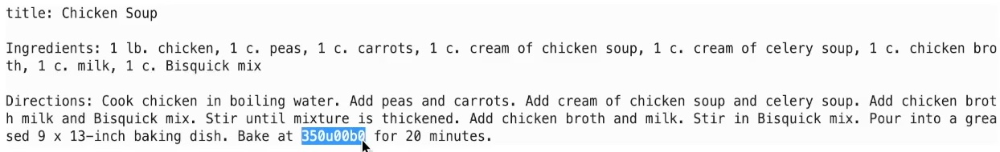

# Tune our ChefGPT

## Introduction

Now that we have a tuned model, let's test it.

Estimated Time: 5 minutes

### Objectives

In this lab, you will:

* Load the tuned model
* Use several techniques to prompts the model for recipes
* Observe the results

### Prerequisites

* You have completed the tasks in all of the previous labs

## Task 1: Download the notebook & upload it to your notebook environment

1. Download the following notebook: [try-chefgpt.ipynb](files/try-chefgpt.ipynb).
1. Locate the notebook in your download folder and drag it to your notebook environment. Please make sure to navigate to the correct folder (`/hol/`).
1. Once the notebook has been uploaded, right click it on the left to open it in your environment. We've added comments to the cells to help you better understand the code.

   

## Task 2: Execute the code & observe the results

1. Please execute the cells in their order of appearance and observe the result.
   After executing the fourth cell, you should see an output which looks a lot like a recipe.
   The result is far from perfect but it is distinctly better than our initial experiments.
   You may observe issues like the following:

   

2. Here, the unicode value for the "degrees" symbol shows as a hexadecimal number instead of the actual symbol.
   Such issues are likely to occur in the absence of a "cleanup" step. This is part of the normal progressive process of fine-tuning our models and datasets. Using small datasets allows us to quickly observe training results, make sure we are on the right path, iterate and improve before we commit to training on large datasets which could require significant resources and time investments.
   In the cleanup set, we could easily convert the degree symbol to F or C for better result.

3. Execute the `v3`, `v4` and `pipeline` variations and observe the difference to the output.
   No version is going to be perfect at the moment as the LLM itself is small and so was our training dataset, but you can see how we can control the output using the available parameters.

4. At this point we could consider training our model on a larger dataset in order to improve the results. We could also consider using a larger LLM.

## **Acknowledgements**

* **Authors** - Lyudmil Pelov, Wendy Yip, Yanir Shahak
