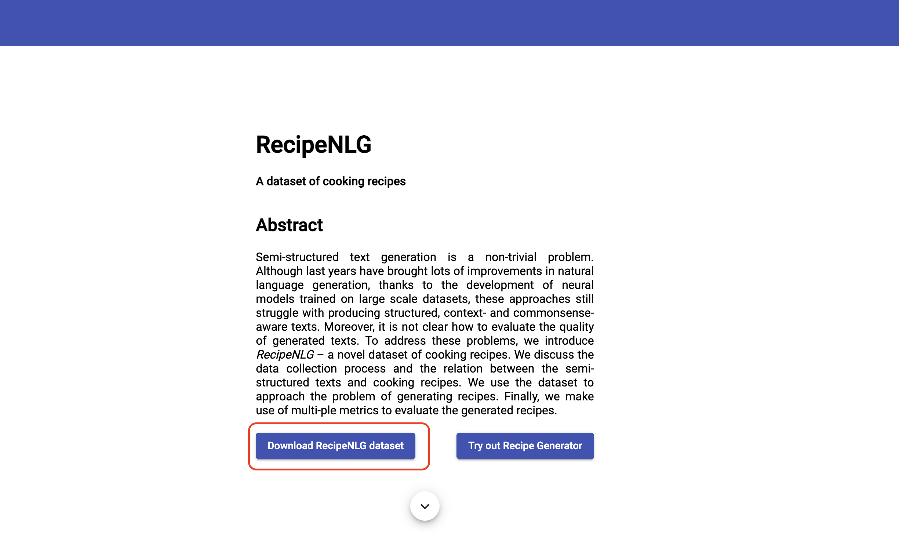
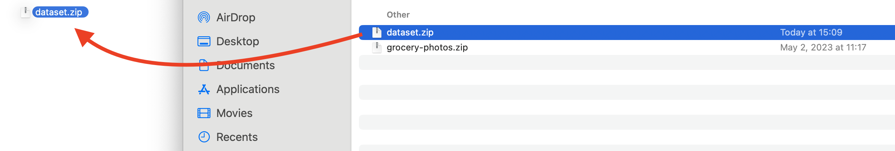
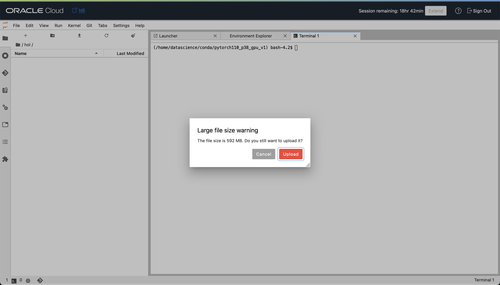
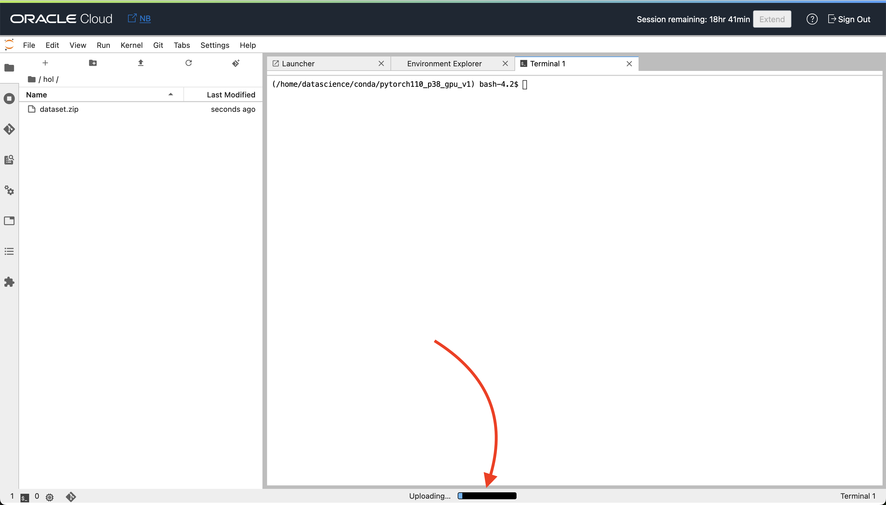

# Load the Dataset

## Introduction

To proceed with the lab we would need to load the recipe dataset that will be used for the large language model tuning. A good dataset is crucial for tuning a large language model on a specific task because it provides the necessary training signal, represents the task accurately, avoids bias, incorporates domain-specific knowledge, and enables effective evaluation and iterative improvements. It ensures the model's ability to generalize, perform well on diverse inputs, and produce accurate and contextually appropriate responses.

Estimated time - 5 minutes

### Objectives

1. Download the dataset
2. Upload the dataset into your notebook

### Prerequisites

By now you should have your OCI Data Science Notebook up and running and ready for use.

## Task 1: Download dataset

- *Step 1*

    For this we are going to use the RecipeNLG dataset. To download the dataset, open following link: [https://recipenlg.cs.put.poznan.pl/](https://recipenlg.cs.put.poznan.pl/)

- *Step 2*

    Click on the `Download RecipeNLG dataset` link.
    

- *Step 3*

    Confirm the RecipeNLP Terms and Conditions and `Download` the dataset
    

The dataset is about 500MB large compressed.

## Task 2: Upload the dataset

We would need to upload the dataset to the notebook and unzip it, to be able to use it.

- *Step 1*

    Go to the browser tab where you opened your OCI Data Science Notebook previously and go into the folder `hol` that you've created.

- *Step 2*
    Drag and drop the downloaded `dataset.zip` file into the notebook to upload it.

    

    ... and confirm the uploading
    

- *Step 3*

    Monitor the upload process at the bottom of the the notebook.
    

You may now **proceed to the next lab**.
