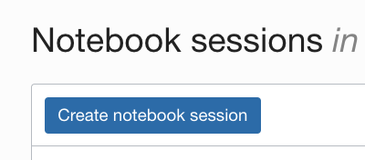
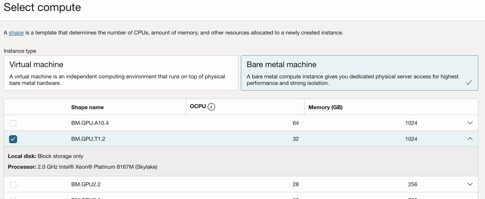
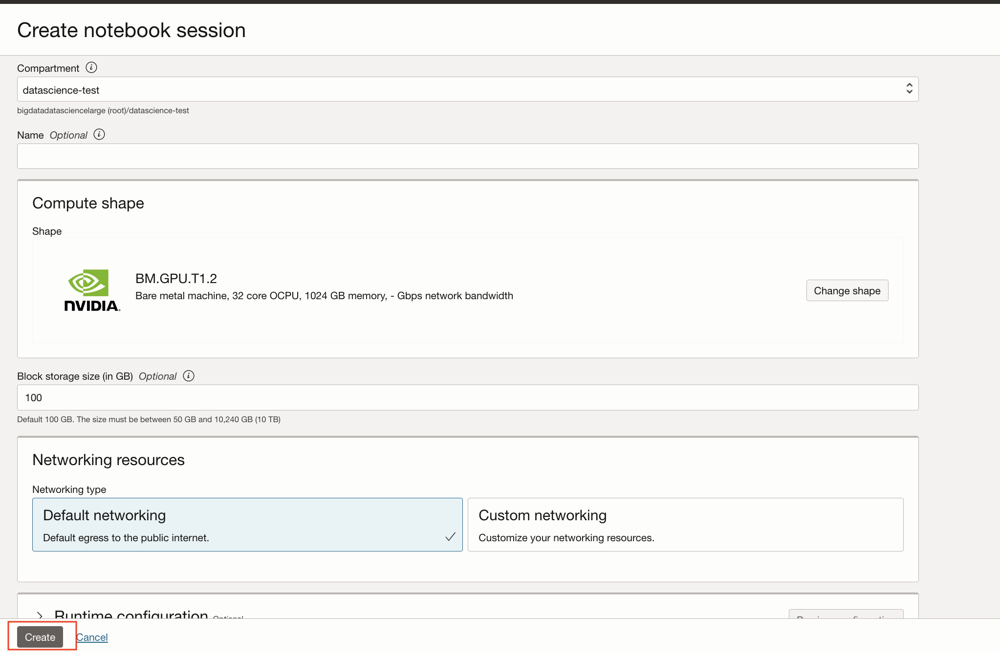
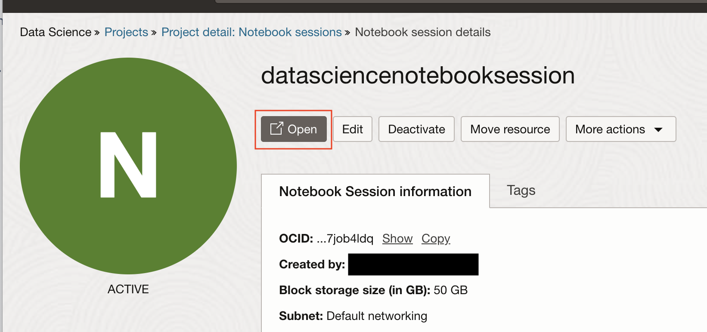

# Create a Notebook Session Running on a VM with A GPU

## Introduction

Data Science notebook sessions are interactive coding environments for building and training models. Notebook sessions provide access to a JupyterLab serverless environment that is managed by the Data Science service. All notebook sessions run in the Data Science service tenancy.

A notebook session is associated with a compute instance, VCN, subnet, and block storage. There are two block storage drives that are associated with a notebook session. There is a boot volume that is initialized each time the notebook session is activated. Any data on the boot volume is lost when the notebook session is deactivated or terminated. There is an additional block storage that is persisted when a notebook session is deactivated, but it is not persisted when a notebook session is terminated. This block volume is mounted in the ``/home/datascience`` directory and it is where the JupyterLab notebooks, data files, installed custom software, and other files should be stored.

When a notebook session is activated or created, the compute instance shape, block storage, VCN, and subnet are configured. These resources can only be changed by deactivating a notebook session, and then changing the configuration while activating the notebook session again. The size of the block storage can only be increased.

Estimated Time: 15 minutes

### Objectives

* Use the Console to create a Data Science notebook session running on a GPU
* Use the Console to open the Data Science notebook session

### Prerequisites

* A tenancy that is configured to work with the Data Science service.
* An account that has permission to create a Data Science notebook session.

## Task 1: Creating a Notebook Session

1. Select the compartment for the project you created in the previous section.
1. Click the name of the project to contain the notebook session.
1. Click **Create notebook session**.
    
1. Confirm that the compartment that is selected is the compartment in the Reservation Information. If the compartment is different, change it to the one listed in the Reservation Information.
1. (Optional, but recommended) Enter a unique name for the notebook session (limit of 255 characters). If you do not provide a name, a name is automatically generated for you.
1. Select a Compute shape. The [Compute Shapes](https://docs.cloud.oracle.com/en-us/iaas/Content/Compute/References/computeshapes.htm) page has details on the specifications. For this lab, it is recommended that you use the BM.GPU.T1.2 shape. Click the **Change shape** button in the compute shape. This will open the select compute window. To choose the shape, click **Bare metal machine**, then check the box besides **BM.GPU.T1.2**, and finally click **Select**.

1. Enter the block volume in GB. The suggested size is 100 Gb or larger.
1. In the **Networking Resources** section, select the **Default Networking** option.
1. (Optional) Add tags to the notebook session by selecting a tag namespace, then entering the key and the value. You can add more tags to the compartment by clicking **+Add Tags**, see [Working with Resource Tags](https://docs.cloud.oracle.com/iaas/Content/General/Concepts/resourcetags.htm#workingtags).
1. Click **Create**.
    
1. While the notebooking is being created, it is in the **Creating** state.  Wait until it is in the **Active** state.
1. When the notebook is in an **Active** state, then click **Open**.
    

You can **proceed to the next** lab.

## **Acknowledgements**

* **Authors** - Lyudmil Pelov, Wendy Yip, Yanir Shahak
