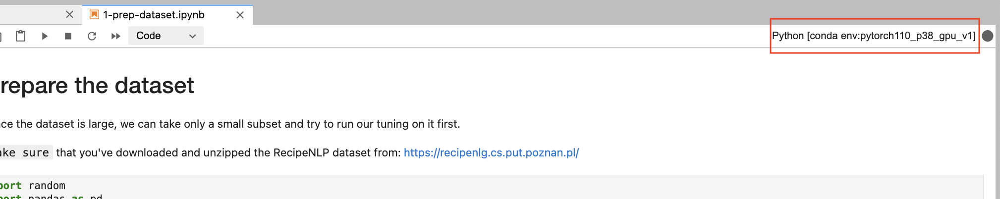
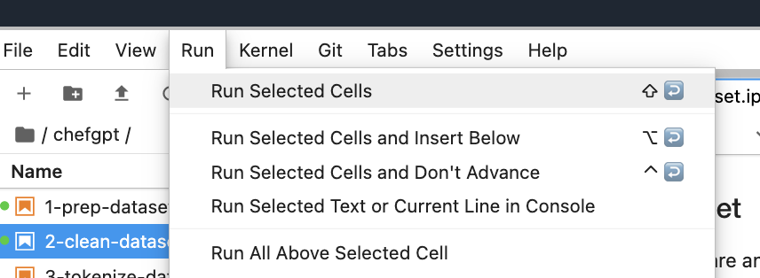
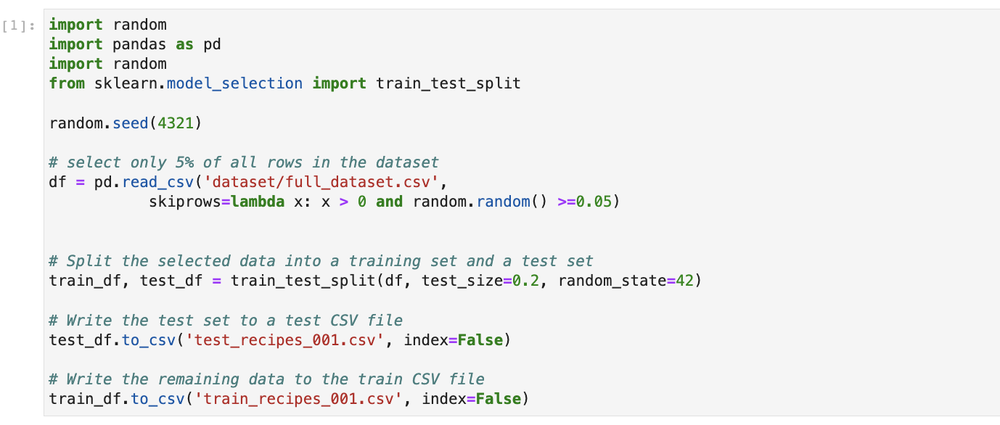

# Prepare the Dataset

## Introduction

In this lab, we are going to download the dataset and split it into training and testing data.

Estimated Lab Time: -- 5 minutes

### Objectives

In this lab, you will:

* Load data using Pandas
* Split data into training and testing datasets

## Task 1: Download the notebook & upload it to your notebook environment

* Download the following notebook: [1-prep-dataset.ipynb](files/1-prep-dataset.ipynb).
* Locate the notebook in your download folder and drag it to your notebook environment. Please make sure to navigate to the correct folder.
* Once the notebook has been uploaded, right click it on the left to open it in your environment. We've added comments to the cells to help you better understand the code.

## Task 2: Make sure the right kernel is selected

1. Please make sure that you have the conda environment that we have prepared in the first lab, selected.

 

## Task 3: Execute the cells in the notebook to load dataset and split dataset intro training and testing dataset

1.  You can execute a cell by clicking on the cell and pressing Shift + Enter.  Alternatively, you can click on the cell, go to the Run tab and select Run Selected Cells or Run All Cells.

2.  In the first cell, we are loading the dataset.  Since this dataset is very large, we are only going to use a small portion of the dataset.  We are going to randomly select 5% of the dataset.   We are using the library [Pandas](https://pandas.pydata.org/) to load the dataset which has the ability to read csv files.  After loading in the dataset, we are splitting the dataset into the training set and the testing set.  It is important when training a machine learning model to split up your dataset, so you can use the training dataset to train your model and use the testing dataset to validate your model.  It is important to see how the model does with data it "has not seen" yet. We will use 80% of the dataset for the training dataset and 20% for testing.

3.  After loading in the dataset, we can check the number of rows and columns of our training and testing dataset with `.shape`.  For example, `print(test_df.shape)` will print the number of columns and rows of the dataframe.  You can check the first three rows of our dataframe with `data.head(3)`

You may now **proceed to the next lab**.
