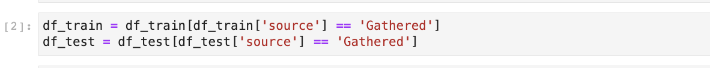
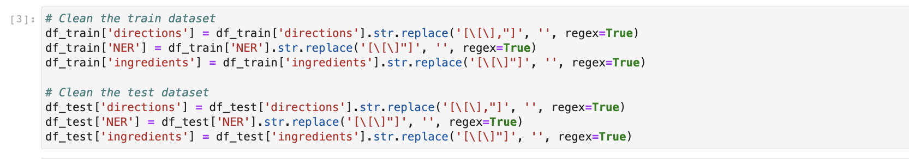
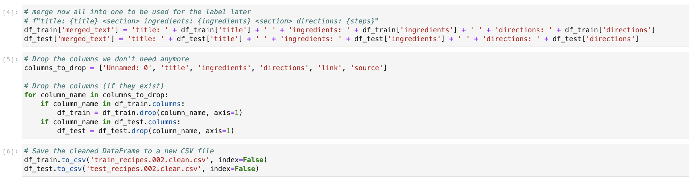

# Clean the Dataset

## Introduction

In this lab, we are going to clean the dataset by removing unnecessary characters and merge the texts together.

Estimated Lab Time: 10 minutes

### Objectives

In this lab, you will:

* Clean the dataset by removing unnecessary characters from the text
* Merge together the text of the titles of the recipe, ingredients and instruction

## Task 1: Download the notebook & upload it to your notebook environment

* Download the following notebook: [2-clean-dataset.ipynb](files/2-clean-dataset.ipynb).
* Locate the notebook in your download folder and drag it to your notebook environment. Please make sure to navigate to the correct folder.
* Once the notebook has been uploaded, right click it on the left to open it in your environment. We've added comments to the cells to help you better understand the code.

## Task 2: Make sure the right kernel is selected

1. Please make sure that you have the conda environment that we have prepared in the first lab, selected.

## Task 3: Execute the cells in the notebook to clean the dataset

1.  You can execute a cell by clicking on the cell and pressing Shift + Enter.  Alternatively, you can click on the cell, go to the Run tab and select Run Selected Cells or Run All Cells.

2. First, we are taking the training and testing datasets and filtering them to only the recommended "Gathered" entries.

3. Next, we are cleaning the dataset.  When working with text data, it is often helpful to "clean" the dataset by removing texts and characters that do not provide a lot of meaning to the actual content.  There are various techniques for cleaning a text dataset.  We will take a simple approach by removing the brackets "[ ]" from the text.  We do that to both the training and testing datasets.

5. We are going to merge the title of the recipe, the ingredients and directions, which are separated into different columns, into a new text column called "merged_text".  We will use the "merged_text" column and drop the "title", "ingredients", "directions", "link" and "source" columns from the dataframe.  The dataframe is going to have only two columns, "NER" and "merged_text".  We are going to do that for both the training and testing dataframes.  The new dataframes are going to be saved to new csv files.  

You may now **proceed to the next lab**.
