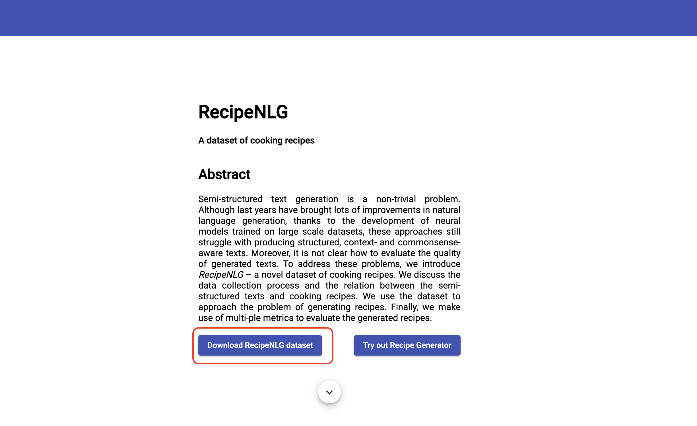
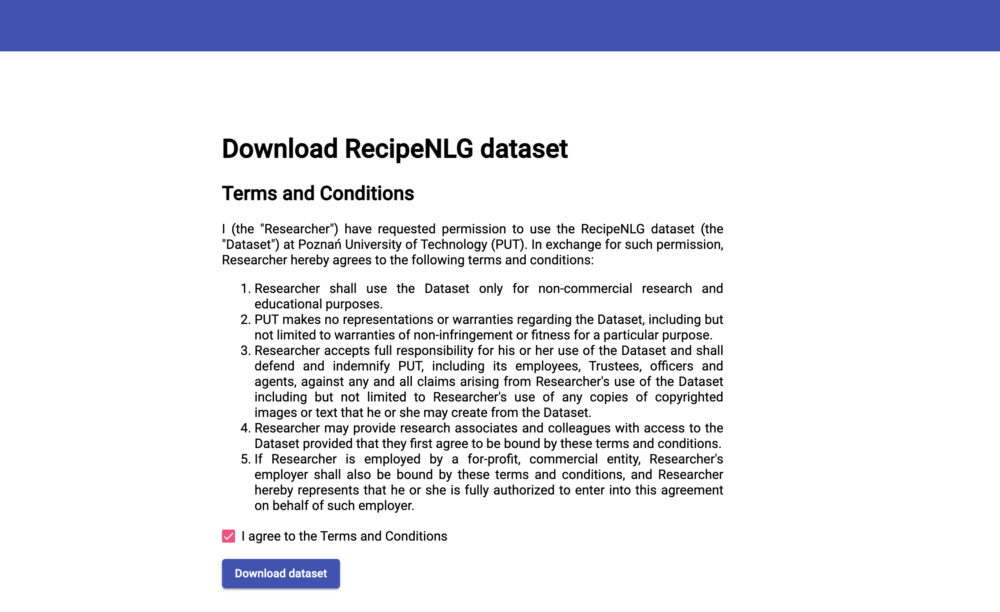
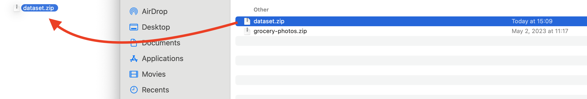
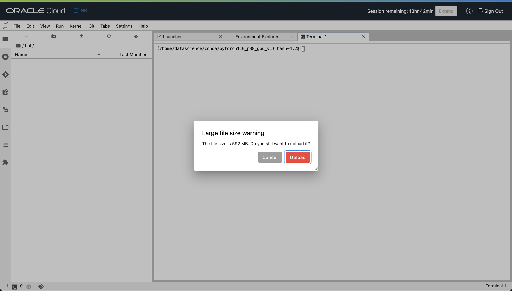

# Load the Dataset

## Introduction

To proceed with the lab we would need to load the recipe dataset that will be used for the large language model tuning. A good dataset is crucial for tuning a large language model on a specific task because it provides the necessary training signal, represents the task accurately, avoids bias, incorporates domain-specific knowledge, and enables effective evaluation and iterative improvements. It ensures the model's ability to generalize, perform well on diverse inputs, and produce accurate and contextually appropriate responses.

Estimated time - ~5 minutes

### Objectives

1. Download the dataset
2. Upload the dataset into your notebook

### Prerequisites

By now you should have your OCI Data Science Notebook up and running and ready for use

## Task 1: Download dataset

1. We are going to use the RecipeNLG dataset. To download the dataset, open following link: [https://recipenlg.cs.put.poznan.pl/](https://recipenlg.cs.put.poznan.pl/)

1. Click on the `Download RecipeNLG dataset` link.
   

1. Confirm the RecipeNLP Terms and Conditions and `Download` the dataset
   

   The dataset is about 500MB compressed.

## Task 2: Upload the dataset

We would need to upload the dataset to the environment and unzip it, to be able to use it.

1. Go to the browser tab where you opened your OCI Data Science Notebook previously and go into the folder `hol` that you've created.

1. Drag and drop the downloaded `dataset.zip` file into the files list on the left to upload it.

    

    ... and confirm the uploading
    

1. Monitor the upload process at the bottom of the the notebook.
    

1. In the terminal that you've previously opened, make sure that you are in the `hol` folder and then unzip the file.

    ```bash
    <copy>cd /home/datascience/hol/</copy>
    ```

    ... and unzip

    ```bash
    <copy>unzip dataset.zip</copy>
    ```

You may now **proceed to the next lab**.

## **Acknowledgements**

***Authors***

- Lyudmil Pelov - Senior Principal Product Manager, Data Science & AI
- Wendy Yip - Senior Product Manager, Data Science & AI
- Yanir Shahak - Senior Principal Software Engineer, AI Services
