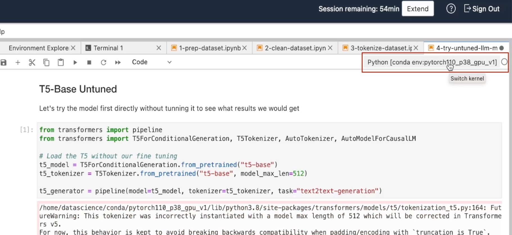
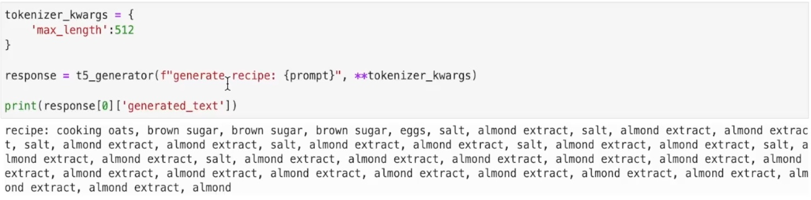

# Try The Untuned LLM Model

## Introduction

Before we go and start tuning our model. We want to know how well the T5 based model is going to perform without tuning. What we're going to do is load the model and generate some recipes based on the out-of-the-box T5 base-model.

Estimated Lab Time: -- 5 minutes

### Objectives

In this lab, you will:

* Test the untuned LLM model to asses it's performance.

## Task 1: Make sure the right kernel is selected

Please make sure that you have the Conda environment that we have prepared in the first lab, selected.


## Task 2: Load & understand the code

Copy the following code to the editor:

```ipynb
<copy>
### T5-Base Untuned

# Let's try the model first directly without tunning it to see what results we would get

from transformers import pipeline
from transformers import T5ForConditionalGeneration, T5Tokenizer, AutoTokenizer, AutoModelForCausalLM

# Load the T5 without our fine tuning

t5_model = T5ForConditionalGeneration.from_pretrained("t5-base")
t5_tokenizer = T5Tokenizer.from_pretrained("t5-base", model_max_len=512)

t5_generator = pipeline(model=t5_model, tokenizer=t5_tokenizer, task="text2text-generation")
</copy>
```

```ipynb
<copy>
prompt = 'cooking oats, brown sugar, salad oil, eggs, salt, almond extract'
</copy>
```

```ipynb
<copy>
tokenizer_kwargs = {
    'max_length':512
}

response = t5_generator(f"generate recipe: {prompt}", **tokenizer_kwargs)

print(response[0]['generated_text'])
</copy>
```

* In the first cell we're loading the T5 wrappers to assist with loading the model from HuggingFace. Then we load the T5 tokenizer we've used previously. Next, we're going to use a pipeline, which is a wrapper from the Transformers library, to help us use this model and the tokenizer for text generation.

* In the second cell we create a hard-coded list of groceries which we will pass to the model as a parameter.

* In the third cell we are sending a prompt to the model which includes our request and the grocery list.

## Task 3: Execute the code

Please load the cells in their order of appearance to execute the code and observe the result.

## Task 4: Analyze the result

If everything went to plan, you should see a result similar to the following:



As you can see, the untrained model has returned the food items directly and is not capable of generating recipes. This model is not trained, and, event if it had seen some recipes in the dataset, it was not trained for generating them. We're going to tune the model for this one specific task, which would be easier than trying to train a generic model capable of performing many tasks.
