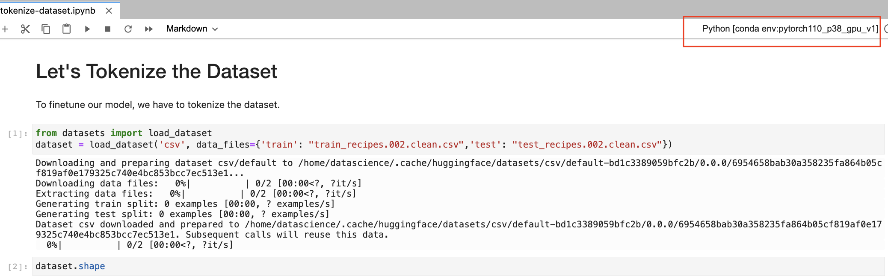
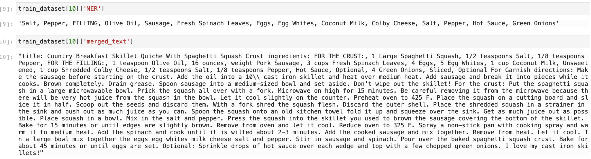

# Tokenize the Dataset

## Introduction

In this lab, we are going to tokenize the dataset to prepare it in a format that can be used for tuning the model.

Estimated Time: 15 minutes

### Objectives

In this lab, you will:

* Select a small sample of training and validation datasets
* Tokenize each entry in the training and validation datasets

### Prerequisites

* You have completed the tasks in all of the previous labs

## Task 1: Download the notebook & upload it to your notebook environment

1. Download the following notebook: [tokenize-dataset.ipynb](files/tokenize-dataset.ipynb).
1. Locate the notebook in your download folder and drag it to your notebook environment. Please make sure to navigate to the correct folder (`/hol/`).
1. Once the notebook has been uploaded, right click it on the left to open it in your environment. We've added comments to the cells to help you better understand the code.

   

## Task 2: Make sure the right kernel is selected

1. Please make sure that you have the conda environment that we have prepared in the first lab, selected.

   

## Task 3: Execute the cells in the notebook to tokenize the dataset

1. You can execute a cell by clicking on the cell and pressing Shift + Enter.  Alternatively, you can click on the cell, go to the Run tab and select Run Selected Cells or Run All Cells.

2. We are going to load the training and testing dataframes.  We want to first see how the training the model goes with a smaller dataset.  Training is going to be faster with a smaller dataset.   We are going to randomly select 5000 recipes from the training dataset for tuning and randomly select 500 recipes from the testing dataset for validation.

   

3. The column `NER` is the food items for each recipe.  Our model should learn from the food items provided and generate the recipe instruction.  The column `merged_text` is the `target` of our model, what our model would be able to generate based on the input food items.

   

4. The model we are tuning is called [T5](https://huggingface.co/docs/transformers/model_doc/t5) which has several versions that vary on the number of parameters.  We are going to choose the T5-base model.  This model has a wrapper from the [HuggingFace](https://huggingface.co/) library.

   

5. We are going to tokenize the dataset which means to transform the text data into a form that the model can use .  The T5 model comes with its own tokenizer, which creates a mapping of text to numbers.   We have a helper function `tokenize_dataset` that will do so.  First, we are creating a text prompt `generate recipe` and add the list of food items for each recipe.  That becomes our input text.  The target of the model is the corresponding `merged_text`. We will take each input, tokenize it and create a tokenized output called `input_tokenized`  We will do the same for our target and create a a tokenized target called `target_tokenized`.  The HuggingFace documentation recommends replacing the padding token IDs of the labels with
-100.  The helper function returns `input_ids`, `attention_mask` and `labels` which are the items that many Large Language Models expect for training inputs.

   

6. We can look at what an entry in the training dataset looks like after it has been tokenized.

   

7. Scroll down to the last sections of the notebook to observe the code which saves the tokenized dataset.

You may now **proceed to the next lab**.

## **Acknowledgements**

* **Authors** - Lyudmil Pelov, Wendy Yip, Yanir Shahak
