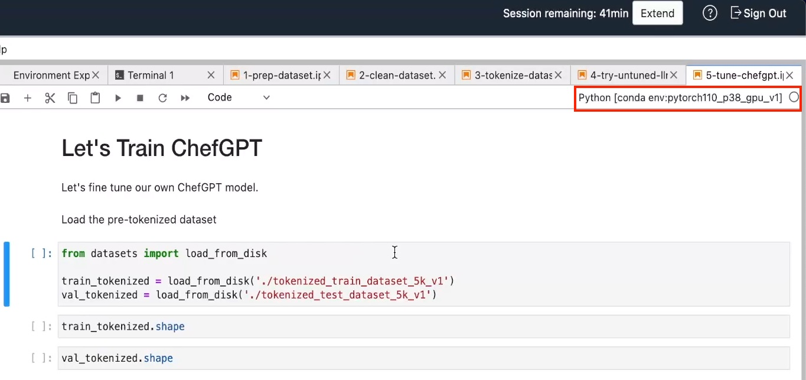
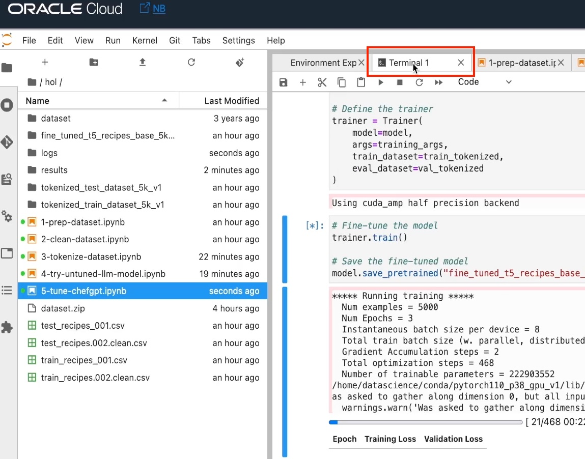
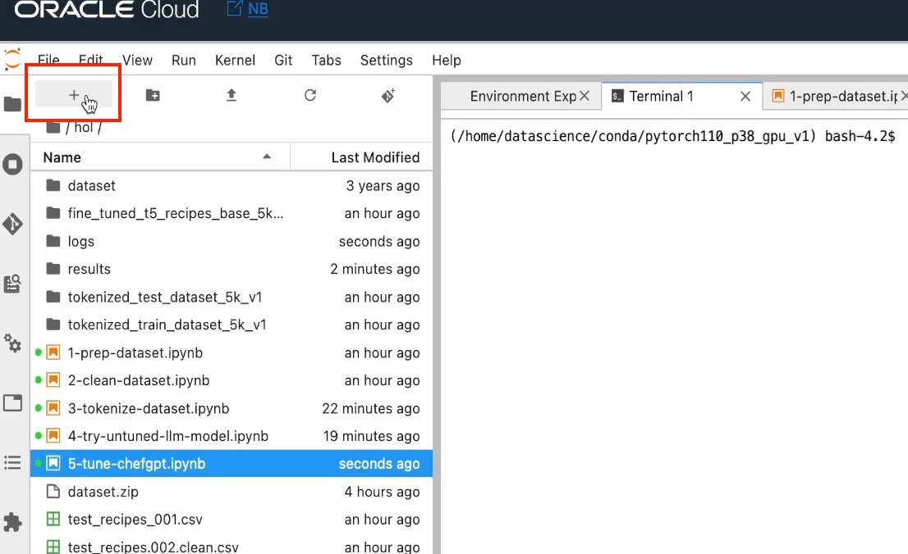
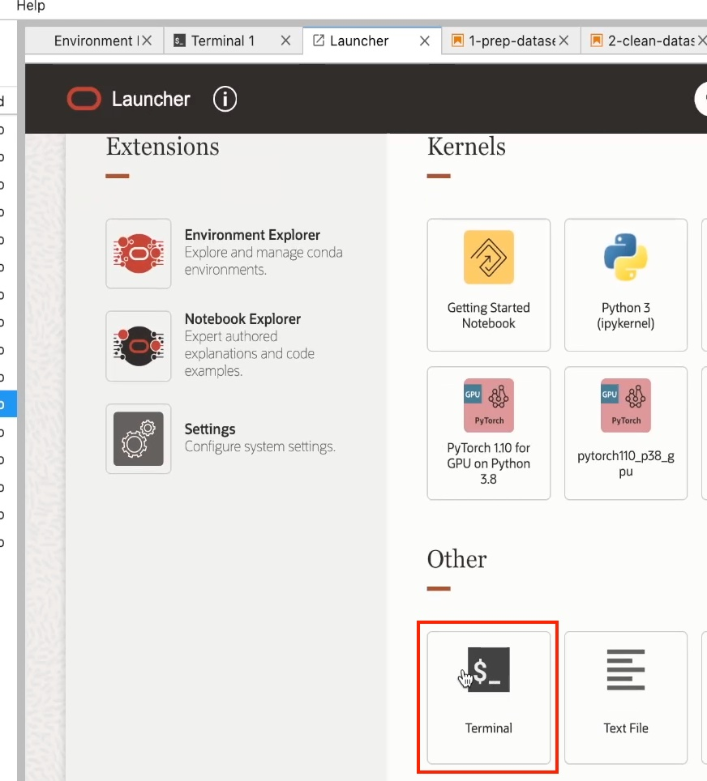
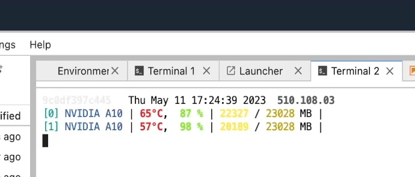
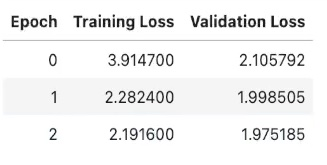
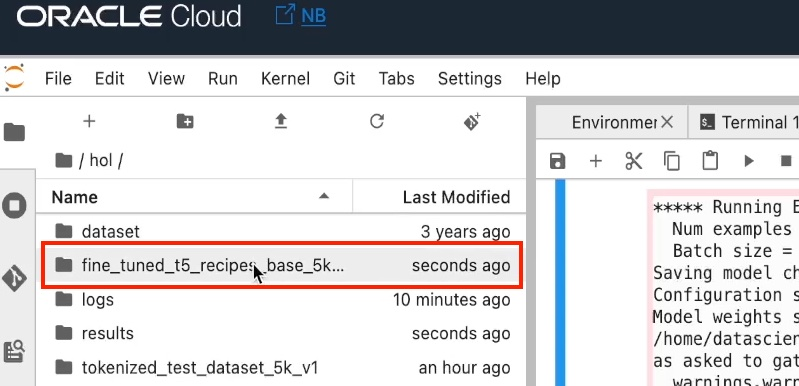
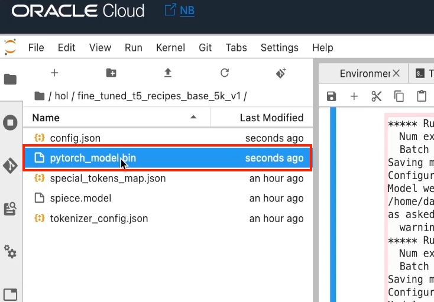

# Tune our ChefGPT

## Introduction

Now that our dataset is clean and tokenized, and we've seen how the untuned t5 model is performing, let's train our own chef GPT model using 5,000 recipes available in our training dataset.

Estimated Lab Time: -- 20 minutes

### Objectives

In this lab, you will:

* Load the model in it's untuned state
* Observe the various parameters which can be used in the training process
* Execute the training process
* Observe the various training stages

## Task 1: Please make sure the right kernel is selected

Please make sure that you have the Conda environment that we have prepared in the first lab, selected.


## Task 2: Load the code

Copy the following code to the editor:

```ipynb
# Let's Train ChefGPT

Let's fine tune our own ChefGPT model.
Load the pre-tokenized dataset
from datasets import load_from_disk

train_tokenized = load_from_disk('./tokenized_train_dataset_5k_v1')
val_tokenized = load_from_disk('./tokenized_test_dataset_5k_v1')
```

```ipynb
train_tokenized.shape
```

```ipynb
val_tokenized.shape
```

```ipynb
## Let's Train
from transformers import T5ForConditionalGeneration, T5Tokenizer, T5Config, TrainingArguments, Trainer
```

```ipynb
# Configure the model
config = T5Config.from_pretrained('t5-base')

# Initialize the model
model = T5ForConditionalGeneration.from_pretrained('t5-base', config=config)
# Disable caching for the model, prevents cache error message during the training!
model.config.use_cache = False
```

```ipynb
# Configure training arguments / A10 dual conform
# as per https://huggingface.co/docs/transformers/model_doc/t5#training
training_args = TrainingArguments(
    output_dir='./results',
    num_train_epochs=3,
    per_device_train_batch_size=8,
    per_device_eval_batch_size=8,
    evaluation_strategy='epoch',
    save_strategy='epoch',
    logging_strategy='epoch',
    logging_dir='./logs',
    gradient_accumulation_steps=2,
    learning_rate=1e-4,
    warmup_steps=100,
    weight_decay=0.01,
    fp16=True,
    load_best_model_at_end=True,
    optim="adamw_torch",
    adam_beta1=0.85
)

# Define the trainer
trainer = Trainer(
    model=model,
    args=training_args,
    train_dataset=train_tokenized,
    eval_dataset=val_tokenized
)
```

```ipynb
# Fine-tune the model
trainer.train()

# Save the fine-tuned model
model.save_pretrained("fine_tuned_t5_recipes_base_5k_v1")
```

* In the first cell, we are going to load the tokenized training dataset.
The second and third cells will print the sizes of the training and evaluation datasets.

* In the fourth and fifth cells we are loading the model using the same wrappers used in previous labs.
Using those wrappers we are going to tune the entire model using the loaded dataset. Since the model is not very large, this is not
going to take a long time.

* In the sixth cell, the training parameters are set while using the `TrainingArguments` and `Trainer` wrappers from the HuggingFace Transformers library.
The training arguments were taken directly from the HuggingFace T5 model training documentation.
The values for the parameters were selected to leverage the performance characteristics of the GPU shape we are using in this lab (dual A10 GPUs).

* In the seventh cell, we are going to execute the training process as well as save the results to a local file.

## Task 3: Execute the code

Please load the cells in their order of appearance to execute the code and observe the result.
After the last cell start executing, you will see some high level information, like the number of examples, the number of epochs, how many training steps per epoch, and how much time the training is going to take.
In our case, this should take less than 10 minutes.

## Task 4: Monitor the execution

If you'd like to see the GPU utilization:

Click on the terminal tab:


If you do not have a terminal tab open, click on the plus icon on the top left:


And the in the `Launcher` page, select `Terminal` under the `Other` section:


Once the terminal window opens, type the following command:

```bash
<copy>gpustat -i</copy>
```

You should see an output similar to this;


The memory utilization should be close to 100% which means that we have selected an optimal batch size.

Click on the notebook tab and wait for the training process to complete.
The `Training Loss` & `Validation Loss` should both report lower values with each training epoch.
Otherwise, we will need to update the regularization techniques used to yield better results.

Here's an example of how the expected results should look like:


## Task 5: Observe the saved model

One the model was done training, you can observe the saved file by clicking the the `fine_tuned_t5_recipes_base_5k` folder:


The model should appear like so:

