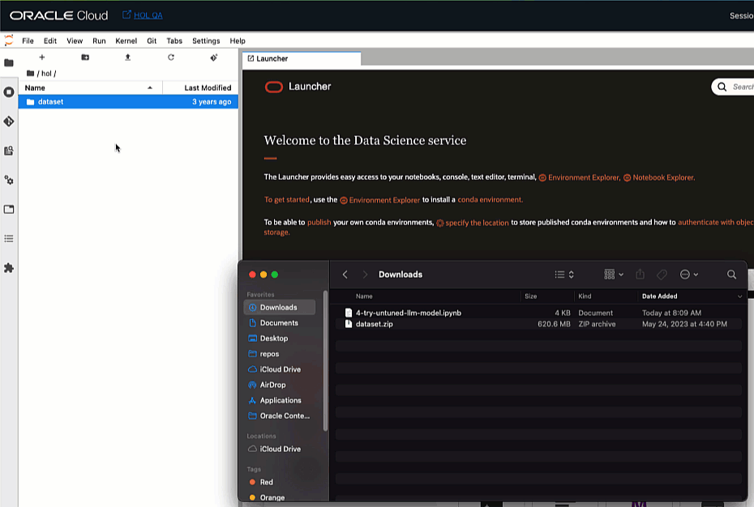

# Tune our ChefGPT

## Introduction

Now that our dataset is clean and tokenized, and we've seen how the untuned t5 model is performing, let's train our own chef GPT model using 5,000 recipes available in our training dataset.

Estimated Lab Time: -- 20 minutes

### Objectives

In this lab, you will:

* Load the model in it's untuned state
* Observe the various parameters which can be used in the training process
* Execute the training process
* Observe the various training stages

## Task 1: Download the notebook & upload it to your notebook environment

* Download the following notebook: [5-tune-chefgpt.ipynb](files/5-tune-chefgpt.ipynb).
* Locate the notebook in your download folder and drag it to your notebook environment. Please make sure to navigate to the correct folder.
* Once the notebook has been uploaded, right click it on the left to open it in your environment. We've added comments to the cells to help you better understand the code.



## Task 2: Make sure the right kernel is selected

Please make sure that you have the Conda environment that we have prepared in the first lab, selected.


## Task 3: Execute the code

Execute the cells one-by-one and observe the result.

## Task 4: Monitor the execution

If you'd like to see the GPU utilization during training:

Click on the terminal tab:


If you do not have a terminal tab open, click on the plus icon on the top left:


And the in the `Launcher` page, select `Terminal` under the `Other` section:


Once the terminal window opens, type the following command:

```bash
<copy>gpustat -i</copy>
</copy>
```

You should see an output similar to this;


The memory utilization should be close to 100% which means that we have selected an optimal batch size.

Click on the notebook tab and wait for the training process to complete.
The `Training Loss` & `Validation Loss` should both report lower values with each training epoch.
Otherwise, we will need to update the regularization techniques used to yield better results.

Here's an example of how the expected results should look like:


## Task 5: Observe the saved model

One the model was done training, you can observe the saved file by clicking the the `fine_tuned_t5_recipes_base_5k` folder:


The model should appear like so:

