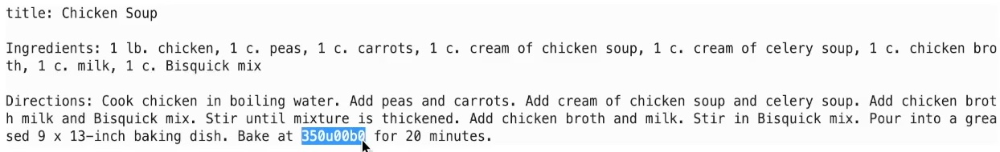

# Tune our ChefGPT

## Introduction

Now that we have a tuned model, let's test it.

Estimated Lab Time: -- 20 minutes

### Objectives

In this lab, you will:

* Load the tuned model
* Use several techniques to prompts the model for recipes
* Observe the results

## Task 1: Load the code

Copy the following code to the editor. Each code section should be placed in a different cell:

```ipynb
<copy>
# Let's try the ChefGPT

# Let's try our newly trained model and see how well it performs
# from transformers import T5ForConditionalGeneration, T5Tokenizer

model = T5ForConditionalGeneration.from_pretrained("fine_tuned_t5_recipes_base_5k_v1")
tokenizer = T5Tokenizer.from_pretrained("fine_tuned_t5_recipes_base_5k_v1")
</copy>
```

```ipynb
<copy>
# Let's setup our food items
food_items = "chicken, peas, carrots, cream of chicken soup, cream of celery soup, chicken broth, milk, Bisquick mix"
</copy>
```

```ipynb
<copy>
# For more information about the different settings visit: https://huggingface.co/blog/how-to-generate
def generate_recipe_v1(prompt):
    input_text = f"generate recipe: {prompt}"
    input_ids = tokenizer.encode(input_text, return_tensors="pt")
    output_ids = model.generate(input_ids, max_length=512, num_return_sequences=1)
    output_text = tokenizer.decode(output_ids[0], skip_special_tokens=True)
    return output_text
</copy>
```

```ipynb
<copy>
recipe = generate_recipe_v1(food_items)
s = recipe.replace("ingredients:", "\n\nIngredients:").replace("directions:", "\n\nDirections:")
print(s)
</copy>
```

```ipynb
<copy>
generation_kwargs_v3 = {
    "max_length": 512,
    "do_sample": True,
    "top_k": 50,
    "top_p": 0.95,
    "num_return_sequences": 3
}

def generate_recipe_v3(prompt):
    input_text = f"generate recipe: {prompt}"
    input_ids = tokenizer(input_text, return_tensors="pt", padding='max_length', truncation=True, max_length=512).input_ids
    output_ids = model.generate(input_ids, **generation_kwargs_v3)
    output_text = tokenizer.decode(output_ids[0], skip_special_tokens=True)
    return output_text

recipe = generate_recipe_v3(food_items)
s = recipe.replace("ingredients:", "\n\nIngredients:").replace("directions:", "\n\nDirections:")
print(s)
</copy>
```

```ipynb
<copy>
generation_kwargs_v4 = {
    "max_length": 512,
    "min_length": 64,
    "no_repeat_ngram_size": 3,
    "do_sample": True,
    "top_k": 60,
    "top_p": 0.95
}

def generate_recipe_v4(prompt):
    input_text = f"generate recipe: {prompt}"
    inputs = tokenizer(
        input_text,
        max_length=512,
        padding="max_length",
        truncation=True,
        return_tensors="pt"
    )

    input_ids = inputs.input_ids
    attention_mask = inputs.attention_mask

    output_ids = model.generate(
        input_ids=input_ids,
        attention_mask=attention_mask,
        **generation_kwargs_v4
    )
    output_text = tokenizer.decode(output_ids[0], skip_special_tokens=True)
    return output_text

recipe = generate_recipe_v4(food_items)
s = recipe.replace("ingredients:", "\n\nIngredients:").replace("directions:", "\n\nDirections:")
print(s)
</copy>
```

```ipynb
<copy>
## Using Pipelines
from transformers import pipeline
from transformers import T5ForConditionalGeneration, T5Tokenizer

model = T5ForConditionalGeneration.from_pretrained("fine_tuned_t5_recipes_base_5k_v1")
tokenizer = T5Tokenizer.from_pretrained("fine_tuned_t5_recipes_base_5k_v1")

generator = pipeline(model=model, tokenizer=tokenizer, task="text2text-generation")
</copy>
```

```ipynb
<copy>
food_items = "chicken, peas, carrots, cream of chicken soup, cream of celery soup, chicken broth, milk, Bisquick mix"

tokenizer_kwargs = {
    "max_length": 512,
    "do_sample": True,
    "top_k": 60,
    "top_p": 0.95,
    "num_return_sequences": 2
}

response = generator(f"generate recipe: {food_items}", **tokenizer_kwargs)

print(response[0]['generated_text'].replace("ingredients:", "\n\nIngredients:").replace("directions:", "\n\nDirections:"))
</copy>
```

* In the first cell we are going to use the same T5 wrapper used in previous labs, only this time, we are going to load the trained model by referencing the `fine_tuned_t5_recipes_base_5k_v1` folder (which is where we saved the trained model in the previous lab). We do the same for the tokenizer.

* In the second cell we specify some food items which will be used in our recipe prompt.

* In the third cell we define a function which accepts a food items list as text, builds a prompt and calls the `generate` function on the model to generate the recipe. There are several ways to use the `generate` functions and we are going to try a few of those in this lab. If you would like to learn more about the various options, please refer to: [https://huggingface.co/blog/how-togenerate](https://huggingface.co/blog/how-togenerate).

* The fourth cell will call our function to generate a recipe using the food items list declared in the second cell, and print the result.

* Cells five and six are variations on the code in cell three where we use different parameters to control the output of the `generate` function.

* In the seventh cell we showcase the use of the `pipeline` wrapper of the `transformers` library. We load the tuned model by specifying the `fine_tuned_t5_recipes_base_5k_v1` folder where the tuned model was saved. In the call to the `pipeline` function, we specify `text2text-generation` as the value to the `task` parameter since T5 is a sequence to sequence LLM.

* In the eighth cell we specify a food items list, set values for some of the possible parameters and use the `generator` function with our prompt and parameters.

## Task 3: Execute the code & observe the results

Please execute the cells in their order of appearance and observe the result.
After executing the fourth cell, you should see an output which looks a lot like a recipe.
The result is far from perfect but it is distinctly better than our initial experiments.
You may observe issues like the following:


Here, the unicode value for the "degrees" symbol shows as a hexadecimal number instead of the actual symbol.
Such issues are likely to occur in the absence of a "cleanup" step. This is part of the normal progressive process of fine-tuning our models and datasets. Using small datasets allows us to quickly observe training results, make sure we are on the right path, iterate and improve before we commit to training on large datasets which could require significant resources and time investments.
In the cleanup set, we could easily convert the degree symbol to F or C for better result.

Execute the `v3`, `v4` and `pipeline` variations and observe the difference to the output.
No version is going to be perfect at the moment as the LLM itself is small and so was out training dataset, but you can see how we can control the output using the available parameters.

At this point we could consider training our model on a larger dataset in order to improve the results. We could also consider using a large LLM.