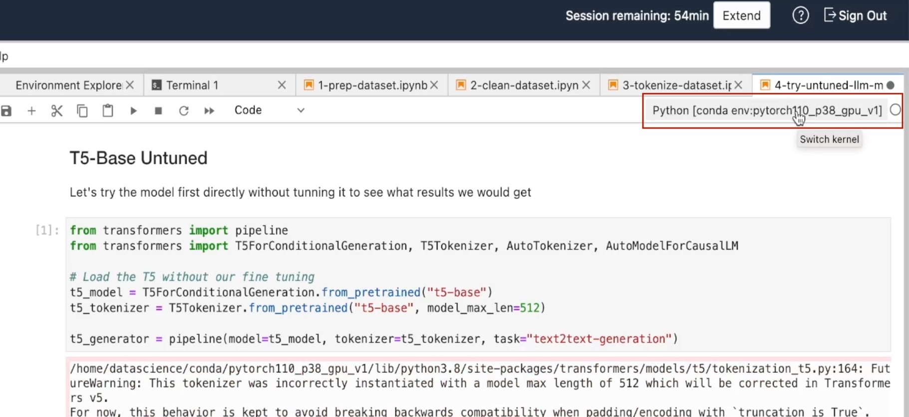
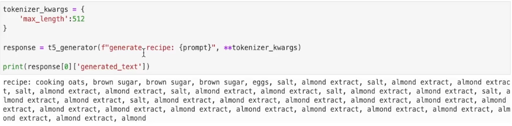

# Try The Untuned LLM Model

## Introduction

Before we go and start tuning our model. We want to know how well the T5 based model is going to perform without tuning. What we're going to do is load the model and generate some recipes based on the out-of-the-box T5 base-model.

Estimated Time: 5 minutes

### Objectives

In this lab, you will:

* Test the untuned LLM model to asses it's performance.

### Prerequisites

* You have completed the tasks in all of the previous labs

## Task 1: Download the notebook & upload it to your notebook environment

1. Download the following notebook: [try-untuned-llm-model.ipynb](files/try-untuned-llm-model.ipynb).
1. Locate the notebook in your download folder and drag it to your notebook environment. Please make sure to navigate to the correct folder (`/hol/`).
1. Once the notebook has been uploaded, right click it on the left to open it in your environment. We've added comments to the cells to help you better understand the code.

   

## Task 2: Make sure the right kernel is selected

1. Please make sure that you have the Conda environment that we have prepared in the first lab, selected.
  

## Task 3: Execute the code & observe the results

1. Execute the cells one-by-one and observe the result. If everything went to plan, you should see a result similar to the following:

   

   As you can see, the untrained model has returned the food items directly and is not capable of generating recipes. This model is not trained, and, even if it had seen some recipes in the dataset, it was not trained for generating them. We're going to tune the model for this one specific task, which would be easier than trying to train a generic model capable of performing many tasks.

## **Acknowledgements**

* **Authors** - Lyudmil Pelov, Wendy Yip, Yanir Shahak
