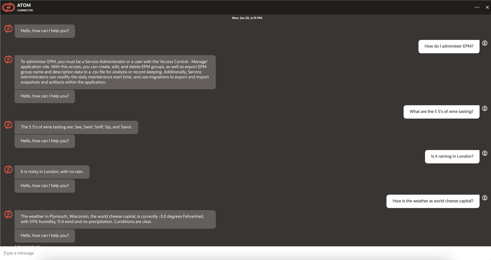

# Introduction

## About this Workshop

This workshop helps to configure and deploy a cutting-edge chatbot solution utilizing a multi-agent architecture to revolutionize conversational AI.
Each Agent/API brings unique capabilities, combining to create an intelligent and versatile system.

Using this workshop, the developers can create multiple OCI Generative AI RAG Agents (connected to OCI Object Storage or OCI Autonomous Database 23ai) and different APIs (connecting through OCI Integration Cloud Service - OIC), and expose them to a OCI Generative AI Tools-powered OCI Digital Assistant (ODA) Chatbot.

When the user asks question in natural language, then the ODA Chatbot leverages Generative AI Tools to dynamically orchestrate and route the user’s request to appropriate Generative AI RAG Agent or OIC API, and thereby fetches the correct response to user’s question.

This solution implements OCI Generative AI Multi-step Tool, so it also supports tool-calling in a sequence. The output of one tool can be the input to another tool.

This multi-agent approach offers a powerful and flexible framework for developers to create next-generation conversational AI applications, catering to a wide range of user needs.

Estimated Workshop Time: 5 hours

### Objectives

Objective of this workshop is to set-up the required OCI services to create a Multi Agent/API Chatbot solution.

* OCI Generative AI Agent Service – Users can configure OCI Generative AI Agent Service (create and configure Knowledge Bases and Agents).
Users can then ingest and perform RAG on the user’s documents in Object Storage or 23ai database, using OCI Generative AI Agent Service.
* OCI Integration Cloud (OIC) - Users can use Oracle Integration Cloud to pull a city's weather information leveraging Weather API
* OCI Digital Assistant (ODA) – Users can create ODA Digital Assistance and import the provided ODA Skills for Generative AI Agents and OIC APIs.
Users can then connect from ODA chatbot and get responses of their natural language questions.
* OCI Visual Builder (VB) ATOM Application – User can create OCI Visual Builder (VB) instance and import ATOM VB web application.
Users can then embed the ODA chatbot in ATOM VB application, and interact with the ODA Chatbot

In this workshop, you will learn how to:

* Create Object Storage Bucket, and upload custom PDF documents in that bucket.
* Setup & configure Generative AI RAG Agent Service (Knowledge Bases and Agents) connected to that Object Storage Bucket.
* Create Autonomous Database 23ai and upload vectorized document content in the database.
* Setup & configure Generative AI RAG Agent Service (Knowledge Bases and Agents) connected to that Autonomous Database 23ai.
* Setup & configure Oracle Integration Cloud to integrate with Weather API.
* Setup & configure Oracle Digital Assistant (ODA) as an OCI Generative AI powered chatbot.
* Setup & configure Visual Builder as a frontend channel for ODA.
* Test out the features and capabilities of this Visual Builder application.

### Prerequisites

This lab assumes you have:

* An Oracle Cloud Account
* Access to OCI Generative AI Agents
* Access to OCI Integration Cloud (OIC)
* Access to OCI Digital Assistant (ODA)
* Access to OCI Visual Builder (VB)
* Access to a Region where the Generative AI Agent service is available: Chicago, Frankfurt
* Must have an Administrator Account or Permissions to manage several OCI Services: Generative AI Agents, Digital Assistant, Visual Builder, 23ai database, Object Storage, Integration Cloud, OCIR, Network, Dynamic Groups, Policies, IDCS/Identity Domain Confidential Applications, Resource Manager
* Familiarity with Oracle Cloud Infrastructure (OCI) is helpful

## Learn More

* [What Is Generative AI? How Does It Work?](https://www.oracle.com/artificial-intelligence/generative-ai/what-is-generative-ai/)
* [What Is Retrieval-Augmented Generation (RAG)?](https://www.oracle.com/artificial-intelligence/generative-ai/retrieval-augmented-generation-rag/)
* [Overview of Generative AI Service](https://docs.oracle.com/en-us/iaas/Content/generative-ai/overview.htm)
* [Overview of Generative AI Agents Service](https://docs.oracle.com/en-us/iaas/Content/generative-ai-agents/overview.htm)
* [Overview of Oracle Integration](https://docs.oracle.com/en-us/iaas/application-integration/doc/overview.html)
* [Overview of Digital Assistants and Skills](https://docs.oracle.com/en-us/iaas/digital-assistant/doc/overview-digital-assistants-and-skills.html)
* [Overview of Visual Builder](https://docs.oracle.com/en-us/iaas/visual-builder/doc/oracle-visual-builder.html)
* [Oracle Digital Assistant's large language model integration](https://docs.oracle.com/en/cloud/paas/digital-assistant/use-chatbot/llm-blocks-skills.html)

## Acknowledgements

* **Author**
    * **Kaushik Kundu**, Master Principal Cloud Architect, NACIE
    * **Abhinav Jain**, Senior Cloud Engineer, NACIE

* **Contributors**
    * **Luke Farley**, Staff Cloud Engineer, NACIE
    * **Nisith Apurb**, Principal Cloud Architect, NACIE

* **Last Updated By/Date**
    * **Kaushik Kundu**, Master Principal Cloud Architect, NACIE, January 2025
