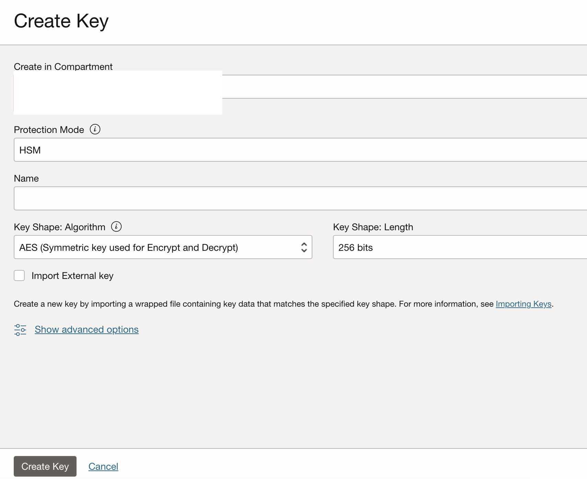
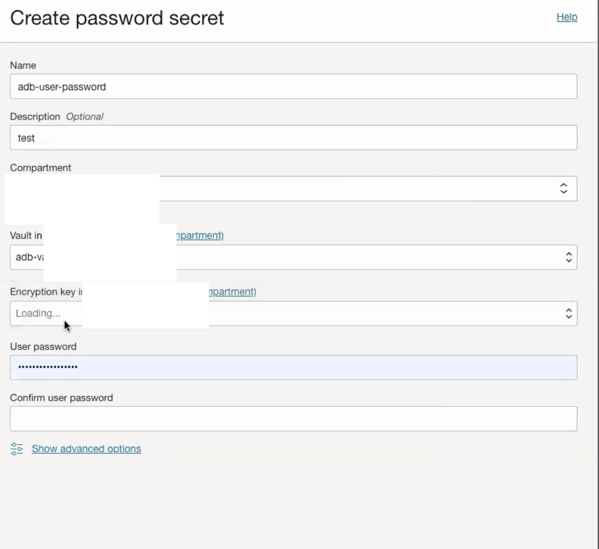
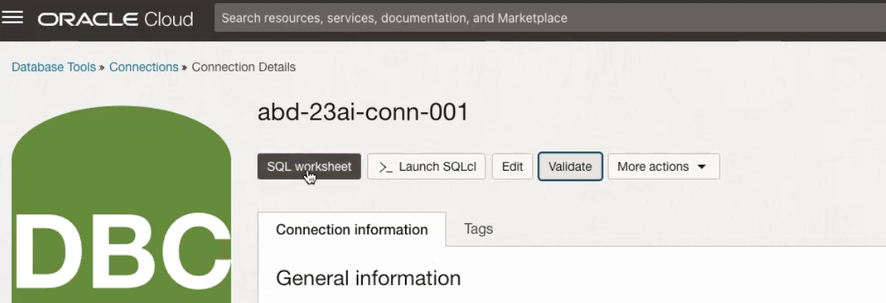
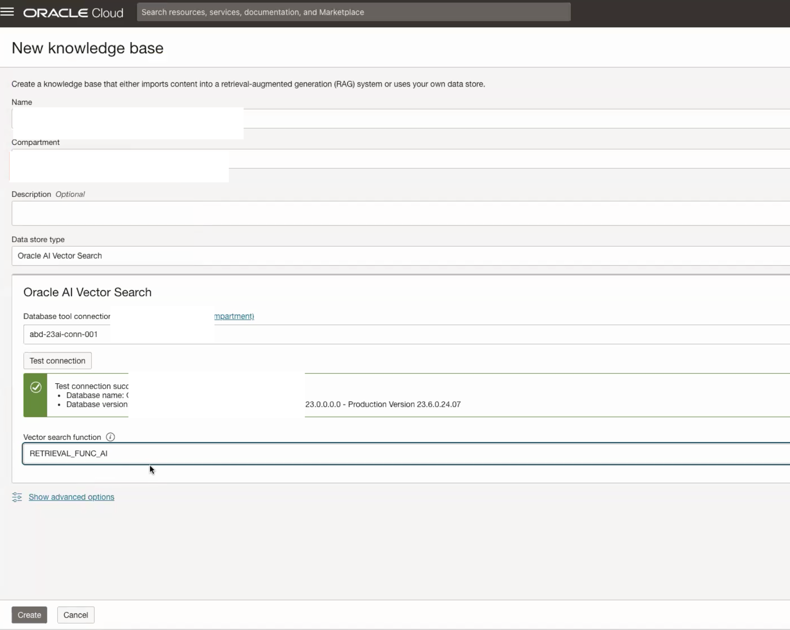

# Lab 2: Provision Generative AI Agent based on ADB 23ai

## Introduction

This lab will take you through the steps needed to provision Oracle Autonomous Database 23ai and Database Tools Connection. We will upload the EPM Administration document using sql to 23ai, then reference the new agent in a later lab.

Estimated Time: 60 minutes

### About Oracle ADB 23ai

Oracle Database 23ai is the next long-term support release of Oracle Database. It includes over 300 new features with a focus on artificial intelligence (AI) and developer productivity. Oracle AI Vector Search is designed for Artificial Intelligence (AI) workloads and allows you to query data based on semantics, rather than keywords.
This feature provides a built-in VECTOR data type that enables vector similarity searches within the database.
With a built-in VECTOR data type, you can run run AI-powered vector similarity searches within the database instead of having to move business data to a separate vector database.

### Objectives

In this lab, you will:

* Provision an Oracle ADB 23ai
* Create DB Tools Connection
* Create a vector table and load data
* Create vector search function
* Create Generative AI Agent - Knowledge base
* Create Generative AI Agent

### Prerequisites

This lab assumes you have:

* All previous labs successfully completed
* Must have an Administrator Account or Permissions to manage several OCI Services: Oracle Databases, Networking, Policies, Oracle ADB, Generative AI Agents.
* Access to a Region where the Agent service is available: Chicago, Frankfurt

## Task 1: Dynamic Group and Policy Definition

This task will help you ensure that the Dynamic Group and Policy are correctly defined.

1. Locate Domains under Identity & Security

    

2. Click on your current domain name

    

3. Click on Dynamic Groups, and then your Dynamic Group name e.g. **genaiagentdg**

    

4. Ensure that your Dynamic Group is properly defined - as follows. Then click on Identity

    

5. Click on Policies, ensure that you are in your "root" compartment, then create a new Policy e.g. **policyforgenaiagentvector**

    

    **Note** The name of your policy can be different.

6. Ensure that your Policy is properly defined - as follows.

    

    **Assuming genaiagentgd is name of dynamic group**
    ```
    allow dynamic-group genaiagentdg to read database-tools-family in compartment <compartment-name>
    allow group Administrators to manage genai-agent-family in tenancy <tenancy-name>
    allow group Administrators to manage object-family in compartment <compartment-name>
    allow dynamic-group genaiagentdg to read secret-bundle in compartment <compartment-name>
    ```

    **Note** If you are using a non-default identity domain - then instead of of just indicating the dynamic group name, you need to indicate domain-name/group-name in the policy statements.

## Task 2: Create VCN and private subnet

This task will help you to create a VCN and private subnet in your compartment.

1. Go to Networking -> Virtual cloud networks and Create VCN. Provide IPv4 CIDR Blocks as 10.0.0.0/16

2. Go to the newly created VCN and click on Create Subnet. Provide IPv4 CIDR Block as 10.0.1.0/24 and click on Private Subnet. You can leave rest as default. Click on Create Subnet.

3. Click on newly created subnet and go to the Security List. Add following ingress rules in the security list. Make sure to have the ingress rule to access database port 1521-1522

    

## Task 3: Create Vault to store database secrets

This task will help you to create vault which would be used to save secrets for the database

1. Locate Vault under Key Management & Secret Management. Provide Name e.g. **genaiagentvault** and click on Create Vault.

    

2. Go to the newly created Vault. Click on Create Key.

3. Provide Name e.g. **genaiagentkey** and leave rest as default. Choose Protection Mode as HSM and click on Create Key.

    

## Task 4: Create Autonomous Database

This task involves creating Autonomous Database 23ai.

1. Locate Autonomous Databases under Oracle Databases. Click on Create Autonomous Database.

    

2. Provide information for Compartment, Display name, Database name. Choose workload type as Data Warehouse. Choose deployment type as Serverless. Choose database version as 23ai and give it a password of your preference.

3. Make sure to select the Network Access: Private Endpoint access only, and select the VCN and subnet mentioned in above section. Also, do not check  Require mutual TLS (mTLS) authentication.

    

4. Finally provide a valid email ID and click on Create Autonomous Database.

## Task 5: Create Database Tools Connection

This task involves creating a Database Tools Connection which will be used to query the database using SQL Worksheet.

1. Locate Database Tools Connections under Developer Services. Click on Create connection.

    

2. Provide Name and Compartment information. Choose Oracle Autonomous Database as Database cloud service. Provide Username as admin.

3. Click on Create password secret. Provide Name, Vault and Key createdin Task 3. Provide same password used at the time of ADB creation in previous task.

    

4. Use the newly created password secret as User password secret.

5. Copy the connection string from your autonomous database. Go to ADB and click on database connection and copy any of the low, medium or high connection strings as shown below,

    

6. Modify the connection string with the following: Reduce retry_count form 20 to 3; Replace host with private ip address. You can get Private IP address from the autonomous database as shown below.

    

7. Click on Create private endpoint. Provide Name and private subnet created in Task 1.

    

8. Choose newly created private endpoint as Private Endpoint.

9. Choose Wallet format as None in SSO details.

10. Click on Create to create a database tools connection.

    

11. Go to newly create Database Tools connection. Click on Validate.

    

# Load vector data in ADB using sql

This section will take you through the steps needed to load data and create a vector search function in your ADB 23ai. 

## Oracle 23ai Prerequisites

The user must have the Oracle 23ai Database with the following components:

* Table: Used to store records with 'docid', 'body', and 'vector'.
* Database Function: Provides vector search results against the provided query.

### Table

The table should have the following required fields:

* 'docid': The record or document ID.
* 'body': The content used for the search.
* 'vector': The vector generated from an embedding model based on the 'body' content.

Optional fields include:

* 'chunkid': The chunk ID for the same 'docid' in case of large content.
* 'url': A URL reference for the content, if available.
* 'title': The title of the body content.

### Function

A function with the following requirements:

* Return Type: 'SYS_REFCURSOR'
* Input Parameters:
  * 'p_query' (query string)
  * 'top_k' (number of top results)The embedding model used for the query string should be the same as the one used for embedding the 'body' field. The return fields should match the table's required (DOCID, BODY and SCORE) and optional fields (CHUNKID, TITLE, and URL)

Note: Names can vary but must be aliased as follows in the function.

This is a high level overview. We will go through the implementation in the following tasks.

## Task 6: Run SQL statements to create a vector table

1. Go to your Database connection created in Task 5. Click on SQL worksheet and run the following code blocks one by one.

    

2. First code block is for Access Control List to let user go out everywhere. This is required for ADB user to access Bucket public link and GenAI Embedding model. It's not required for Oracle Base Database.

     ```text
       <copy>
       -- ACL to let user go out everywhere (host =>'*'), it's not required for Oracle Base Database.
       begin
        -- Allow all hosts for HTTP/HTTP_PROXY
        dbms_network_acl_admin.append_host_ace(
            host =>'*',
            lower_port => 443,
            upper_port => 443,
            ace => xs$ace_type(
            privilege_list => xs$name_list('http', 'http_proxy'),
            principal_name => upper('admin'),
            principal_type => xs_acl.ptype_db)
        );
        end;
        /
       </copy>
    ```

3. Create the credentials to access OCI GenAI service. Check and find the credential information below with your information.

    * user ocid: You can find under Profile -> My Profile when you click the top right section of OCI console.
    * tenancy ocid: You can find under Profile -> tenancy when you click the top right section of OCI console.
    * compartment ocid: Go to your compartment under Identity and copy compartment ocid
    * private_key
    * fingerprint

    For private key and fingerprint go to Profile -> My Profile when you click the top right section of OCI console. Click on API Keys under Resources and add an API Key

    

4. DBMS_CLOUD credentials: (Important Note: Put the private key all on a single line.)

     ```text
       <copy>
       -- DBMS_CLOUD credentials
       -- Some examples are based on DBMS_CLOUD, that is included in Autonomous DB.
       -- If you need to install it (for example on Base Database) you can refer to: https://support.oracle.com/knowledge/Oracle%20Cloud/2748362_1.html
       begin
            DBMS_CLOUD.CREATE_CREDENTIAL (
                credential_name => 'OCI_CRED_BUCKET',
                user_ocid       => 'ocid1.user.oc1..aaaaaaaaa2...',
                tenancy_ocid    => 'ocid1.tenancy.oc1..aaaaaaaa...',
                private_key     => 'MIIEvgI...RpV',
                fingerprint     => '0f:df...1d:88:d6'
            );
        end;
        /
       </copy>
    ```

5. Credentials for GenAI OCI

     ```text
       <copy>
       declare
            jo json_object_t;
       begin
            jo := json_object_t();
            jo.put('user_ocid','ocid1.user.oc1..aaaaaaaaa2...');
            jo.put('tenancy_ocid','ocid1.tenancy.oc1..aaaaaaaa...');
            jo.put('compartment_ocid','ocid1.tenancy.oc1..aaaaaaaa...');
            jo.put('private_key','MIIEvgI...RpV');
            jo.put('fingerprint','0f:df...1d:88:d6');
            dbms_vector.create_credential(
                credential_name   => 'OCI_CRED',
                params            => json(jo.to_string)
            );
        end;
        /
       </copy>
    ```

6. Run the following to test: - this should return vector embedding for "hello"

     ```text
       <copy>
       SELECT
            dbms_vector.utl_to_embedding(
                'hello',
                json('{
                    "provider": "OCIGenAI",
                    "credential_name": "OCI_CRED",
                    "url": "https://inference.generativeai.us-chicago-1.oci.oraclecloud.com/20231130/actions/embedText",
                    "model": "cohere.embed-multilingual-v3.0"
                }')
            )
        FROM dual;
       </copy>
    ```

7. Create a table from a PDF file. Please upload the PDF file to a storage bucket and get the Pre-Authenticated Request link to access the PDF file.

    * Upload the following PDF file to a storage bucket.
        * [EPM Admin Access Control](https://objectstorage.us-chicago-1.oraclecloud.com/n/idb6enfdcxbl/b/Excel-Chicago/o/Livelabs%2Fgenai-multi-agent%2FEPM_Administering%20Access%20Control%20for%20Oracle%20Enterprise%20Performance%20Management%20Cloud.pdf)
    * Get the Pre-Authenticated Request link to access the PDF file.
    * Divide the BLOB into chunks using 'utl to chunks'. Adjust the chunk settings according to your needs. For more details, check this link: [Custom Chunking Specifications](https://docs.oracle.com/en/database/oracle/oracle-database/23/vecse/convert-text-chunks-custom-chunking-specifications.html)
    * Use 'utl to text' for further processing. More details can be found here: [UTL TO CHUNKS](https://docs.oracle.com/en/database/oracle/oracle-database/23/arpls/dbms_vector_chain1.html#GUID-4E145629-7098-4C7C-804F-FC85D1F24240)

     ```text
       <copy>
       CREATE TABLE ai_extracted_data AS
       SELECT
            j.chunk_id,
            j.chunk_offset,
            j.chunk_length,
            j.chunk_data
       FROM
            -- divide a blob into chunks (utl_to_chunks):
            (select * from dbms_vector_chain.utl_to_chunks(
                dbms_vector_chain.utl_to_text(
                    to_blob(
                        DBMS_CLOUD.GET_OBJECT('OCI_CRED_BUCKET', '<preauthenticated-url>')
                    )
                ), json('{"max":"75", "normalize":"all", "overlap":"15"}')
            )),
            JSON_TABLE(column_value, '$'
                COLUMNS (
                    chunk_id NUMBER PATH '$.chunk_id',
                    chunk_offset NUMBER PATH '$.chunk_offset',
                    chunk_length NUMBER PATH '$.chunk_length',
                    chunk_data CLOB PATH '$.chunk_data'
                )
            ) j;
       </copy>
    ```

8. Check the table.

    ```text
       <copy>
       select * from ai_extracted_data
       select count(*) from ai_extracted_data
       </copy>
    ```

9. Create a vector table and load data from an existing table: If your existing data hasn't been processed into chunks yet, your chunk size might exceed 512, which would prevent embedding generation. To address this, refer to [Custom Chunking Specifications](https://docs.oracle.com/en/database/oracle/oracle-database/23/vecse/convert-text-chunks-custom-chunking-specifications.html) to convert content to chunk.

    * Create  the vector table from an existing table: For the existing table, there will be at least two columns: one for the record ID to locate each record, and a content column (typically of 'CLOB' data type) for processing vector search.

     ```text
       <copy>
       -- Create vector table from an existing table
       -- There is a quota limit for running the embedding model. For datasets with more than 400 records, we can repeatedly load the data or write a script to load data in batches.
       -- In the following table ai_extracted_data, chunk_id is the record id while chunk_data is the content column.
       create table ai_extracted_data_vector as (
            select chunk_id as docid, to_char(chunk_data) as body, dbms_vector.utl_to_embedding(
                chunk_data,
                json('{
                    "provider": "OCIGenAI",
                    "credential_name": "OCI_CRED",
                    "url": "https://inference.generativeai.us-chicago-1.oci.oraclecloud.com/20231130/actions/embedText",
                    "model": "cohere.embed-multilingual-v3.0"
                }')
            ) as text_vec
            from ai_extracted_data
            where chunk_id <= 400
        )
       </copy>
    ```

10. Load data for datasets with more than 400 records

     ```text
       <copy>
       insert into ai_extracted_data_vector
       select chunk_id as docid, to_char(chunk_data) as body, dbms_vector.utl_to_embedding(
            chunk_data,
            json('{
                "provider": "OCIGenAI",
                "credential_name": "OCI_CRED",
                "url": "https://inference.generativeai.us-chicago-1.oci.oraclecloud.com/20231130/actions/embedText",
                "model": "cohere.embed-multilingual-v3.0"
            }')
            ) as text_vec
        from ai_extracted_data
        where chunk_id > 400
       </copy>
    ```

11. Check the vector table

     ```text
       <copy>
       select * from ai_extracted_data_vector
       select count(*) from ai_extracted_data_vector
       </copy>
    ```

12. Create Function against vector table

    * When returning the results, rename (alias) the record ID as 'DOCID', the content column as 'BODY', and the VECTOR DISTANCE between text vec and query vec as 'SCORE'. These 3 columns are required. If the vector table includes 'URL' and 'Title' columns, rename them (alias) as 'URL' and 'TITLE' respectively.

    * For more details, please check [Vector Distance Functions and Operators](https://docs.oracle.com/en/database/oracle/oracle-database/23/vecse/vector-distance-functions-and-operators.html)

    * For specific information on vector distance, refer to [VECTOR DISTANCE](https://docs.oracle.com/en/database/oracle/oracle-database/23/sqlrf/vector_distance.html#GUID-BA4BCFB2-D905-43DC-87B0-E53522CF07B7)

     ```text
       <copy>
       -- Create function from vector table
       -- When returning the results, rename (alias) the record ID as 'DOCID', the content column as 'BODY', and the VECTOR_DISTANCE between text_vec and query_vec as 'SCORE'. These 3 columns are required. If the vector table includes 'URL' and 'Title' columns, rename them (alias) as 'URL' and 'TITLE' respectively.
       create or replace FUNCTION retrieval_func_ai (
            p_query IN VARCHAR2,
            top_k IN NUMBER
       ) RETURN SYS_REFCURSOR IS
            v_results SYS_REFCURSOR;
            query_vec VECTOR;
       BEGIN
            query_vec := dbms_vector.utl_to_embedding(
                p_query,
                json('{
                    "provider": "OCIGenAI",
                    "credential_name": "OCI_CRED",
                    "url": "https://inference.generativeai.us-chicago-1.oci.oraclecloud.com/20231130/actions/embedText",
                    "model": "cohere.embed-multilingual-v3.0"
                }')
            );

            OPEN v_results FOR
                SELECT DOCID, BODY, VECTOR_DISTANCE(text_vec, query_vec) as SCORE
                FROM ai_extracted_data_vector
                ORDER BY SCORE
                FETCH FIRST top_k ROWS ONLY;

            RETURN v_results;
        END;
       </copy>
    ```

13. Run & check the function

     ```text
       <copy>
       -- Run & check the function
       -- Display the DOCID and SCORE
       DECLARE
            v_results SYS_REFCURSOR;
            v_docid VARCHAR2(100);
            v_body VARCHAR2(4000);
            v_score NUMBER;
            p_query VARCHAR2(100) := 'How to Convert Text String to Embedding?'
            top_k NUMBER := 10;
       BEGIN
            v_results := retrieval_test_func(p_query, top_k);

            DBMS_OUTPUT.PUT_LINE('DOCID | SCORE');
            DBMS_OUTPUT.PUT_LINE('--------|------');

            LOOP
                FETCH v_results INTO v_docid, v_body, v_score;
                EXIT WHEN v_results%NOTFOUND;

                DBMS_OUTPUT.PUT_LINE(v_docid || ' | ' || v_score);
            END LOOP;

            CLOSE v_results;
        END;
       </copy>
    ```

# Create Knowledge base and chat with agent

## Task 7: Create Knowledge Base

This task will help you create a knowledge base using 23ai database as source.

1. Locate Knowledge Bases under Analytics & AI -> Generative AI Agents.

    

2. Click on your Create knowledge base. Provide Name, Data store type as Oracle AI Vector Search, Provide Database tool connection and click on Test connection. Once successful provide the vector search function created in Task 6 or your own vector search function. Lastly, click on create to create the Knowledge base.

    

## Task 8: Create Agent

1. Locate Agents under Analytics & AI -> Generative AI Agents.

    

2. Click on Create Agent. Provide Name, an optional welcome message - Hi I'm 23ai Vector DB RAG Agent. How can I help you? Select the Knowledge base created in previous task. Click on Create.

    

3. In few minutes the status of recently created Agent will change from Creating to Active. Click on "Endpoints" menu item in the left panel and then the Endpoint link in the right panel.

    

4. It’ll open up the Endpoint Screen. **Copy and keep the OCID of the Endpoint**. It’ll be used later. Click on "Launch chat" button

    

## Task 9: Chat with Agent

1. Locate Chat under Analytics & AI -> Generative AI Agents.

    

2. Select agent created in the previous task from the dropdown. Also, select the endpoint associated with that agent. Ask a relevant question depending on information stored in DB and start chatting with the agent.

You may now proceed to the next lab.

## Acknowledgements

* **Authors**
    * **Abhinav Jain**, Senior Cloud Engineer, NACIE
    * **Luke Farley**, Staff Cloud Engineer, NACIE

* **Contributors**
    * **Kaushik Kundu**, Master Principal Cloud Architect, NACIE

* **Last Updated By/Date**
    * **Luke Farley**, Staff Cloud Engineer, NACIE, January 2025
