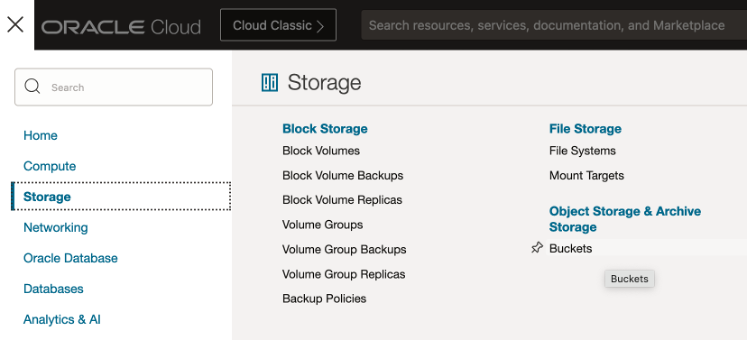
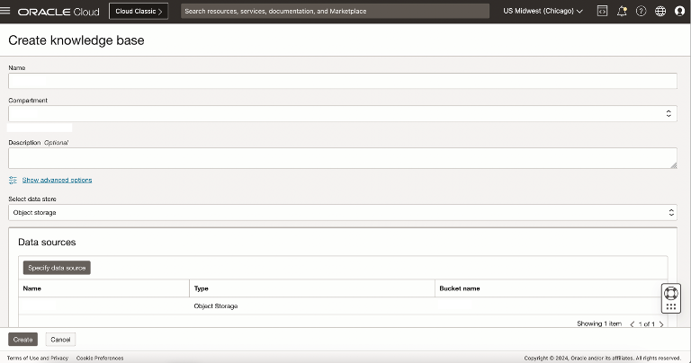
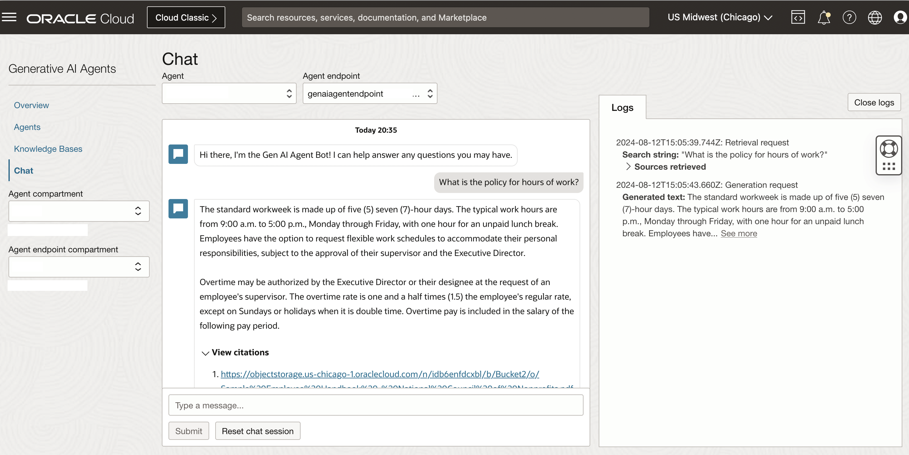

# Provision Generative AI Agents Service

## Introduction

This lab walks you through the steps to setup an OCI Generative AI Agent including ingesting a knowledge base from OCI Object Storage

Estimated Time: 30 minutes

### About Generative AI Agents

OCI Generative AI Agents is a fully managed service that combines the power of large language models (LLMs) with an intelligent retrieval system to create contextually relevant answers by searching your knowledge base, making your AI applications smart and efficient.

OCI Generative AI Agents supports several ways to onboard your data and then allows you and your customers to interact with your data using a chat interface or API. OCI Object Storage Service enables you to create Buckets. Once the Buckets are created, you can then upload your unstructured PDF manuals / documents in those buckets.

### Objectives

In this lab, you will:

* Create Object Storage Bucket and upload files
* Create OCI Gen AI RAG Agent
* (optional) test agent in console
* (optional) update Agent's Knowledge Base

### Prerequisites

This lab assumes you have:

* All previous labs successfully completed
* Permissions to manage OCI Services: Generative AI Agents, Object Storage
* Access to a Region where the Agent service is available: Chicago, Frankfurt

## Task 1: Provision Oracle Object Storage Bucket

This task will help you to create Oracle Object Storage Bucket under your chosen compartment.

1. Locate Buckets under Object Storage & Archive Storage

    

2. Provide the information for **Compartment** and **Bucket Name**. For this lab you can use **Multi Agent Bucket** Click Create.
    The Object Storage Bucket will be created

    

## Task 2: Upload PDF Document(s) to the Object Storage Bucket

1. Download the following files:

    [CWM Tasting Notes](https://objectstorage.us-chicago-1.oraclecloud.com/n/idb6enfdcxbl/b/Excel-Chicago/o/Livelabs%2Fgenai-multi-agent%2FCWM%20Tasting%20Notes%20Oct%202024%20(1)-1.pdf)

    [Making Cheese](https://objectstorage.us-chicago-1.oraclecloud.com/n/idb6enfdcxbl/b/Excel-Chicago/o/Livelabs%2Fgenai-multi-agent%2FMaking%20Cheese-1.pdf)

    [Plymouth Cheese Counter](https://objectstorage.us-chicago-1.oraclecloud.com/n/idb6enfdcxbl/b/Excel-Chicago/o/Livelabs%2Fgenai-multi-agent%2Fplymouth_cheese_counter_press_release_-_updated_-_5-23.pdf)

3. Click on the Bucket name, then Objects -> Upload button

    Click on “select files” link to select the downloaded files from your machine. This step can be repeated to select multiple files to upload to the bucket.

    **Note:** The Gen AI Agents service currently supports .pdf and .txt file formats

    

4. Click Upload -> Close to upload the PDF files in Task 2 step 1 to the Object Storage Bucket.

## Task 3: Provision Knowledge Base

This task will help you to create Oracle Generative AI Agent’s Knowledge Base under your chosen compartment.

1. Locate Generative AI Agents under AI Services

    

2. Locate Knowledge Bases in the left panel, select the correct Compartment.

    Then click on “Create knowledge base” button

    

3. Specify the name of the knowledge base e.g. **WineCheeseKb**, ensure that you have selected the correct compartment.

    Select “Object storage” in the “Select data source” dropdown, and then click on the “Specify data source” button

    

4. Specify the name of the data source and Description (Optional)

    Select the bucket that you have created in task one **Multi Agent Bucket**, and for Object prefix choose “Select all in bucket”

    Click the “Create” button

    

5. Click the “Create” button to create the knowledge base

    

6. In few minutes the status of recently created Knowledge Base will change from Creating to Active

    

## Task 4: Provision Agent

This task will help you to create Oracle Generative AI Agent under your chosen compartment.

1. Locate Agents in the left panel, select the correct Compartment.

    Then click on “Create agent” button

    

2. Specify the agent name e.g. **WineCheeseAgent**, ensure the correct compartment is selected and indicate a suitable welcome message

    Select the Knowledge Base that you created in the previous task **WineCheeseKb**. Providing the Welcome message is optional.

    Click the “Create” button.

    

3. In few minutes the status of recently created Agent will change from Creating to Active

    Click on “Endpoints” menu item in the left panel and then the Endpoint link in the right panel.

    

4. It’ll open up the Endpoint Screen. **Copy and keep the OCID of the Endpoint**. It’ll be used later.

   Click on “Launch chat” button

   

5. It’ll open up the Chat Playground, where you can ask questions in natural language, and get the responses from your PDF documents

    

## Task 5: Update Agent's Knowledge Base (optional)

You may want to update your agent's knowledge base for a variety of reasons in the future. This optional tasks walks through how to do this manually.

1. Add/Update/Remove files from Object Storage

    follow the same steps as in [Task 2](#task-2-upload-pdf-documents-to-the-object-storage-bucket)

2. Navigate to Data Source

    

    * In the Generative AI Agents Service, navigate to the **knowledge bases** view
    * Click on the name of your knowledge base in the list
    * Click on the name of your data source in the list

3. Run Ingestion Job

    
    * Click **Create Ingestion Job**
    * Provide a unique name and optional description
    * click **Create**

    **Note:** Data ingestion Jobs perform incremental ingestion from 2nd run onwards. The time this job takes is proportional to the amount of changes you made to your data source.

## Acknowledgements

* **Author**
    * **Kaushik Kundu**, Master Principal Cloud Architect, NACIE
    * **Luke Farley**, Staff Cloud Engineer, NACIE

* **Contributors**
    * **Abhinav Jain**, Senior Cloud Engineer, NACIE

* **Last Updated By/Date**
    * **Kaushik Kundu**, Master Principal Cloud Architect, NACIE, January 2025
