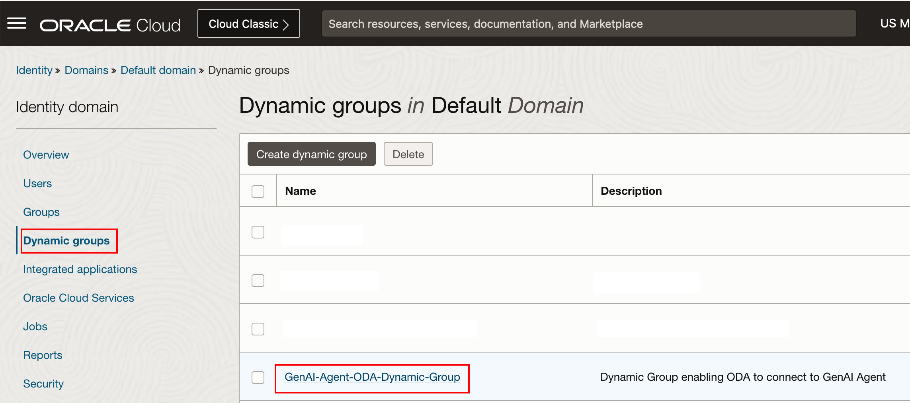
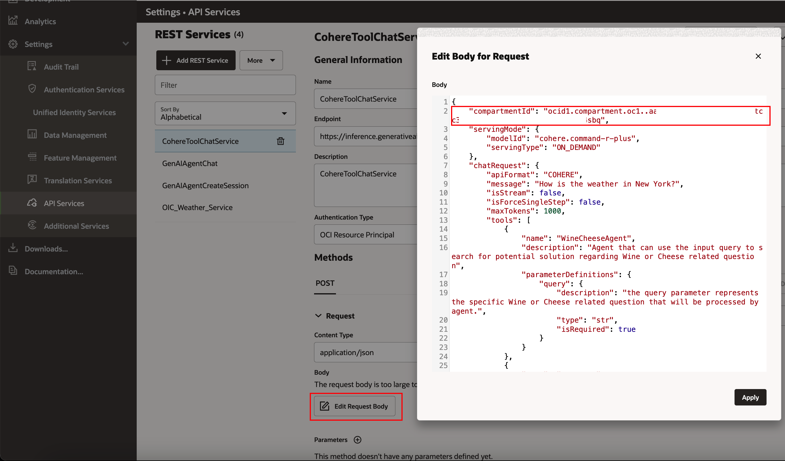
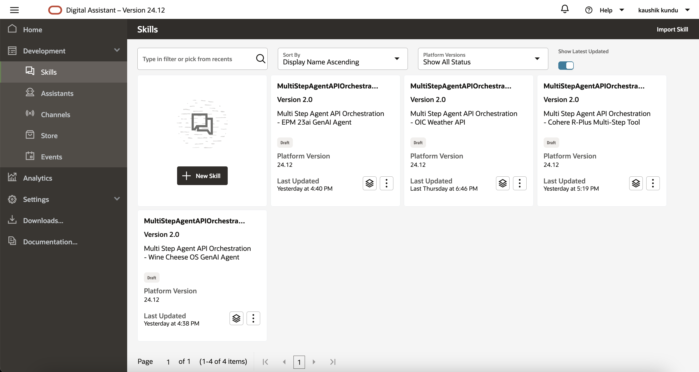
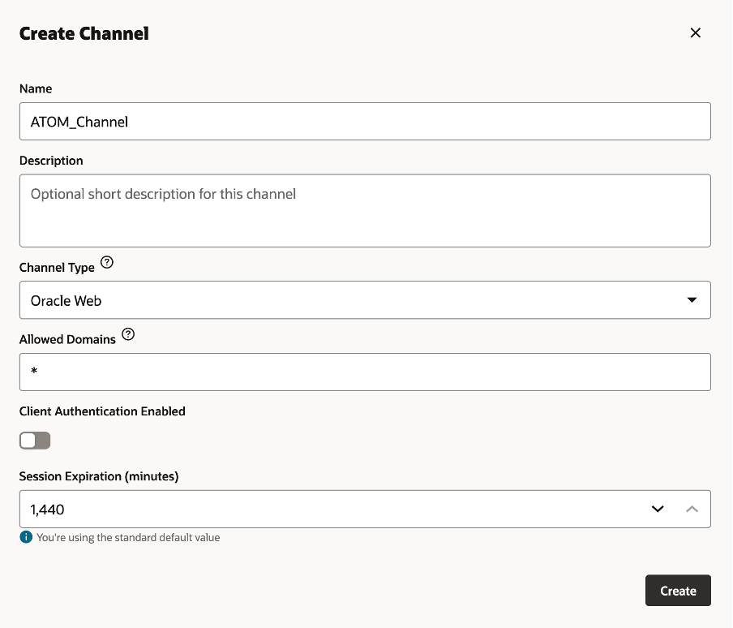
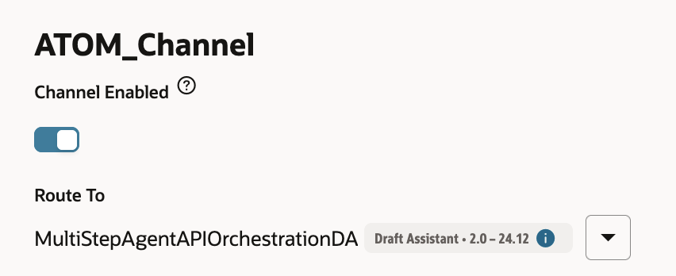
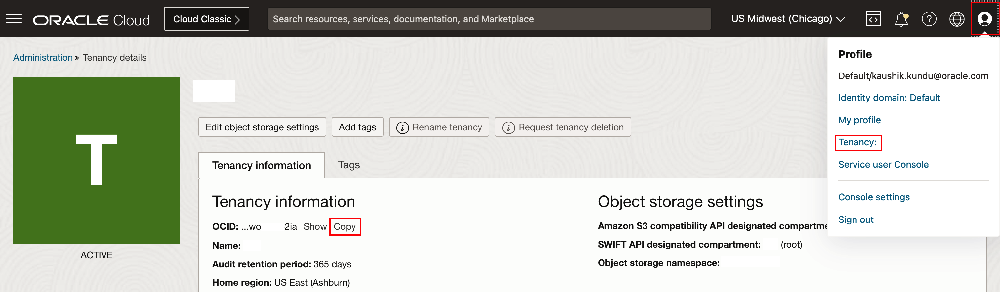

# Setup OCI Digital Assistant (ODA)

## Introduction

This lab will take you through the steps needed to provision Oracle Digital Assistant Cloud Service

Estimated Time: 60 minutes

### About OCI Digital Assistant

Oracle Digital Assistant (ODA) is a platform that allows you to create and deploy digital assistants for your users. Digital assistants are virtual devices that help users accomplish tasks through natural language conversations, without having to seek out and wade through various apps and web sites. Each digital assistant contains a collection of specialized skills. When a user engages with the digital assistant, the digital assistant evaluates the user input and routes the conversation to and from the appropriate skills.

### Objectives

In this lab, you will:

* Create Dynamic Group and Policy to enable ODA connectivity to other OCI Services.
* Provision an ODA instance.
* Import and configure ODA Rest API Services to connect to different solution components.
* Import and configure ODA Digital Assistant and ODA Skills to use different solution components.
* Create a Channel to connect the ODA Digital Assistant to a frontend.

### Prerequisites

This lab assumes you have:

* All previous labs successfully completed
* Must have an Administrator Account or Permissions to manage several OCI Services: Digital Assistant

## Task 1: Dynamic Group and Policy Definition

This task will help you configure the Dynamic Group and Policy.

These Dynamic Group and Policy Definition are for single-tenancy deployment - where ODA and Generative AI Agent are in the same tenancy.

For Policy Definitions required for multi-tenancy deployment (where ODA and Generative AI Agent are in different tenancies), please refer to Task 7.

1. Locate Domains under Identity & Security

    

2. Click on your current domain name

    

3. Click on Dynamic Groups, and then your Dynamic Group name

    

    **Note** The name of your dynamic group can be different.

4. Ensure that your Dynamic Group is properly defined - as follows. Then click on Identity

    

    **Note** The resource.compartment.id should be set to the OCID of your Compartment - that is having your ODA Instance.

5. Click on Policies, ensure that you are in your "root" compartment, then click on your Policy name

    

    **Note** The name of your policy can be different.

6. Ensure that your Policy is properly defined - as follows.

    

    ```
    allow dynamic-group <dynamic-group-name> to manage agent-family in tenancy
    allow dynamic-group <dynamic-group-name> to manage genai-agent-family in tenancy
    allow dynamic-group <dynamic-group-name> to manage object-family in tenancy
    ```

    **Note** If you are using a non-default identity domain - then instead of of just indicating the dynamic group name, you need to indicate domain-name/group-name in the policy statements.

## Task 2: Provision Oracle Digital Assistant

This task will help you to create Oracle Digital Assistant under your chosen compartment.

1. Locate Digital Assistant under AI Services

    

    **Note** You can find Digital Assistant under the AI Services.

2. Provide the information for Compartment, Name , Description (optional) & Shape. Click Create

    


3. In few minutes the status of recently created Digital Assistant will change from Provisioning to Active

    

## Task 3: Create REST Services for the OCI Generative AI Agent

This task involves creating REST service which will be used by ODA to connect to OCI Generative AI Agent service.

1. Download the four REST Service Configurations

    a. [agent-RESTService-GenAIAgentCreateSession.yaml](https://idb6enfdcxbl.objectstorage.us-chicago-1.oci.customer-oci.com/n/idb6enfdcxbl/b/Excel-Chicago/o/Livelabs%2Fgenai-multi-agent%2FRESTService-GenAIAgentCreateSession.yaml)

    b. [agent-RESTService-GenAIAgentChat.yaml](https://objectstorage.us-chicago-1.oraclecloud.com/n/idb6enfdcxbl/b/Excel-Chicago/o/Livelabs%2Fgenai-multi-agent%2FRESTService-GenAIAgentChat.yaml)

    c. [RESTService-CohereToolChatService.yaml](https://objectstorage.us-chicago-1.oraclecloud.com/n/idb6enfdcxbl/b/Excel-Chicago/o/Livelabs%2Fgenai-multi-agent%2FRESTService-CohereToolChatService.yaml)

    d. [RESTService-OIC\_Weather\_Service.yaml](https://objectstorage.us-chicago-1.oraclecloud.com/p/HIomV4YoAvkW7IqNJA_T7KqSFb6ZxX21ObHS9jBchxkCa8_J0tcEJ-UErkj_Ij9I/n/idb6enfdcxbl/b/Excel-Chicago/o/Livelabs/genai-multi-agent/RESTService-OIC_Weather_Service.yaml)

2. Locate the ODA instance (created in Task 2)

    

3. Select the ODA Instance and click on Service Console

    

4. In the ODA Console, click on hamburger menu. Under Settings, click API Services

    

5. Click on More -> Import REST Services

    

    **Note** Import all Rest Services:
    - The GenAIAgentCreateSession Rest API service (using "agent-RESTService-GenAIAgentCreateSession.yaml")
    - GenAIAgentChat Rest API service (using "agent-RESTService-GenAIAgentChat.yaml")
    - CohereToolChatService Rest API service (using "RESTService-CohereToolChatService.yaml")
    - OIC\_Weather\_Service (using "RESTService-OIC\_Weather\_Service.yaml")

7. In the GenAIAgentCreateSession Rest API service, under Parameters, click on the pencil icon to change the value of the GenAIAgentEndpointId

    

8. In the Value field, remove the existing value 1, and put the value of the GenAI Agent (based on Object Storage) Endpoint Id (from Lab 1 Task 4 Step 4), and then click the Tick icon

    

9. Test the GenAIAgentCreateSession Rest API service, by clicking on the Test Request button. You should see Response Status 200, with a proper Resoponse Body. Ensure that the "id" field is not blank / null.

    

10. Repeat Step 6 and Step 7 and Step 8 to successfully test the GenAIAgentCreateSession Rest API service with the value of the GenAI Agent (based on ADB 23ai) Endpoint Id (from Lab 2 Task 8 Step 4)

11. For the OIC\_Weather\_Service, update the Endpoint (from Lab 3 Task 4 Step 28), UserName/Password (from Lab 3 Task 3 Step 6), click on the pencil icon to change the value of the city parameter to London, and then test the service using the Test Request button. You should see Response Status 200.

    Endpoint URL should have the format "https://****/getTemperature1?city"

    

12. Test the CohereToolChatService. Make sure in the request payload (in Edit Request Body) you reference your own compartment id.

    

## Task 4: Import Digital Assistant (Provided)

1. Click on the link to download the required Digital Assistant

    [MultiStepAgentOrchestrationDA.zip](https://objectstorage.us-chicago-1.oraclecloud.com/p/KjBKc36lERmhtvcp01tckJ0s7EcMGYckWVWkihq3SDrKJSiEQ9p7xsmEWRKzM5g_/n/idb6enfdcxbl/b/Excel-Chicago/o/Livelabs/genai-multi-agent/MultiStepAgentOrchestrationDA.zip)

2. Import the downloaded Digital Assistant.

   Click on the Menu -> Development -> Assistants.

   Click on Import Digital Assistant & select the zip file to import

    

3. Click on the Menu -> Development -> Skills.

    You'll see 4 new ODA Skills -
    - MultiStepAgentAPIOrchestrationTool,
    - MultiStepAgentAPIOrchestrationEPM23aiGenAIAgent
    - MultiStepAgentAPIOrchestrationWineCheeseOSGenAIAgent
    - MultiStepAgentAPIOrchestrationOICWeatherAPI

    

4. Open the MultiStepAgentAPIOrchestrationTool Skill, go to Settings -> Configuration -> Custom Parameters.

    Please provide your own values for:
    - CompartmentOCID
    - EPMGenAIAgentEndpointIdInput (from Lab 2 Task 8 Step 4)
    - WineCheeseGenAIAgentEndpointIdInput (from Lab 1 Task 4 Step 4)

    

5. Ensure the Chatbot Training is completed for the Digital Assistant and Skills

   Then click on the “Preview” button at top-right corner.

    

6. To start the conversation loop in ODA preview, send this initial message: "MultiAgentAPIChat"

    You can use the following sample prompts to test this Digital Assistant:

     ```text
       <copy>
       1. How do I administer EPM?

       2. What are the 5 S's of wine tasting?

       3. How is the weather in New York?

       4. In EPM, How do I export groups to CSV?

       5. Where is the World Cheese capital and how is the weather there?

       6. The wine LA PLUMA ROSE OF SAUV BLANC is from where, and how is the weather there?

       7. What is the maximum amount of groups a user can be a part of in EPM?

       8. Does EPM search option support wildcards (*)?

       9. Which role do I need to create an EPM group?

       10. What are the steps of the cheese making process?
       </copy>
    ```

    

## Task 5: Create Channel to Embed ODA in Visual Builder Application or in any custom Web App

1. Click on hamburger menu and select Development > Channels, and click on Add Channel

    

2. Enter the Channel Name and Description. Select the following option on the form:
    * Channel Type = Oracle Web
    * Allowed Domain = *
    * Client Authentication Enabled = Toggle off

    

3. After channel creation, route it to Digital Assistant imported in Task 4, and enable the Channel by using the toggle button.

    

4. Ensure that the Client Authentication Enabled is disabled. **Take note of Channel Id**.

    

## Task 6: (optional) View Conversation Analytics

From ODA service console homepage -> skill **Display name** -> **Insights** on side nav bar

* On this overview page, you can see stats such as **Total number of Conversations** and **Number of Unique users
* The View dropdown on the top right allows you to set a time window
* The Channels filter allows you to filter data from a specific frontend channel
* The Conversations tab allows you to see user messages and the agent's responses

## Task 7: (optional) Policy Definitions for multi-tenancy deployment

This task will help you ensure that the required Policy Definitions are correctly defined for multi-tenancy deployment (where ODA and Generative AI Agent are in different tenancies).

If the Policy Definitions are not correctly defined, please define them as follows.

**Required Information:**

* _ODATenancyOCID_ - The OCID of the Tenancy, where the ODA Instance is created.

    In the OCI Console, you can click on your profile icon in the top right corner, click on your Tenancy name, and then copy the OCID of the tenancy.

    

* _ODAInstanceOCID_ - The OCID of the ODA Instance.

    In the OCI Console, you can go to your Digital Assistance instance (Menu -> Analytics & AI -> Digital Assistant), and then copy the OCID of the       ODA instance

    

1. In the tenancy where the ODA instance is hosted - Locate Policies under Identity & Security, ensure that you are in your "root" compartment, and      then define the following policies.

   ```
   <copy>
    endorse any-user to manage agent-family in any-tenancy where request.principal.type='odainstance'
    endorse any-user to manage genai-agent-family in any-tenancy where request.principal.type='odainstance'
    endorse any-user to manage object-family in any-tenancy where request.principal.type='odainstance'
    </copy>
   ```

   

2. In the tenancy where the Generative AI instance is hosted - Locate Policies under Identity & Security, ensure that you are in your "root"
   compartment, and then define the following policies.

   _Please ensure to replace the ODATenancyOCID and ODAInstanceOCID with the proper OCID values._

   ```
   <copy>
    define tenancy oda-instance-tenancy as ODATenancyOCID
    admit any-user of tenancy oda-instance-tenancy to manage agent-family in tenancy where request.principal.id in ('ODAInstanceOCID')
    admit any-user of tenancy oda-instance-tenancy to manage genai-agent-family in tenancy where request.principal.id in ('ODAInstanceOCID')
    admit any-user of tenancy oda-instance-tenancy to manage object-family in tenancy where request.principal.id in ('ODAInstanceOCID')
    </copy>
   ```

   

You may now proceed to the next lab.

## Acknowledgements

* **Author**
    * **Kaushik Kundu**, Master Principal Cloud Architect, NACIE

* **Contributors**
    * **Abhinav Jain**, Senior Cloud Engineer, NACIE
    * **Luke Farley**, Staff Cloud Engineer, NACIE

* **Last Updated By/Date**
    * **Abhinav Jain**, Senior Cloud Engineer, NACIE, February 2025
