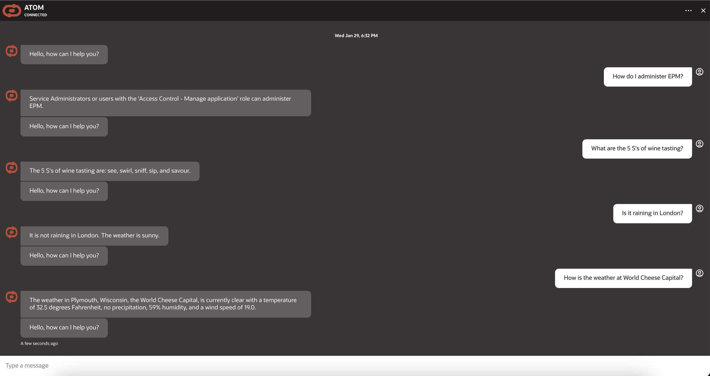

# Demo User Experience

## Introduction

This lab walks you through using the application as an end user.

Estimated Time: 15 minutes

### Objectives

In this lab, you will:

* Login to the application
* Chat with the agent

### Prerequisites

This lab assumes you have:

* Access to a fully deployed application

## Task 1: Login to the Application

1. Navigate to the website url your application administrator provided you.

    The url may be a vanity url or look like this:

    `https://<vb_instance_name>-vb-<tenancy_namespace>.builder.<region>.ocp.oraclecloud.com/ic/builder/rt/<vb_app_name>/live/webApps/atom/`

2. If you do not have an active session, you will be prompted to login to the OCI tenancy.

    

    * If your tenancy has an SSO option, try that first
    * If you have issues logging in or do not know what credentials to use, reach out to your application administrator
    * If this is your first time logging into the tenancy, you may need to setup a MFA device

## Task 2: Chat with the Agent

1. Agent Chat loop:
    This chatbot provides a simple continuous loop for you to ask questions against. These questions should be about topics or documentation found in the Agent's knowledge base or APIs configured.
    It will not be able to answer general world questions like a foundational model typically does. Instead, the agent will respond saying it cannot answer your question

    

2. Some sample prompts for you to try:

     ```text
       <copy>
       1. How do I administer EPM?

       2. What are the 5 S's of wine tasting?

       3. How is the weather in New York?

       4. How do I export groups to CSV?

       5. How is the weather at World Cheese Capital?

       6. Is it raining at the place where LA PLUMA ROSE OF SAUV BLANC wine is from?

       7. What is the maximum amount of groups a user can be a part of?

       8. Does search option support wildcards (*)?

       9. Which role do I need to create a group?

       10. What are the steps of the cheese making process?
       </copy>
    ```

## Acknowledgements

* **Author**
    * **Abhinav Jain**, Senior Cloud Engineer, NACIE
    * **Kaushik Kundu**, Master Principal Cloud Architect, NACIE
* **Last Updated By/Date**
    * **Kaushik Kundu**, Master Principal Cloud Architect, NACIE, January 2025
