# Lab 1: Create and configure Autonomous Database

## Introduction

In this lab we will provision an Oracle Autonomous Database to use as the vector store for the following labs. We will be using the new vector data type in Oracle Database 23ai.

Estimated Time: 20 mins

### Prerequisites

* An Oracle Cloud Infrastructure Account
* Permissions to create an Autonomous Database

## Task 1: Create the Autonomous Database

1. Log in to your OCI console.

2. Open the main "hamburger" menu in the top left corner of the Console. Select "Oracle Database" and then click "Autonomous Database."    
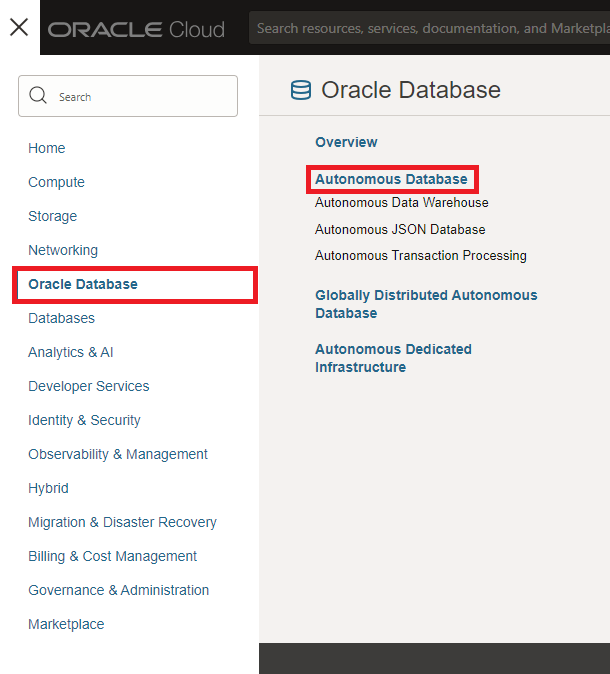

3. Select the correct compartment from the "List Scope"→"Compartment" on the left side of the page, and then click the "Create Autonomous Database" button.    
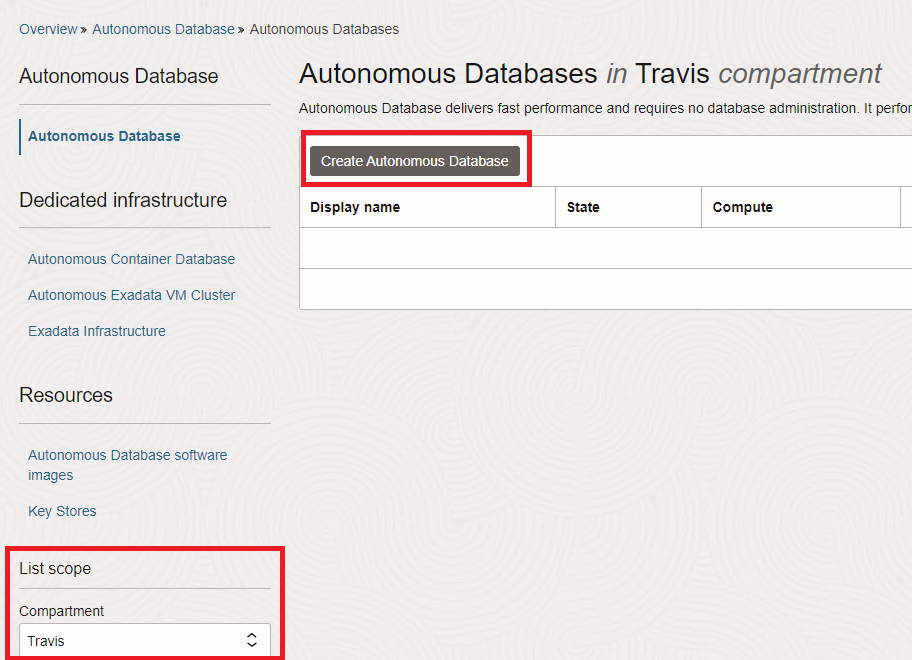

4. Change the "Display name" and "Database name" to "LiveLabVS" and choose the "Transaction Processing" workload. Everything else can remain as the default.    
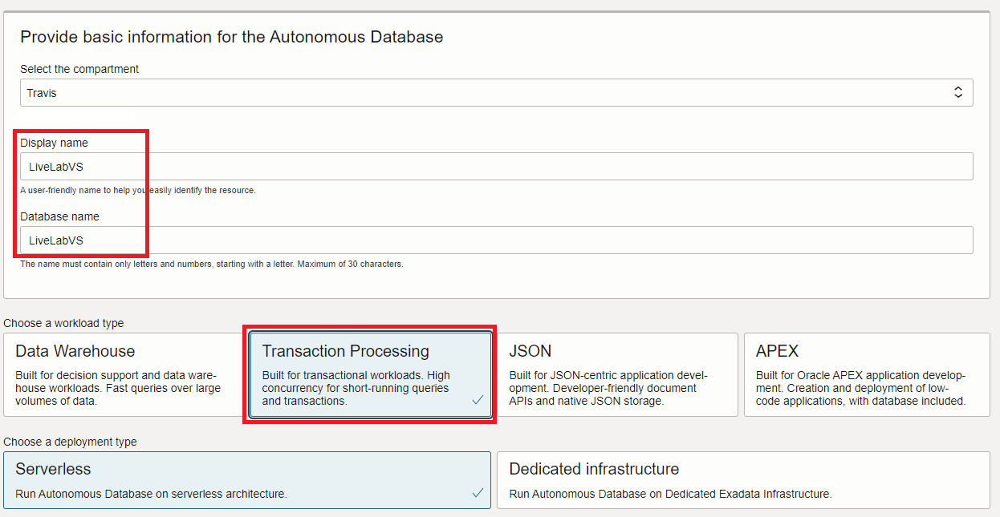

5. Make sure the database version is "23ai". Everything else can remain as the default.    
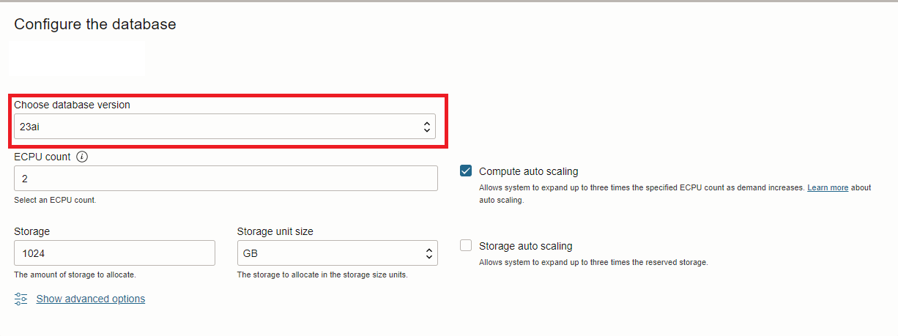

6. Enter an administrator password. For this lab, we will use "**Livelabpassword1!**".    
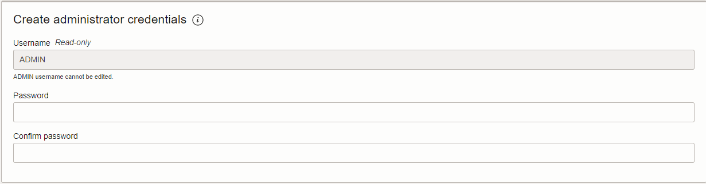

7. Leave everything else as the default, and click the "Create Autonomous Database" button.

8. Wait while the database is fully provisioned. Once the "ADW" icon turns from orange to green, and the word "AVAILABLE" appears under it, the database is ready.    
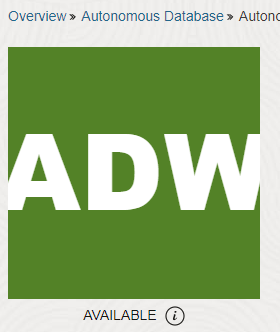

## Task 2: Download the Autonomous Database Wallet File

1. Once the database is ready, click the "Database connection" button on the database details page.    
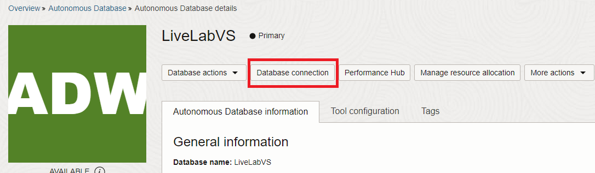

2. Leave "Wallet Type" as "Instance wallet" and click the "Download wallet" button. Enter a password for the wallet. For this lab, we will be using "**Livelabpassword1!**". Click the "Download" button.    
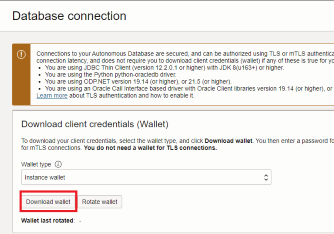
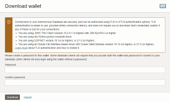

3. Close the database connection page

## Task 3(Optional): Create an AIUSER Database Account

1. From the database details page, click the "Database actions" dropdown button and select "Database Users".    
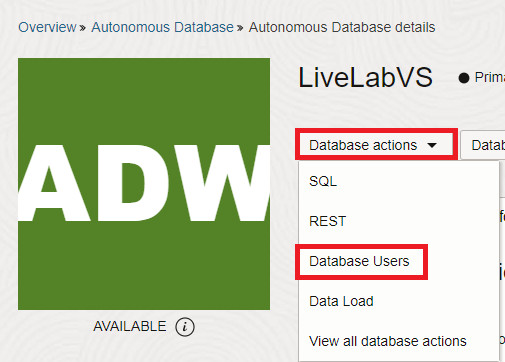

2. Click the "Create User" button on the right side of the page.    
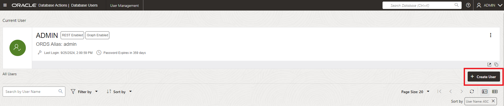

3. Enter the following details for the user:    
a. Username: **AIUSER**    
b. Quota on tablespace DATA: **UNLIMITED**    
c. Password: **Livelabpassword1!**    
Enable the slider for "Web Access"    
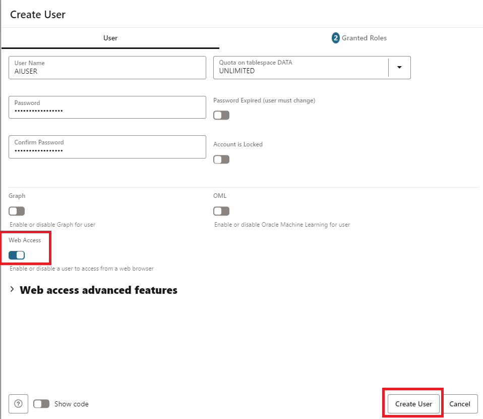

4. Click the "ADMIN" profile button in the top right of the page, and select "Sign Out".    
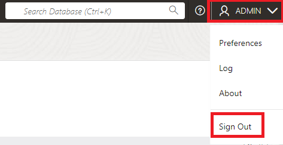

5. Enter the credentials for the user account you just created. In this lab we use the following:    
a. Username: **AIUSER**    
b. Password: **Livelabpassword1!**    
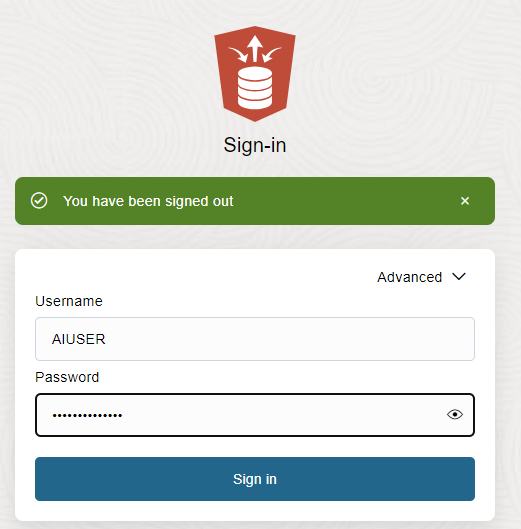

6. Select the "Development" tab and select "SQL" from the list. Click the "Open" button.    
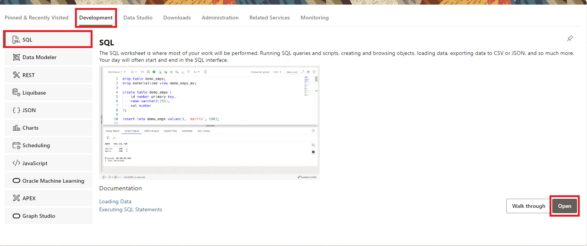

## Task 4: Create Database Tables For Vector Store   
**If you did Task 3, skip to number 2 below:**    
1. From the database details page, click the "Database actions" dropdown button and select "SQL".    
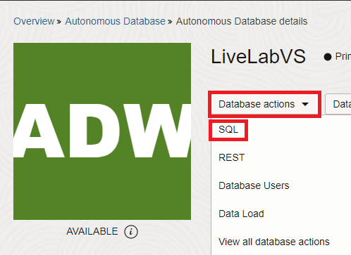

2. Copy and paste the SQL code from the create_tables.sql file into the SQL worksheet and click the "Run Script" button (or press F5).    
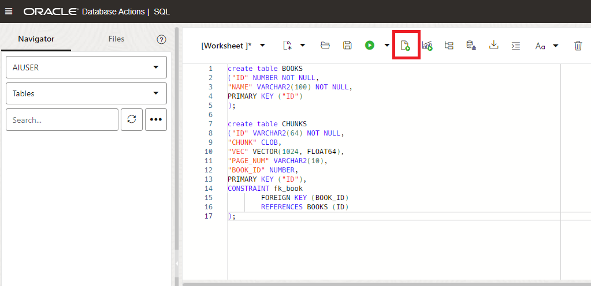


```sql
<copy>
create table BOOKS
("ID" NUMBER NOT NULL,
"NAME" VARCHAR2(100) NOT NULL,
PRIMARY KEY ("ID") 
);
 
create table CHUNKS
("ID" VARCHAR2(64) NOT NULL,
"CHUNK" CLOB,
"VEC" VECTOR(1024, FLOAT64),
"PAGE_NUM" VARCHAR2(10),
"BOOK_ID" NUMBER,
PRIMARY KEY ("ID"),
CONSTRAINT fk_book
        FOREIGN KEY (BOOK_ID)
        REFERENCES BOOKS (ID)
);
</copy>
```

## **Acknowledgements**

* **Authors** - Travis Ledbetter
* **Last Updated By/Date** - Travis Ledbetter, October 2024

