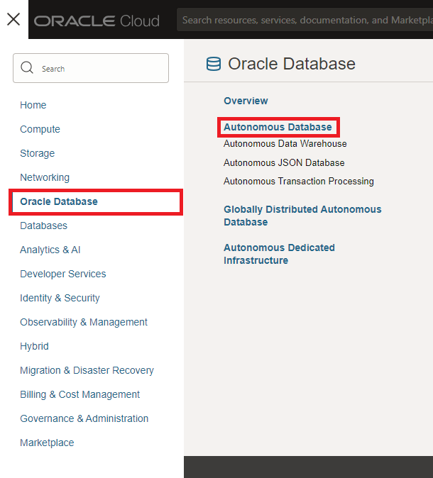
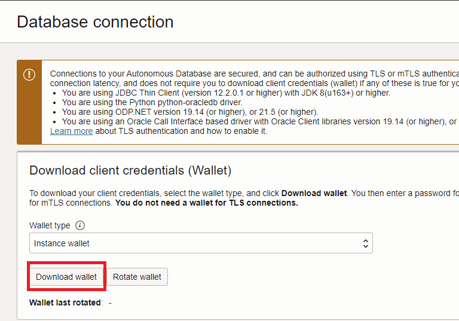
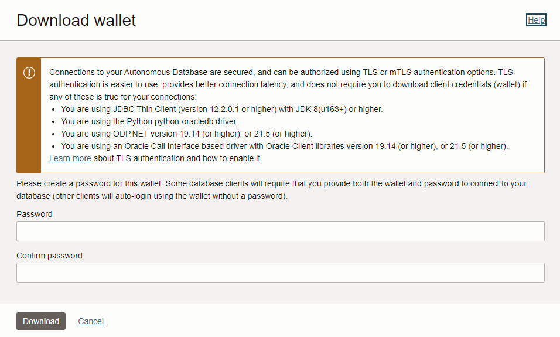

### Lab *: Create and configure Autonomous Database
<details>
<summary>Step 1: Create the Autonomous Database</summary>    	
1. Log in to your OCI console.<br>
2. Open the main "hamburger" menu in the top left corner of the Console. Select "Oracle Database" and then click "Autonomous Database."<br>
&nbsp;&nbsp;&nbsp;&nbsp;<br>
3. Select the correct compartment from the "List Scope"→"Compartment" on the left side of the page, and then click the "Create Autonomous Database" button.<br>
&nbsp;&nbsp;&nbsp;&nbsp;<br>
4. Change the "Display name" and "Database name" to "LiveLabVS" and choose the "Transaction Processing" workload. Everything else can remain as the default.<br>
&nbsp;&nbsp;&nbsp;&nbsp;<br>
5. Make sure the database version is "23ai". Everything else can remain as the default.<br>
&nbsp;&nbsp;&nbsp;&nbsp;<br>
6. Enter an administrator password. For this lab, we will use "<b>Livelabpassword1!</b>".<br>
&nbsp;&nbsp;&nbsp;&nbsp;<br>
7. Leave everything else as the default, and click the "Create Autonomous Database" button.<br>
8. Wait while the database is fully provisioned. Once the "ADW" icon turns from orange to green, and the word "AVAILABLE" appears under it, the database is ready.<br>
&nbsp;&nbsp;&nbsp;&nbsp;<br>
</details>

<details>
<summary>Step 2: Download the Autonomous Database Wallet File</summary>    
1. Once the database is ready, click the "Database connection" button on the database details page.<br>
&nbsp;&nbsp;&nbsp;&nbsp;<br>
2. Leave "Wallet Type" as "Instance wallet" and click the "Download wallet" button. Enter a password for the wallet. For this lab, we will be using "<b>Livelabpassword1!</b>". Click the "Download" button.<br>
&nbsp;&nbsp;&nbsp;&nbsp; &nbsp;&nbsp;&nbsp;&nbsp;<br>
3. Close the database connection page
</details>

<details>
<summary>Step 3(Optional): Create an AIUSER Database Account</summary>    
1. From the database details page, click the "Database actions" dropdown button and select "Database Users".<br>
&nbsp;&nbsp;&nbsp;&nbsp; <br>
2. Click the "Create User" button on the right side of the page.<br>
&nbsp;&nbsp;&nbsp;&nbsp; <br>
3. Enter the following details for the user:<br>
&nbsp;&nbsp;&nbsp;&nbsp;a. Username: <b>AIUSER</b><br>
&nbsp;&nbsp;&nbsp;&nbsp;b. Quota on tablespace DATA: <b>UNLIMITED</b><br>
&nbsp;&nbsp;&nbsp;&nbsp;c. Password: <b>Livelabpassword1!</b><br>
&nbsp;&nbsp;&nbsp;&nbsp;Enable the slider for "Web Access"<br>
&nbsp;&nbsp;&nbsp;&nbsp; <br>
4. Click the "ADMIN" profile button in the top right of the page, and select "Sign Out".<br>
&nbsp;&nbsp;&nbsp;&nbsp; <br>
5. Enter the credentials for the user account you just created. In this lab we use the following:<br>
&nbsp;&nbsp;&nbsp;&nbsp;a. Username: <b>AIUSER</b><br>
&nbsp;&nbsp;&nbsp;&nbsp;b. Password: <b>Livelabpassword1!</b><br>
6. Select the "Development" tab and select "SQL" from the list. Click the "Open" button.<br>
&nbsp;&nbsp;&nbsp;&nbsp; <br>
</details>

<details>
<summary>Create Database Tables For Vector Store</summary>    
<b>If you did Step 3, skip to number 3 below:</b><br>
1. From the database details page, click the "Database actions" dropdown button and select "SQL".<br>
&nbsp;&nbsp;&nbsp;&nbsp; <br>
2. Select the "Development" tab and select "SQL" from the list. Click the "Open" button.<br>
&nbsp;&nbsp;&nbsp;&nbsp; <br>
3. Copy and paste the SQL code from the create_tables.sql file into the SQL worksheet and click the "Run Script" button (or press F5).<br>
&nbsp;&nbsp;&nbsp;&nbsp; <br>
 
```sql
create table BOOKS
("ID" NUMBER NOT NULL,
"NAME" VARCHAR2(100) NOT NULL,
PRIMARY KEY ("ID") 
);
 
create table CHUNKS
("ID" VARCHAR2(64) NOT NULL,
"CHUNK" CLOB,
"VEC" VECTOR(1024, FLOAT64),
"PAGE_NUM" VARCHAR2(10),
"BOOK_ID" NUMBER,
PRIMARY KEY ("ID"),
CONSTRAINT fk_book
        FOREIGN KEY (BOOK_ID)
        REFERENCES BOOKS (ID)
);
```
</details>
