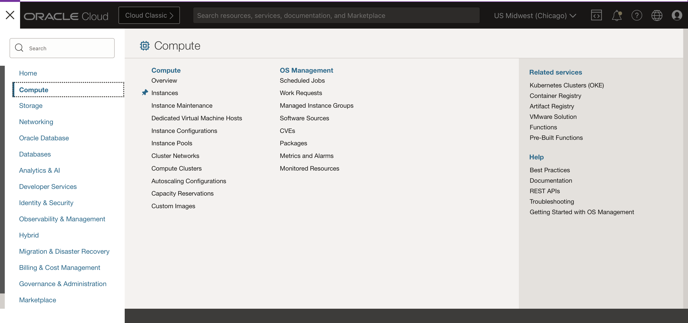
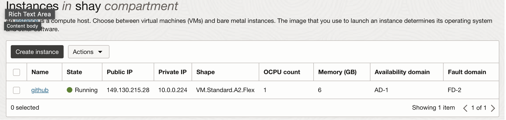
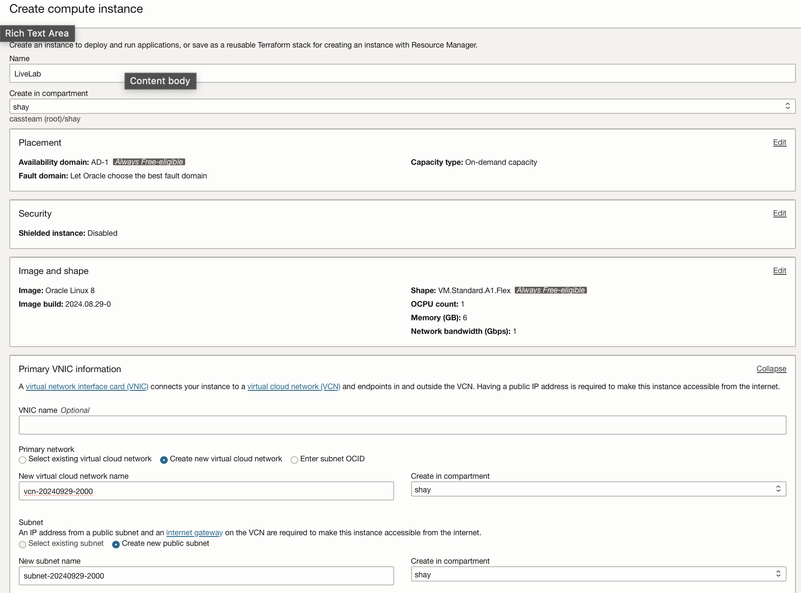
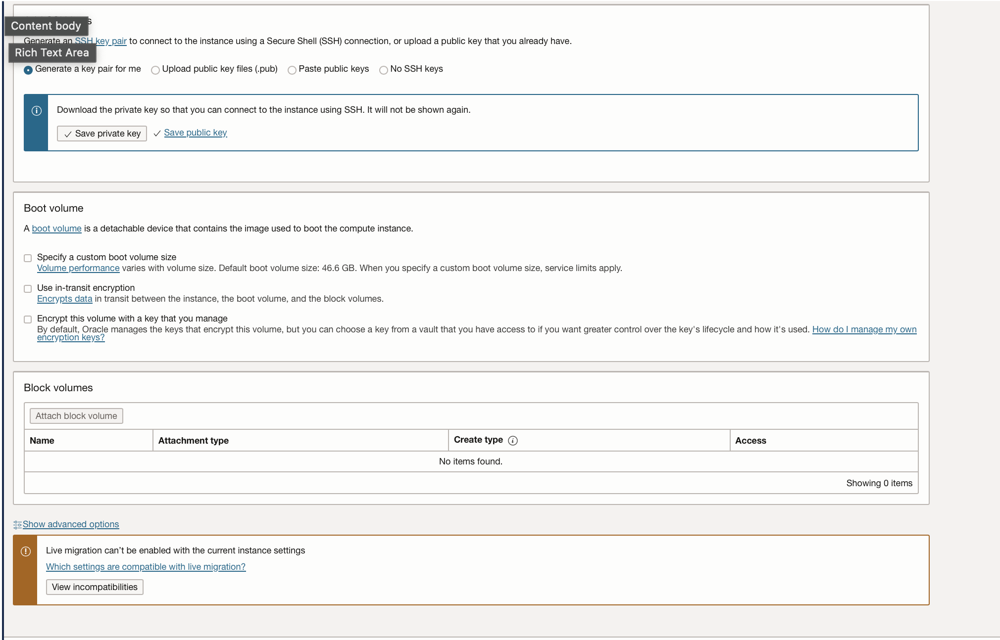
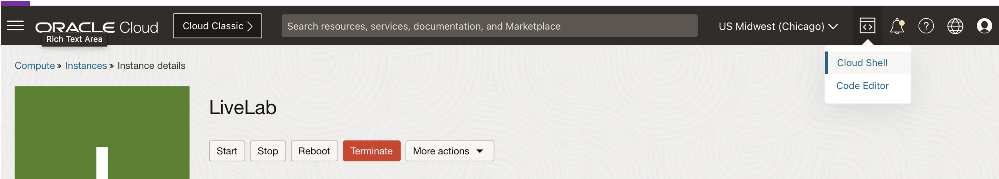
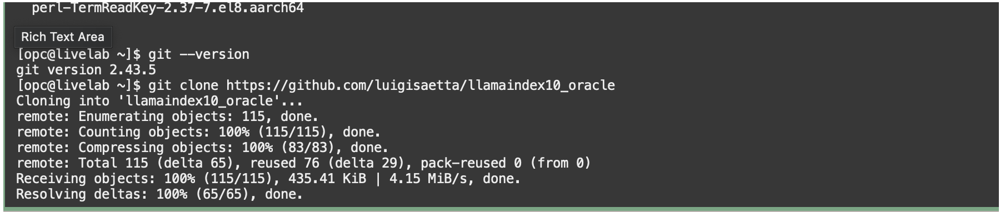

# Lab 2: Set up the Compute Instance and Connect to GitHub Code

1. Open the main "hamburger" menu in the top left corner of the Console. Select "Compute" and then click "Instances."  
 &nbsp;&nbsp;&nbsp;&nbsp; 

2. Select the correct compartment from the "List Scope"→"Compartment" on the left side of the page, and then click the "Create Instance" button.  
&nbsp;&nbsp;&nbsp; 

3. Fill in the following information 
    Name: LiveLab
    Shape: VM.Standard.A1.FLEX
    Image: Oracle Linux 
    Click on 'Edit' on Primary VNIC Information
    Click 'Create New Virtual Cloud Network' 
    Download SSH Private Key and Save Public Key 
    Click 'Create'  

&nbsp;&nbsp;&nbsp; 

5. Go to Cloud Shell  

&nbsp;&nbsp;&nbsp; 
   
6. Log into your instance 
    ssh i ~/[private-key] <username>@<public_ip_address>  

&nbsp;&nbsp;&nbsp; 

6.install python 3.11
    sudo yum update
    sudo yum upgrade
    sudo wget https://www.python.org/ftp/python/3.11.0/Python-3.11.0.tgz
    sudo tar -xf Python-3.11.0.tgz
    cd Python-3.11.0
    ./configure --enable-optimizations
    sudo make altinstall
    python3.11 --version  

&nbsp;&nbsp;&nbsp; 

7. Install requirement.text
   pip install -r requirement.txt  

