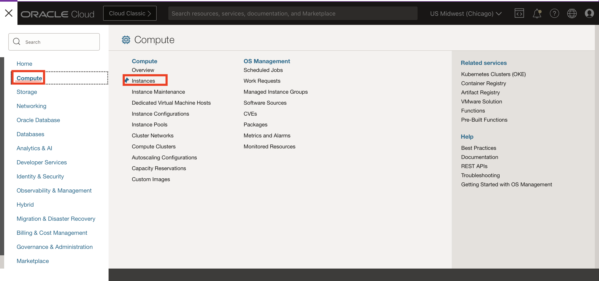
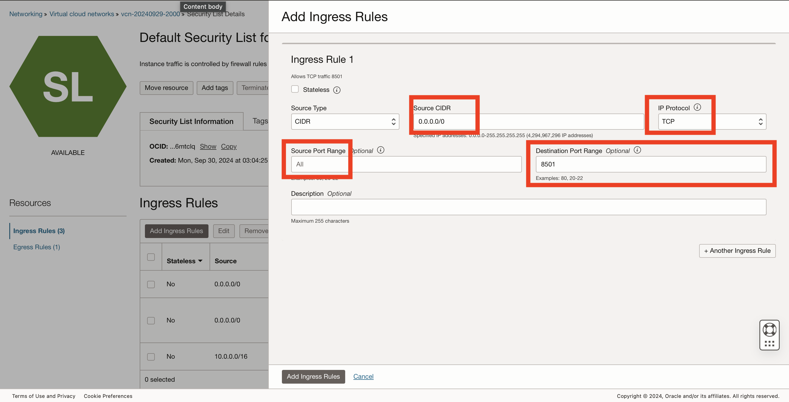

# Lab 2: Set up the Compute Instance and Connect to GitHub Code

### Objective 
This lab you will be creating a virtual machine that will install python 3.11, clone the GitHub Repo, and open necessary port. 

### Prerequisites
* Labs 1 of this Livelab completed.

Estimated Time: 30 minutes

## Task 1: Set up the VM Machine

1. Open the main "hamburger" menu in the top left corner of the Console. Select "Compute" and then click "Instances."  
 &nbsp;&nbsp;&nbsp;&nbsp; 

2. Select the correct compartment from the "List Scope"→"Compartment" on the left side of the page, and then click the "Create Instance" button.  
&nbsp;&nbsp;&nbsp; 

3. Fill in the following information 
    Name: LiveLab
    Shape: VM.Standard.A1.FLEX
    Image: Oracle Linux 
    Click on 'Edit' on Primary VNIC Information
    Click 'Create New Virtual Cloud Network' 
    Download SSH Private Key and Save Public Key 
    Click 'Create'  

&nbsp;&nbsp;&nbsp; 

&nbsp;&nbsp;&nbsp; 

## Task 2: Install Python and Clone the Repo
1. Go to Cloud Shell  

2. Log into your instance 
    ssh i ~/[private-key] <username>@<public_ip_address>  

&nbsp;&nbsp;&nbsp; 

3.install python 3.11  
    sudo yum update  
    sudo yum upgrade  
    sudo yum install python3.11-devel  
    python3.11 --version  

&nbsp;&nbsp;&nbsp; 

4. Install requirement.text
   pip install -r requirement.txt  

## Task 3: Open Port on VCN

1. On your network open port 8501
   Go your VCN  
   Go to Default Security Lists  
   Add ingress rules  
    CIDR: 0.0.0.0/0   
    IP protocol: TCP  
    Destination Port Range: 8501 <br<

   &nbsp;&nbsp;&nbsp; 

## **Acknowledgements**

* **Authors** - Shay Hameed

You may now **proceed to the next lab**

