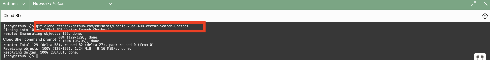

# Lab 2: Set up the Compute Instance and Connect to GitHub Code

### Objective 
This lab you will be creating a virtual machine that will install python 3.11, clone the GitHub Repo, and open necessary port. 

Estimated Time: 30 minutes

### Prerequisites
* Lab 1 of this Livelab completed.

## Task 1: Set up the VM Machine

1. Open the main "hamburger" menu in the top left corner of the Console. Select "Compute" and then click "Instances."    


2. Select the correct compartment from the "List Scope"→"Compartment" on the left side of the page, and then click the "Create Instance" button.    


3. Fill in the following information    
    Name: LiveLab    
    Shape: VM.Standard.A1.FLEX    
    Image: Oracle Linux    
    Click on 'Edit' on Primary VNIC Information    
    Click 'Create New Virtual Cloud Network'    
    Download SSH Private Key and Save Public Key    
    Click 'Create'    


## Task 2: Install Python and Clone the Repo
1. Go to Cloud Shell    

2. Log into your instance 
    ```bash ssh i ~/[private-key] <username>@<public_ip_address>```    


3.install python 3.11    
    sudo yum update    
    sudo yum upgrade    
    sudo yum install python3.11-devel    
    python3.11 --version    




4. Install requirement.text    
   pip install -r requirement.txt    

## Task 3: Open Port on VCN

1. On your network open port 8501
   Go your VCN    
   Go to Default Security Lists    
   Add ingress rules    
    CIDR: 0.0.0.0/0     
    IP protocol: TCP    
    Destination Port Range: 8501    

  
   

## **Acknowledgements**

* **Authors** - Shay Hameed

You may now **proceed to the next lab**
