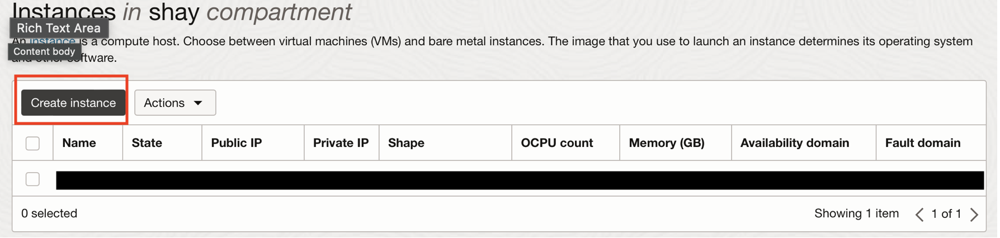
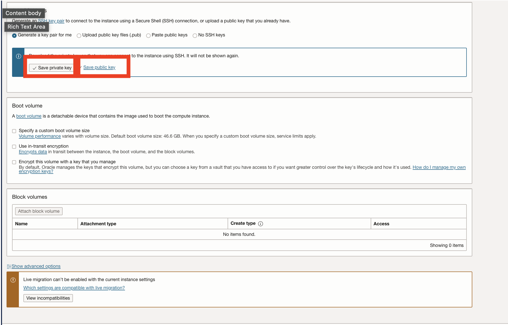
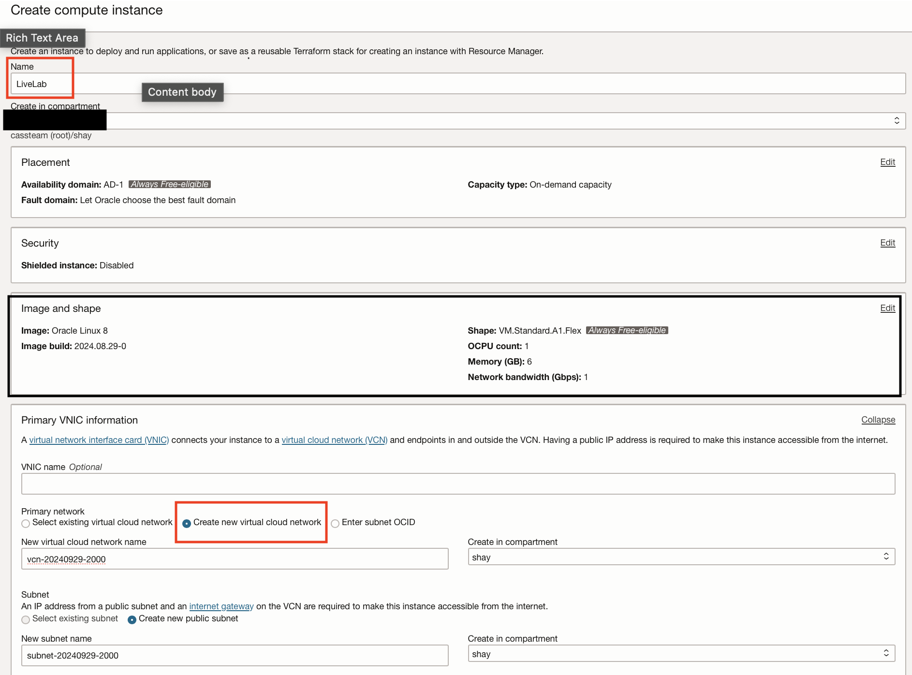
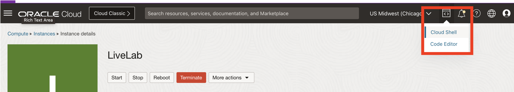
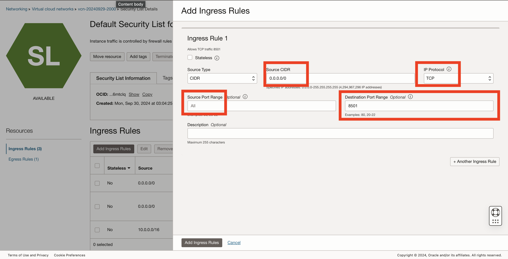

# Lab 2: Set up the Compute Instance and Connect to GitHub Code

## Introduction
This lab you will be creating a virtual machine that will install python 3.11, clone the GitHub Repo, and open necessary port. 

Estimated Time: 30 minutes

### Prerequisites
* Lab 1 of this Livelab completed.

## Task 1: Set up OCI Compute Instance

1. Open the main "hamburger" menu in the top left corner of the Console. Select "Compute" and then click "Instances."

2. Select the correct compartment from the "List Scope"→"Compartment" on the left side of the page, and then click the "Create Instance" button.

3. Select the correct compartment from the "List Scope"→"Compartment" on the left side of the page, and then click the "Create Instance" button.    
4. Fill in the following information:    
**Name:** LiveLab

**Shape:** VM.Standard.A1.FLEX 

**Image:** Oracle Linux

Click on **'Edit'** on Primary VNIC Information  

Click **'Create New Virtual Cloud Network'** 

5. Save private key for access.
    
    
6. Click **'Create'**    



## Task 2: Install Python and Clone the Repo
1. Launch Cloud Shell    
   
2. Ssh into compute instance.
```bash
<copy>
ssh i ~/[private-key] <username>@<public_ip_address>
</copy>
```

3. Install Python 3.11 on VM.

```bash
<copy>
sudo yum update
sudo yum upgrade
sudo yum install python3.11-devel
python3.11 --version
</copy>
```

4. Install requirements.txt:


4. Install requirement.txt  
   ```
   <copy>
   pip install -r requirements.txt 
   </copy>
   ```

## Task 3: Open Port on VCN

1. On your network, open port 8501:  
Go your VCN    
Go to Default Security Lists    
Add ingress rules:    
    CIDR: 0.0.0.0/0    
    IP protocol: TCP    
    Destination Port Range: 8501

   

## **Acknowledgements**

* **Authors** - Shay Hameed
* **Last Updated By/Date** - Travis Ledbetter, October 2024

You may now **proceed to the next lab**
