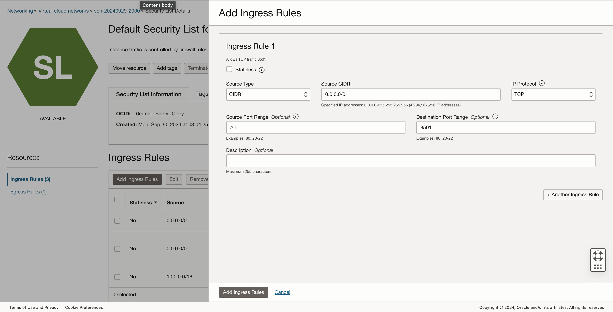

# Lab 2: Set up the Compute Instance and Connect to GitHub Code

1. Open the main "hamburger" menu in the top left corner of the Console. Select "Compute" and then click "Instances."  
 &nbsp;&nbsp;&nbsp;&nbsp; 

2. Select the correct compartment from the "List Scope"→"Compartment" on the left side of the page, and then click the "Create Instance" button.  
&nbsp;&nbsp;&nbsp; 

3. Fill in the following information  
    Name: LiveLab  
    Shape: VM.Standard.A1.FLEX  
    Image: Oracle Linux  
    Click on 'Edit' on Primary VNIC Information  
    Click 'Create New Virtual Cloud Network'   
    Download SSH Private Key and Save Public Key   
    Click 'Create'  

&nbsp;&nbsp;&nbsp; 

5. Go to Cloud Shell  

&nbsp;&nbsp;&nbsp; 
   
6. Log into your instance 
    ssh i ~/[private-key] <username>@<public_ip_address>  

&nbsp;&nbsp;&nbsp; 

7.install python 3.11  
    sudo yum update  
    sudo yum upgrade  
    sudo yum install python3.11-devel  
    python3.11 --version  

&nbsp;&nbsp;&nbsp; 

8. Install requirement.text
   pip install -r requirement.txt  

9. On your network open port 8501
   Go your VCN  
   Go to Default Security Lists  
   Add ingress rules  
    CIDR: 0.0.0.0/0   
    IP protocol: TCP  
    Destination Port Range: 8501 <br<

   &nbsp;&nbsp;&nbsp; 
