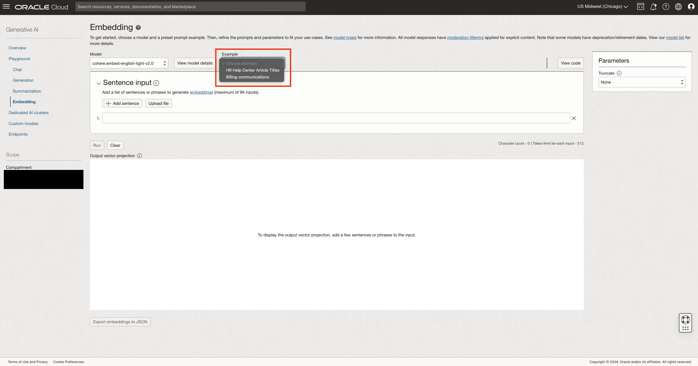
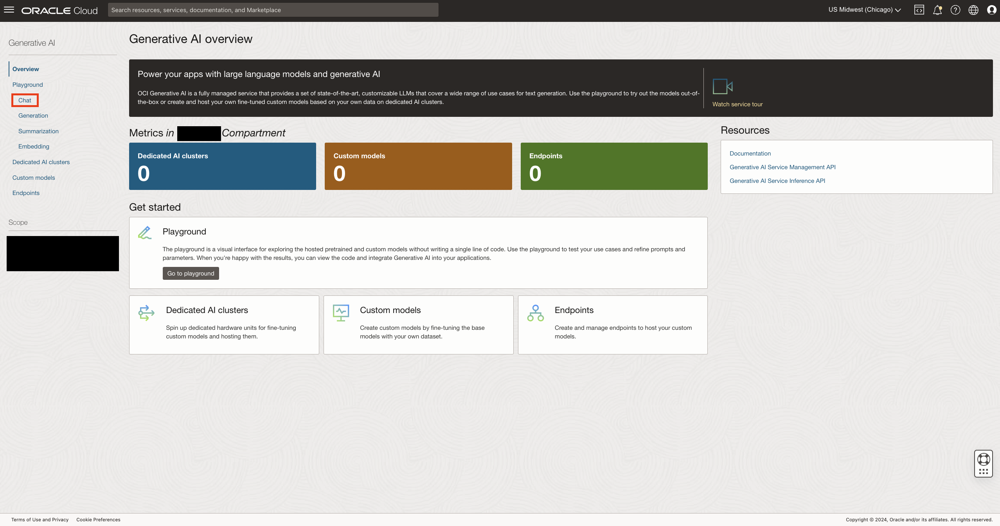
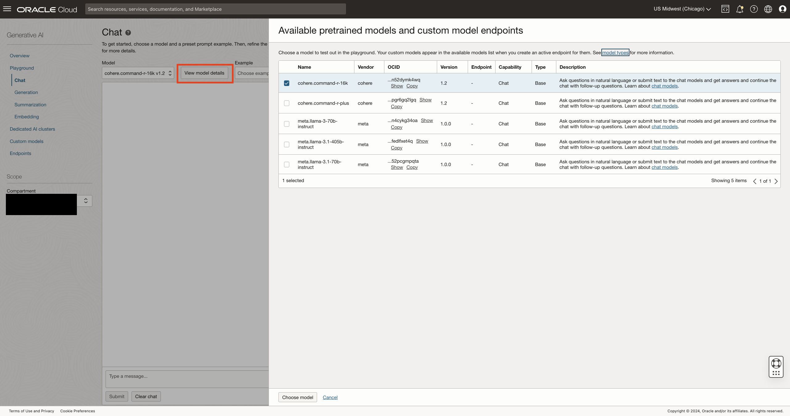
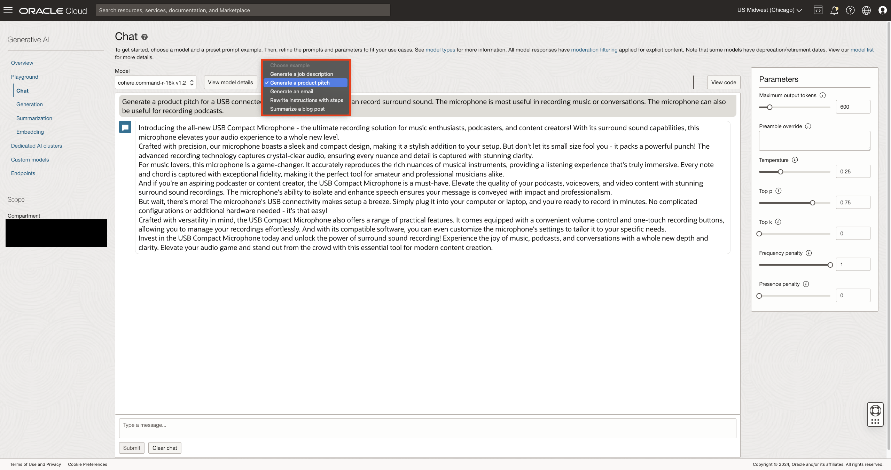

# Lab 3: Build RAG Pipeline

## Introduction
Today, generative AI is one of the fastest growing fields in technology. Thanks to the advancement in research and industry, companies can now query their unstructured data intelligently using Vector AI Search and generate new content, analysis of events and much more using generative models. In this section we will define, explore and use OCI Embedding and Generative Chat models as well as build a modular RAG pipeline from user provided text data. This section is meant to be educational in nature. If you have experience with Generative AI, feel free to skip the steps marked optional.

Estimated Time: 30 minutes

### Prerequisites

* A tenancy subscribed to the Chicago region.
* Permissions to use OCI Generative AI service shared APIs.

## Task 1 (Optional): OCI Generative AI Embedding Models:

The first step to any machine learning task is data. For a very long time, companies all around the world have been querying their structured data stored in a database using SQL statements. For unstructured data, which is defined as any data that is not stored in a table with rows and columns, large blocks text, images, video and audio are all examples of unstructured data. With the help of embedding models this is not the case anymore. These AI models allow us to turn unstructured data into vectors that can be queried.

Vectors are numerical representations of data that capture the semantic meaning of unstructured content. These vectors can then be used to perform tasks such as similarity search, clustering, and classification, allowing companies to query, analyze, and retrieve insights from their unstructured data efficiently.

1. Click the **Navigation Menu** in the upper left, navigate to **Analytics & AI**, and select **Generative AI**.
    
2. On the left navigation panel under **playground**, click **Embedding**.
    
3. Use one of the example templates to embed text or bring in your own data.
    
4. Click run to visualize results. Pay special attention to how similar sentences are grouped together.
    

This concludes our section on embedding models. Embedding models are a crucial step in our RAG pipeline, enabling us to uncover similarities in text and perform other semantic applications. Next we will experiment with OCI Generative AI Chat models.

## Task 2 (Optional): OCI Generative AI Chat Models

To enable enterprises to take advantage of the ever growing Generative AI models Oracle has introduced a new cloud service called OCI Generative AI Chat models. These models can be utilized through the Generative AI shared API(focus of this section) or through the Dedicated AI Clusters for additional performance and dedicated hosting. Oracle is adding new models for new use cases all the time, meaning the model offerings may change. We will test out some of these models on the OCI Generative AI playground.

1. Make sure you are in the **OCI Generative AI console**.
2. On the left hand navigation panel, click **Chat**.
    
3. Click on "View Model Details" to see models that are available to use, and choose a model.
    
4. Test out models with the examples provided, or use your own queries.
    

## Task 3 (Optional): Overview of Retrieval Augmented Generation

Everything that we have covered in the previous sections and labs have been building up to a RAG pipeline. We first created the 23ai Autonomous Vector Database, a compute instance for our front-end and went over Embedding and Chat models. In this task we will introduce you to retrieval augmented generation and talk about each component of the **RAG Pipeline**. 

RAG Pipeline Components:

1.	Data Ingestion
	* Collect and preprocess domain-specific data.
	* Generate embeddings using an embedding model.
2.	Vector Storage
	* Store embeddings in the Autonomous Vector Database.
	* Utilize the vector datatype for efficient storage and retrieval.
3.	Query Processing
    * User inputs a query.
	* Generate an embedding of the query.
4.	Similarity Search
	* Search the vector database using the query embedding.
	* Retrieve the most relevant documents or data points.
5.	Response Generation
    * Feed the retrieved information into a generative AI model.
	* Generate a context-aware and accurate response.

Now that we have an understanding of our RAG components, we can go ahead and proceed to the final step, setting up our front end and finally experimenting with our RAG pipeline

You may now **proceed to the next lab**.

## **Acknowledgements**

* **Authors** - Enis Aras