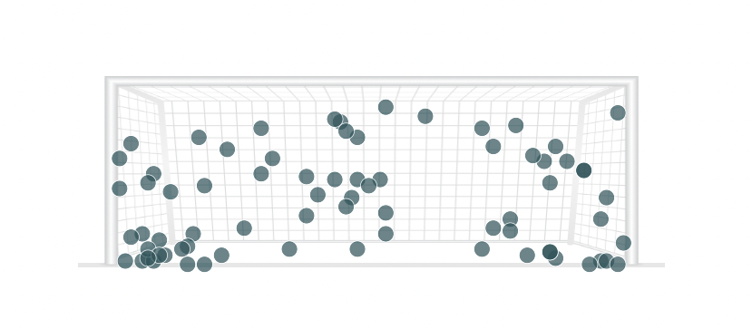

# Introduction

## About this Workshop

The Premier League has been leading the charge with their embrace of data and visualizations as a way to increase fan engagement. They recognize that visualized data often enables users to ask questions they may not have otherwise asked. These data visualizations will be a catalyst that sparks interesting conversations with fans across the world. Visualized data enables fans to explore their favorite teams, players, and remarkable matches in a new dimension. As a fun visual element, maps are also appealing as they give eager fans an easy way to highlight memorable moments. 

In this workshop you will be using Oracle Analytics Cloud with data provided by the Premier League to configure a custom image map layer of a football goalmouth and plot the penalty goals scored by players across the Premier League during the 2022-2023 season. 

The at-a-glance usability of maps makes them one of the most powerful tools for rapidly uncovering insights. Any dataset with geographic coordinates can be transformed through mapping. Oracle Analytics Cloud allows users the flexibility to tailor any image relevant to their analysis into a custom background map layer.

Estimated Workshop Time: 2 hours 

### Objectives

In this workshop, you will learn how to:
* Provision an Oracle Analytics Cloud instance 
* Setup and prepare data for mapping
* Apply custom image map layers
* Build visualizations
* Filter Oracle Analytics Cloud dashboards and visualizations

### Prerequisites

This lab assumes you have:
* An Oracle account
* A basic understanding of analytics terms and concepts
* Permission to create Datasets in Oracle Analytics Cloud (OAC)
* Access to the Console of OAC

## Acknowledgements
* **Author** - Andres Quintana, Senior Product Manager, Analytics Product Strategy
* **Contributors** -  Carrie Nielsen, Analytics Product Strategy
* **Last Updated By/Date** - Quintana, July 2023
