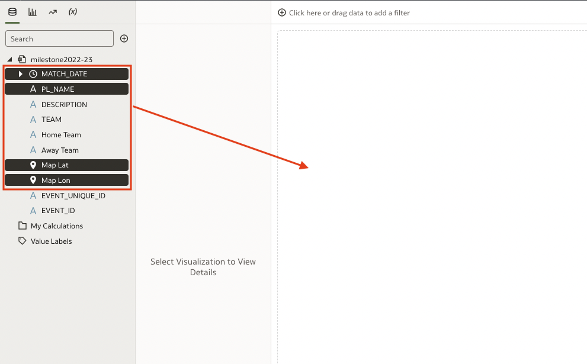
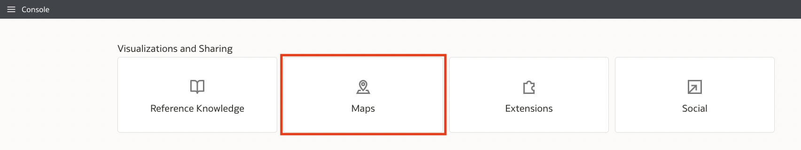

# Establish Map Boundaries

## Introduction

In this lab you will explore the data to establish the upper and lower limits of the latitude and longitude values in order to create the map boundaries. You will also upload the background map image. 

Estimated Lab Time: 20 minutes

### Objectives

In this lab, you will:
* Use the data to build a table 
* Use the table to establish the upper and lower limits of the latitude and longitude values
* Upload the background map image

### Prerequisites (Optional)

This lab assumes you have:
* An Oracle Cloud account
* All previous labs successfully completed

## Task 1: Create a table.
Creating a table from the latitude and longitude data will allow you to explore the upper and lower limits of the values. This step is important because these limits will allow you to accurately define the map boundaries. A Premier League goalmouth is exactly three times as wide as it is tall. Knowing this ratio and the data limits will ensure that the goalmouth map accurately visualizes the data.

1. In your Oracle Analytics Cloud workbook, select Match Date, PL Name, MapLat, and MapLon from the data and drag them into the visualizations pane. This will automatically return a table. 

	

2. Hovering your mouse over the **MapLat** column header will reveal sorting arrows. Click on the up arrow to sort from lowest to highest, and the down arrow to sort from highest to lowest. These are the upper and lower limits for Latitude. 

  

3. Repeat the above step for the **MapLon** column to find the upper and lower limits for the Longitude column. 

4. The data limits are reflected in the table below. 
  
  | Latitude | Longitude | 
  | --- | --- |
  | 8.375 | -161.568 |
  | 0.15 | -135.135 |
  
As mentioned above, a Premier League goalmouth is exactly 3x wider than it is tall. This means that the limits will be adjusted to fit this parameter. 

5. Click the save icon in the upper right corner of the page to save your workbook. Save it as goalmouth-lab.

  

  

## Task 2: Upload the map image.

1. Download the attached image that will be used for the background map layer. 

  [Goalmouth Map](files/pl-goalmouth.png)

2. Use the back arrow at the top left of the workbook page to navigate back to the Oracle Analytics Cloud home page. 

  

3. Select the 'hamburger' menu in the top left of the page and navigate to **Console**.

  

4. In the Console select **Maps**. 

	

5. Click on Backgrounds to navigate to the backgrounds tab. 

  

5. Click on **Image Backgrounds** and select the **+** icon to upload the attached background image from Step 1. 

  

6. Browse to your downloaded file.

  

7. In the map image edit window, select the drop-down menu next to **Coordinates** and change the selection from Auto to Custom (Lat, Long).

  

8. As you recall, a Premiere League goalmouth is three times wider than it is tall. Knowing our upper and lower lat, long limits allows us to establish a frame. Use the below coordinates to standardize your map image. 

  | Latitude | Longitude | 
  | --- | --- |
  | 10 | -163.75 |
  | 0.0 | -133 |

  

9. Navigate back to your workbook. 

This concludes the Map Boundaries lab. You may proceed to the next lab.

## Learn More

* [URL text 1](http://docs.oracle.com)
* [URL text 2](http://docs.oracle.com)

## Acknowledgements
* **Author** - Andres Quintana, Senior Product Manager, Analytics Product Strategy
* **Contributors** -  Carrie Nielsen, Analytics Product Strategy
* **Last Updated By/Date** - Quintana, July 2023
