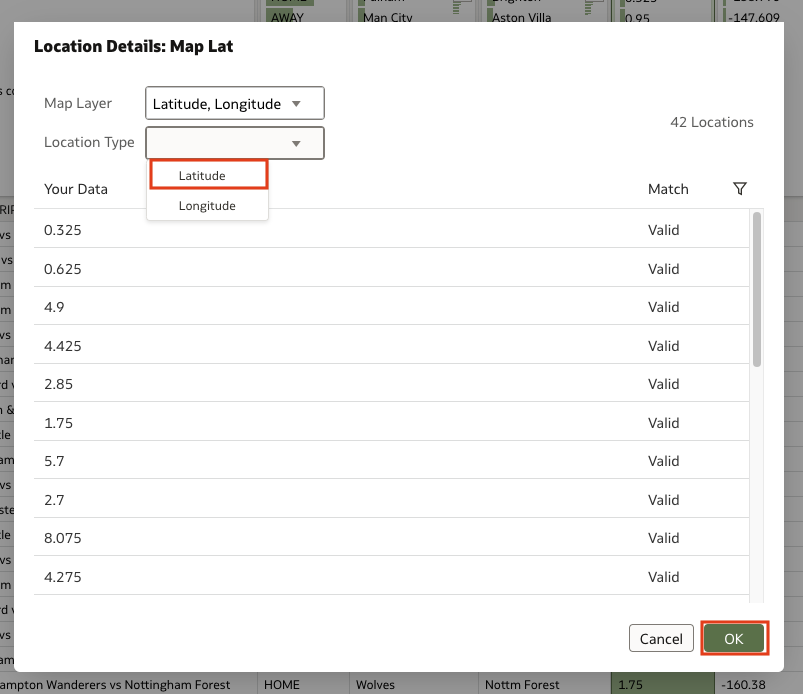

# Prepare the Dataset

## Introduction

In this exercise, you will upload the data, prepare and save the dataset, and create the workbook.

Estimated Time: 20 minutes

### Objectives

In this lab, you will:
* Upload the data file
* Prepare and save the dataset
* Load the image for the background map layer

### Prerequisites 

This lab assumes you have:
* An Oracle account
* A basic understanding of analytics terms and concepts
* Permission to create Datasets in Oracle Analytics Cloud (OAC)
* Access to the Console of OAC

## Task 1: Upload the data file

Premier League has provided a dataset which includes all of the successful penalty goals scored during the 2022-23 season. This data will be used to construct a map showing where the ball enters the goalmouth on those penalties. You will be able to see which players were more successful at home versus while they were playing away. You will also be able to determine if there are players who have equal success at home or while away.

1. Download the attached file. 

  [Premier League Data](files/milestone2022-23.xlsx)

2. Click **Create** the top right corner of the Oracle Analytics Cloud home page.

  

3. Select Dataset to upload and create the dataset. After selecting Dataset, click to browse for your downloaded file and select **Open**.

  

  

  

4. Once your file uploads, select **Ok** to begin preparing the dataset.

  

## Task 2: Configure the Location Details

1. At the bottom of your browser window, click on the file name to access the data editor. 

  

2. Click on the 3 dot menu icon for the **MapLat** column and select Location Details to transform the data into geographic reference data. 

  

3. In the Location Details window, verify that the data will be treated as Latitude and click Ok.  

  

4. Repeat the above steps for **MapLon** and make sure the data will be treated as Longitude. 

5. In the top right hand corner of the window, click the save icon to save the dataset. Name it **milestone2022-23**. 

  

  

6. Once the dataset is saved, click **Create Workbook** in the top right corner of the screen. 

  

7. After you click Create Workbook, a workbook page will open. In the top right corner of the window, click the **X** to close the auto-insights pane. 

  

This concludes the dataset preparation lab. You may proceed to the next lab.

## Acknowledgements
* **Author** - Andres Quintana, Senior Product Manager, Analytics Product Strategy
* **Contributors** -  Carrie Nielsen, Analytics Product Strategy
* **Last Updated By/Date** - Quintana, July 2023
