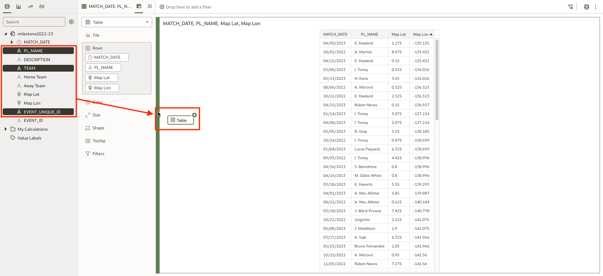
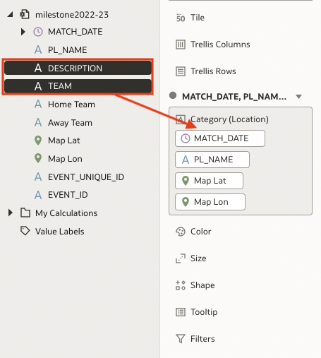
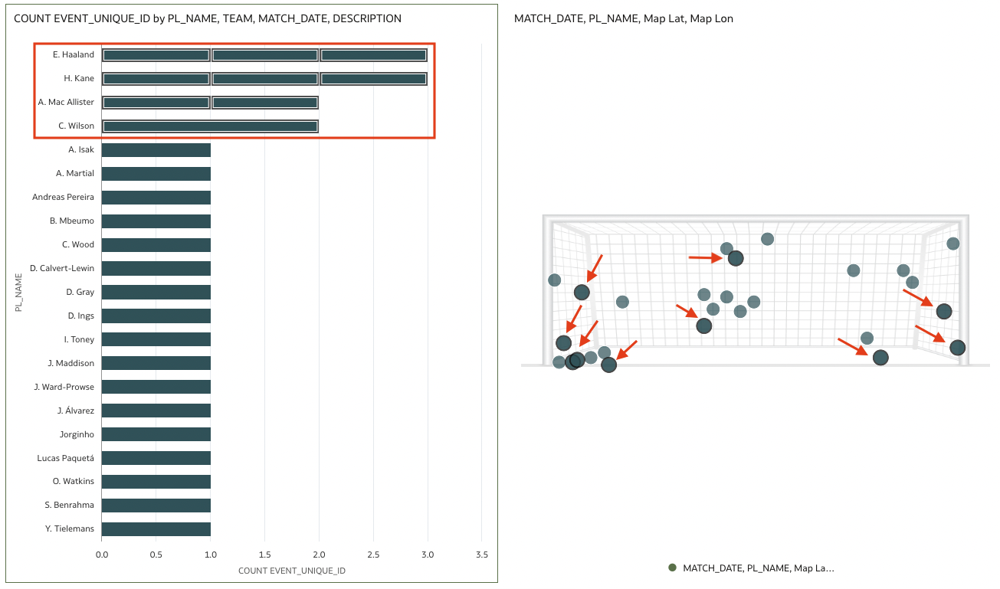

# Construct the Dashboard

## Introduction

In this lab you will construct visualizations and build a dashboard.

Estimated Time: 30 minutes

### Objectives

In this lab, you will:
* Construct visualizations
* Build a dashboard

### Prerequisites

This lab assumes you have:
* An Oracle Cloud account
* All previous labs successfully completed
* Access to the Console of OAC

## Task 1: Aggregate an Attribute 
Visualizations allow us to tell a story with the data that will resonate and stay with the end user. This creates a lasting impact beyond the capabilities of the data alone. In this section you will create a map and bar chart from the data. Together, these visuals will illustrate the data's contextual narrative. Since the data does not include a count of Penalties Scored, we will have to add it by aggregating the Event Unique ID attribute.

1. To start, you'll create a second table. Select PL Name, TEAM, Event Unique ID and bring them into the the canvas to the left of the table you created in the previous section. On the canvas you will see a green bar indicating that a new table visualization is being added. 

	

  

As you move forward in this lab ensure that you are selected on the table with PL Name, TEAM, and Event Unique ID as the grammar panel and properties only relate to the selected visualization. 

2. In the grammar panel, right click on Event Unique ID and select **Aggregate** and then **Count**.

  

3. The above step created a count of the number of penalties each player has scored by Home and Away. 

   

4. Click the drop down at the top of the grammar panel to change this new table's visualization type to a Horizontal Stacked Bar Chart.

  

5. Your canvas should look like this: You'll see the table from the previous lab section used to find the upper and lower limits of the Latitude and Longitude and  the Horizontal Stacked Bar Chart you just created.

  

## Task 2: Modify the Bar Chart
In the previous section, you aggregated the attribute of Event Unique ID to create a count of penalties scored. From there, you created a bar chart to visualize that count. Now, you will modify that bar chart to visually tell the story of each player's penalty success. 

1. Move TEAM to **Color**. This will make it so each player's penalty goals are displayed on one individual bar segmented by colors which will represent penalties scored at Home or Away matches.

  

2. Add Match Date and Description to the Detail of the bar chart. This will change each bar into individual segments representing each match.

  

3. Sort the bar chart by the number of penalties scored from High to Low. To do this, click on the 3 dot menu icon in the top right of the bar chart visualization, select sort by, select Count Event Unique ID, and finally click high to low 
  
    

4. Your canvas should now look like this: You will see the modifications you made to the Stacked Bar Chart visualization and the table created earlier in this workshop.

  

## Task 3: Assemble the map

1. Select the table visualization that was created earlier in this workshop and change the visualization type to a **Map**. 

  

2. Move MapLat and MapLon from Shape to Category (Location). 

  

3. To change the background map layer, start by selecting Properties at the top of the grammar panel, then the Map tab, and finally click "Default" which will open a dropdown menu. You will now be able to select the the background map layer that you previously uploaded. It should  be named pl-goalmouth.

  

4. Add Description and Team to the map. 

  

After adding Description and Team to the map, hover your mouse over one of the points on the map. The tooltip will now show the Match Description, whether the penalty was scored by a player on the Home or the Away team, the match date, and player name. 

  

5. At this point, your map should look like this.

  

6. Your canvas should look like this. You will see the Stacked Bar Chart created in the previous section as well as the Goal Mouth Map that was just completed. 
  
  

## Task 4: Add filters

1. Filters add interactivity and the ability to see a clearer picture of a specific portion of the data. Begin by adding **Team** to the filter bar at the top of the canvas. 

  

2. Now, click the 3 dot menu in the top right corner of the bar chart. From here, click **Use as Filter** 

  

3. Let's take a look at all penalty goals scored during away games. To do this, click on the Team filter and select **Away**.  

  

You should see the Away attribute move to the right side of the filter into the Selections area.

  

Now, imagine you are a broadcaster and you're researching for upcoming matches and want to discuss players who have scored more than two penalty goals during away matches this season. By clicking on the top player name on the bar chart and then while holding ctrl on your keyboard click to multi-select the next three player names. You should have four total players selected. The penalty goals represented by these players will be outlined in bold on the map. The map allows you start conversations from the placement of their goals. As you can see, only two of those goals are in the center while the rest are in the corners. It would be reasonable to discuss that it is more likely for a player to have success by aiming for the corners of the goal.

  

4. Bring the canvas back to showing all of the data. To do this you can click any blank space within the bar chart and then click on the selected value in the team filter (at the top of the page) to remove the selections. 

5. Explore the data by experiencing different filter options. Observe the changes to the goal map. 

## Task 5: (Optional) Customize your Dashboard 

1. Start by selecting the bar chart. Click on the properties tab and change the title to "Penalties Scored by Player"

  

2. Now change the Labels Axis from PL NAME to Player Name and the Values Axis name from Count Event Unique ID to Penalties Scored. Navigate to the Axis tab in Properties and change the Label axis from Auto to Custom, repeat for the Values axis. 

  

3. Now following the above steps change the Title of the Map to Penalty Map and remove the legend. 

  

  

4. At this stage, your canvas should look like this:

  

Congratulations on completing this workshop! 

## Acknowledgements
* **Author** - Andres Quintana, Senior Product Manager, Analytics Product Strategy
* **Contributors** -  Carrie Nielsen, Analytics Product Strategy
* **Last Updated By/Date** - Quintana, July 2023
