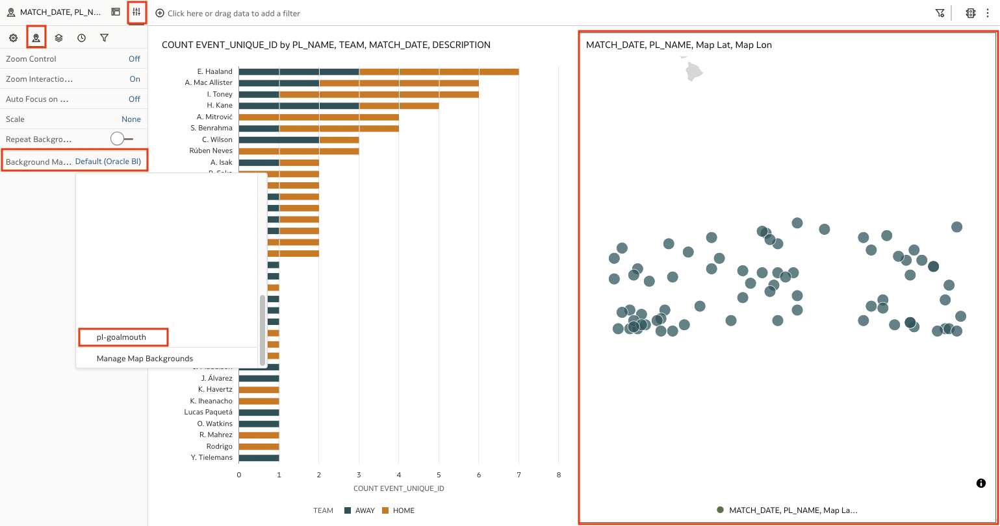
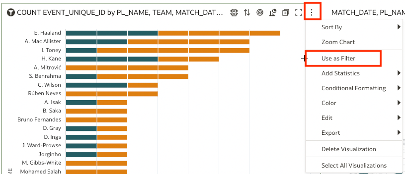
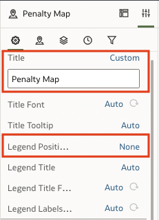

# Construct the Dashboard

## Introduction

In this lab you will construct visualizations and build a dashboard.

Estimated Time: 20 minutes

### Objectives

In this lab, you will:
* Construct visualizations
* Build a dashboard

### Prerequisites (Optional)

This lab assumes you have:
* An Oracle Cloud account
* All previous labs successfully completed

## Task 1: Add a Column to the Data Layer 
Visualizations allow us to tell a story with the data that will resonate and stay with the end user. This creates a lasting impact beyond the capabilities of the data alone. In this section you will create a map and bar chart from the data. Together, these visuals will illustrate the data's contextual narrative. Since the data does not include a count of Penalties Scored, we will have to add it manually in the data layer. 

1. Select 'Data' at the top of the page. 

	

2. Click the pencil icon on the dataset to edit the data. This will open the data in a new tab.

  

3. On the left side of the window (next to the search bar) click the **+** icon. 

   

5. Clicking the **+** will open an edit panel to create a new column. We will name this column *Penalties Scored*. Since the data only includes successful penalties, this will be treated like a row count and in the value box. Just type "1" and click Validate and then and Add Step".

  

6. In the bottom left of the window change the Penalties Scored column to be treated as a measure. 

  

7. Save the data layer and return to the workbook tab. Click on Visualize in the top center of the window. After you save the data layer the workbook will automatically refresh to include the new data. 

## Task 2: Create a Bar Chart

1. Select PL Name, Penalties Scored, and TEAM and drag them to the left of the table on the workbook. You will see a green bar indicating that a new visualization is being added. 

  

2. The visualization automatically populated as a bar chart. You will need to change it to a horizontal stacked bar chart. 

  

3. Add Match Date and Description to the Detail of the bar chart. This will change each bar into individual blocks representing each match. 

  

4. Sort the bar chart by the number of penalties scored from High to Low. To do this, click on the 3 dot menu icon in the top right of the visualization, select sort by, select penalties scored, and finally click high to low 

  

5. At this point, your canvas should look like this:

  

## Task 3: Assemble the map

1. Select the table visualization and change the visualization type to a **Map**. 

  

2. Move MapLat and MapLon from Shape to Category (Location). 

  

3. Select Properties and the Map tab and change the Background Map to the name of the background map layer that you previously uploaded. It should  be named pl-goalmouth.

  

4. Add Description and Team to the map. 

  

5. At this point, your map should look like this.

  

6. Your canvas should look like this.
  
  

## Task 4: Add filters

1. Filters add interactivity and the ability to see a clearer picture of a specific portion of the data. Begin by adding **Team** to the filter bar at the top of the canvas. 

  

2. Now, click the 3 dot menu in the top right corner of the bar chart. From here, click **Use as Filter** 

  

3. Let's take a look at all penalty goals scored during away games. To do this, click on the Team filter and select **Away**.  

  

Now, imagine you are a broadcaster and you're researching for upcoming matches and want to discuss players who have scored more than two penalty goals during away games this season. By clicking on the top player name on the bar chart and then while holding ctrl on your keyboard click to multi-select the next two player names. The penalty goals represented by these players will become highlighted on the map.  

  

4. Bring the canvas back to showing all of the data. To do this you can click any blank space within the bar chart and then click on the selected value in the team filter (at the top of the page) to remove the selections. 

7. Explore the data by experiencing different filter options. Observe the changes to the goal map. 

## Task 5: (Optional) Customize your Dashboard 

1. Start by selecting the bar chart. Click on the properties tab and change the title to "Penalties Scored by Player"

  

2. Now change the axis from PL NAME to Player Name. Navigate to the Axis tab in Properties and change the Label axis from Auto to Custom. 

  

3. Now following the above steps change the Title of the Map to Penalty Map and remove the legend. 

  

4. At this stage, your canvas should look like this:

  

Congratulations on completing this workshop! 

## Acknowledgements
* **Author** - Andres Quintana, Senior Product Manager, Analytics Product Strategy
* **Contributors** -  Carrie Nielsen, Analytics Product Strategy
* **Last Updated By/Date** - Quintana, July 2023
