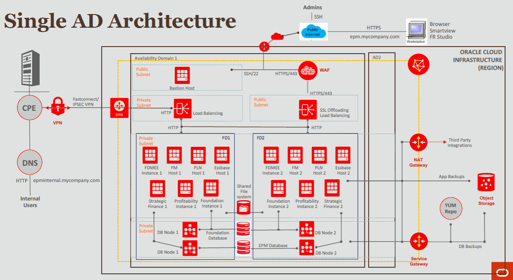

# Introduction: Deploy Hyperion on Oracle Cloud Infrastructure

## About this Workshop

Hyperion EPM is an Oracle Enterprise Performance Management suite of apps under the domains of Hyperion Financial Management and Hyperion Planning.

Oracle Hyperion Financial Management provides financial consolidation and reporting, while Hyperion Planning is a centralized planning, budgeting, and forecasting solution that integrates financial and operational planning processes and improves business predictability.

Hyperion EPM can be moved to Oracle Cloud Infrastructure (OCI) for improved efficiency, cost savings, and performance gains compared to on-premises deployments or other clouds. Deploying Hyperion on Oracle Cloud Infrastructure provides access to high-performance compute, Oracle RAC, and Exadata, helping ensure the highest levels of performance availability. Ensuring there is no single point of failure.

When migrating from on-premises, you will take advantage of cloud-based features and web-based tooling such as provisioning and automation of application deployment built by the Hyperion development team. Any currently supported Hyperion version can effectively run on Oracle Cloud.

By moving to OCI, customers gain economic and operational savings with improved elasticity, agility and cost savings while maintaining key customizations and integrations optimized alongside Hyperion.

The goal of this workshop is to help you get comfortable using Oracle Cloud Infrastructure and help you deploy all the resources required for Hyperion to run on OCI.

**Estimated Time: 2 hours 30 minutes**

### Objectives

In this workshop, you will:
* Utilize OCI Resource Manager (ORM) stacks and Terraform configuration to set up Hyperion infrastructure
* Configure the Hyperion VM instances that Terraform provisions
* Optionally, configure a shared file system for all Hyperion instances

### Prerequisites

This lab assumes you have:
* An Oracle account and tenancy provisioned
* If you do not have these provisioned, go through the lab "Getting Started" on the sidebar to enable an OCI environment.
  * If you do already have these provisioned, you may start on Lab 1.

## Hyperion Products Overview

Here is a brief overview of Hyperion products.

1. Oracle Hyperion Foundation Services

Common infrastructure components that enable you to install and
configure all the modules of the Enterprise Performance Management system;
and to manage users, security, metadata, and the life cycle of the applications. Foundation Services are necessary regardless of whether you want to deploy Hyperion Financial Management, or Hyperion Planning, or both.

2. Oracle Hyperion Financial Management (HFM)

A multidimensional online analytical processing server on RDBMS
that provides an environment for web-based consolidation, tax provision,
QMR, JSK applications. The application enables global financial consolidation, reporting, and analysis in a single, highly scalable software solution.

3. Oracle Hyperion Tax Provision (HTP)

A comprehensive global tax provision solution for multinational
companies reporting under US GAAP or IFRS. The application encompasses all the stages of the corporate tax provision process, including tax automation,
data collection, tax provision calculation, return-to-accrual automation, and tax reporting and analysis. The application is built using Oracle Hyperion Financial Management, and it leverages all the functionality provided by Financial Management.

4. Oracle Hyperion Planning

A centralized, Excel and web-based planning, budgeting, and
forecasting solution that integrates financial and operational planning
processes and improves business predictability.

5. Oracle Hyperion Financial Data Quality Management, Enterprise
Edition (FDMEE)

A packaged solution that helps finance users develop standardized financial data management processes by using a web-based guided workflow.

6. Oracle Hyperion Strategic Finance

A financial forecasting and modelling solution with on-the-fly scenario analysis and modelling capabilities, which helps you quickly model and evaluate financial scenarios, and offers out of the box treasury capabilities for sophisticated debt and capital structure management.

7. Oracle Hyperion Profitability and Cost Management

An application that provides actionable insights, by discovering drivers of cost and profitability, empowering users with visibility and flexibility, and improving resource alignment.

## Hyperion Infrastructure Diagram

The Terraform files included within this workshop set up an infrastructure that looks like the following.

## Learn More

* More information on the Terraform files used later in the lab can be found at the following [link.](https://docs.oracle.com/en/solutions/deploy-hyperion-oci/index.html) This link also has more information about the general deployment of a Hyperion solution.
* The blog post [Oracle HYPERION EPM on Oracle Cloud Infrastructure](https://blogs.oracle.com/cloud-infrastructure/post/oracle-hyperion-epm-on-oracle-cloud-infrastructure) gives a high level overview of reasons to run Hyperion infrastructure on OCI.
* Installers for the Hyperion products can be downloaded from the following link [here.](https://edelivery.oracle.com/) This link also holds downloads for other applications; choose the ones you need.

## Acknowledgements
* **Author** - Mitsu Mehta, Cloud Engineer, Packaged Apps
* **Contributors** - The Oracle Packaged Apps Team
* **Last Updated Date** - October 1, 2021
