# Use ORM and Terraform to provision Hyperion Infrastructure

## Introduction

In this lab, we will do a lot of the heavy lifting in provisioning our infrastructure.

Estimated Time: 60 minutes (a lot of this will be waiting for provisioning to finish)

### About Terraform and ORM

**Terraform** is an open-source "infrastructure-as-code" tool published by HashiCorp. The concept of "infrastructure-as-code" was actually created in response to more and more infrastructures getting deployed in clouds. The best analogy to describe Terraform is that of a "blueprint". Terraform files tell us (and the cloud) what makes up a given architecture and how to build it out. Thus, developers can use Terraform files in bundles (called a _stack_) to rapidly spin up infrastructure.

**ORM** (OCI Resource Manager) is Oracle's Infrastructure-as-Code gateway. It is compatible with Terraform, and utilizes it to spin up OCI infrastructure like networks, VMs, and databases.

### Objectives

In this lab, you will:
* Use boilerplate Terraform files to create an Infrastructure-as-Code stack
* Use ORM to configure the variables within the Terraform files
* Sit back and watch magic happen

## Task 1: Download the boilerplate Terraform Stack

We've written a Terraform stack that is provided freely for your use.

Go to the following URL and download the `oci-hyperion.zip` file from this link [HERE](https://objectstorage.us-ashburn-1.oraclecloud.com/p/EwriB0Oq1hUYAPvkceXZMLTsxcywHAimwkYVc-l03mxWzVWGX79a8QO1lap5wMXz/n/c4u04/b/livelabsfiles/o/ai-ml-library/oci-hyperion.zip).

**Note:** Terraform deployments can also be performed manually through a local computer. If you're curious about how to do this, we encourage reading up on Terraform as a tool; a link to their main page is cited below. In a manual deployment, you would unzip this file, install the Terraform command line tools onto your machine, and then utilize those commands in conjunction with manual editing of the `.tf` files to perform the deployment.

## Task 2: Use ORM to Configure Variables and Configure Infrastructure

We'll now get ready to use the Resource Manager to deploy the Terraform stack we just downloaded.

1. Login to your Oracle cloud account at [cloud.oracle.com](cloud.oracle.com) with your cloud account name (the _tenancy_) and tenancy admin username and password. (If you're unsure of who this is, the person who signed up for the account likely has tenancy admin privileges.)

  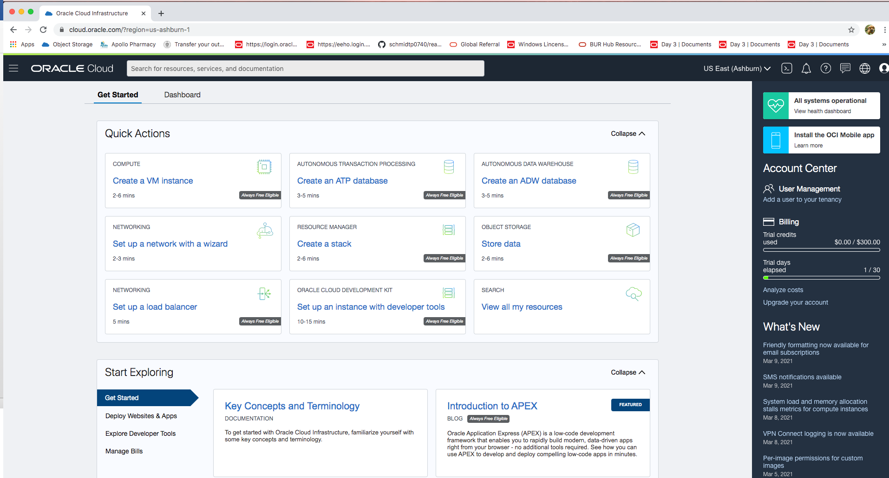

2. From the console, click on the three lines at the top left (known as the "hamburger menu", or just the "menu"); then go to **Developer Services** --> **Resource Manager** --> **Stacks**.

  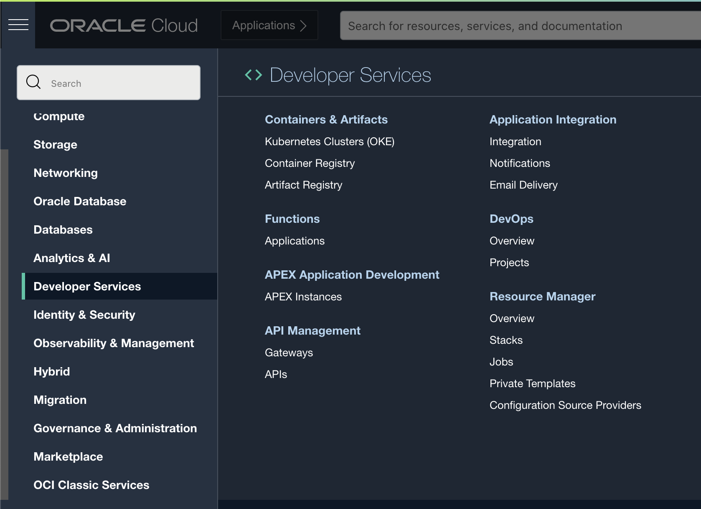

3.	If stacks already exist, click on the Create Stack button. If this is your first stack, the Create Stack screen should show up automatically.

  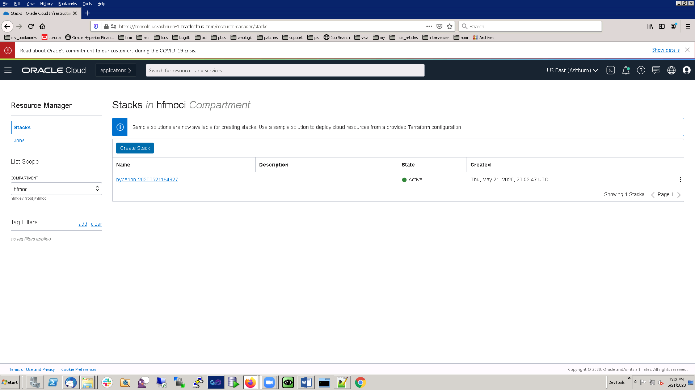

4.  We'll be using our own configuration for this lab. Select the `.zip` file radio button and browse or drop the `oci-hyperion.zip` configuration file downloaded in the previous task.

  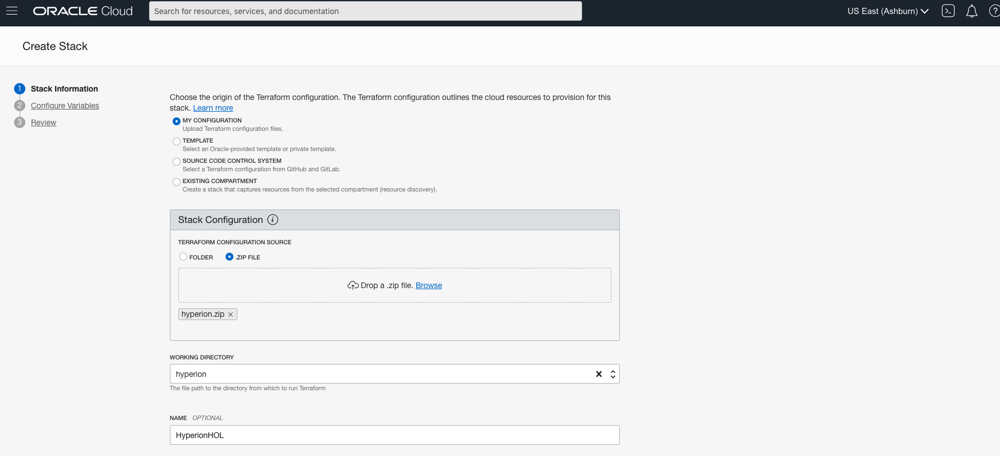

5.  While OCI provides us a default name (and the photo taken fills in that default name), we'll make a name that's easier for us to read. Provide the name **HyperionHOL** and a description **Hyperion on OCI**.

  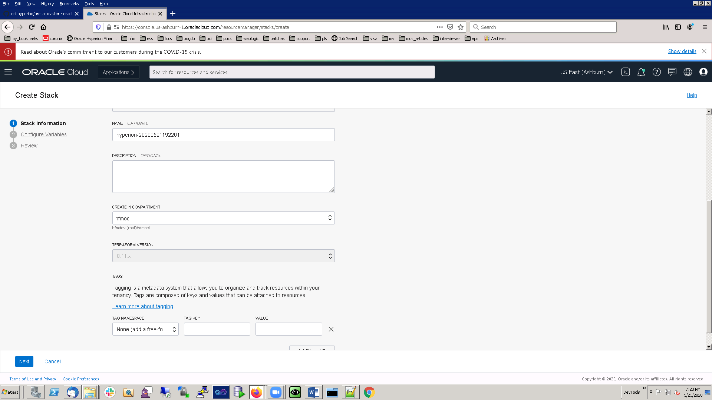

6.	Select the root compartment where you want to provision all your resources. (You can alternatively choose to create a compartment to provision your resources.) For the Terraform version, select **TF 0.13**.

7.  That's all we'll need on this screen; hit "Next".

---

The next few screens will ask us to configure variables to dictate the infrastructure's exact parameters.

8.  In the public key text box, you will have to provide a public SSH key of the SSH key bundle we created earlier in Step 1. Copy the content of the public key and paste it in the "PUBLIC SSH KEY" section. (Most machines will allow you to open public keys for copy pasting). Leave the rest of the configurations as is in this section.

  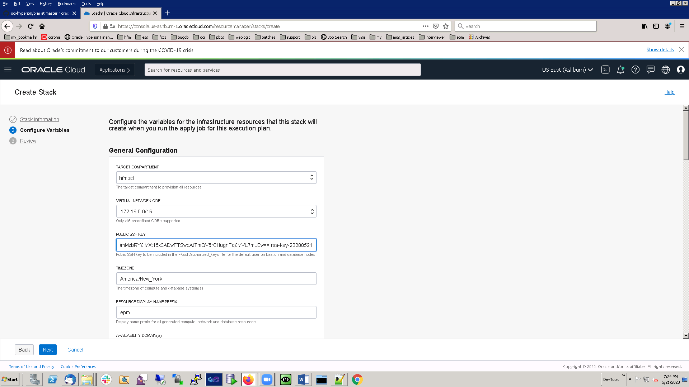

9.	Enter the Availability Domain value as 1. (An _availability domain_ designates which data center the stack exists in. What availability domain a stack is in doesn't affect its functionality.)Note that the Resource Manager also gives you helpful information about how to set up an infrastructure that spans multiple availability domains, which showcases both the power of Terraform and ORM.

  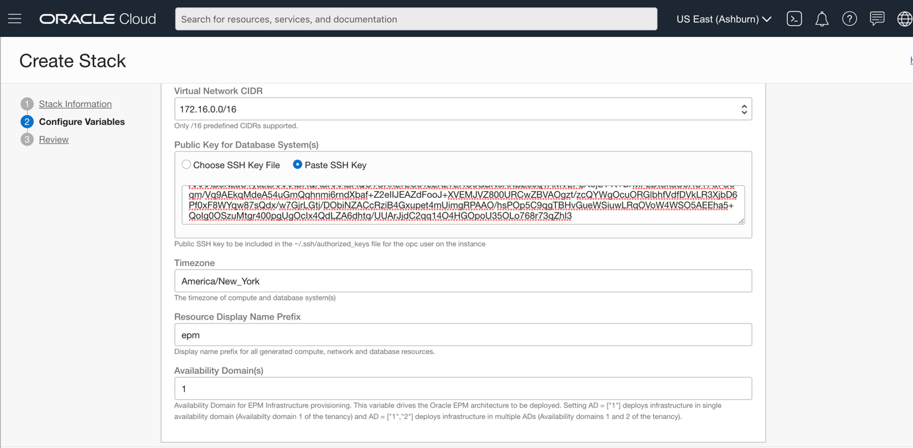

10.	Under the Choose EPM Application section, select Hyperion Financial Management.

  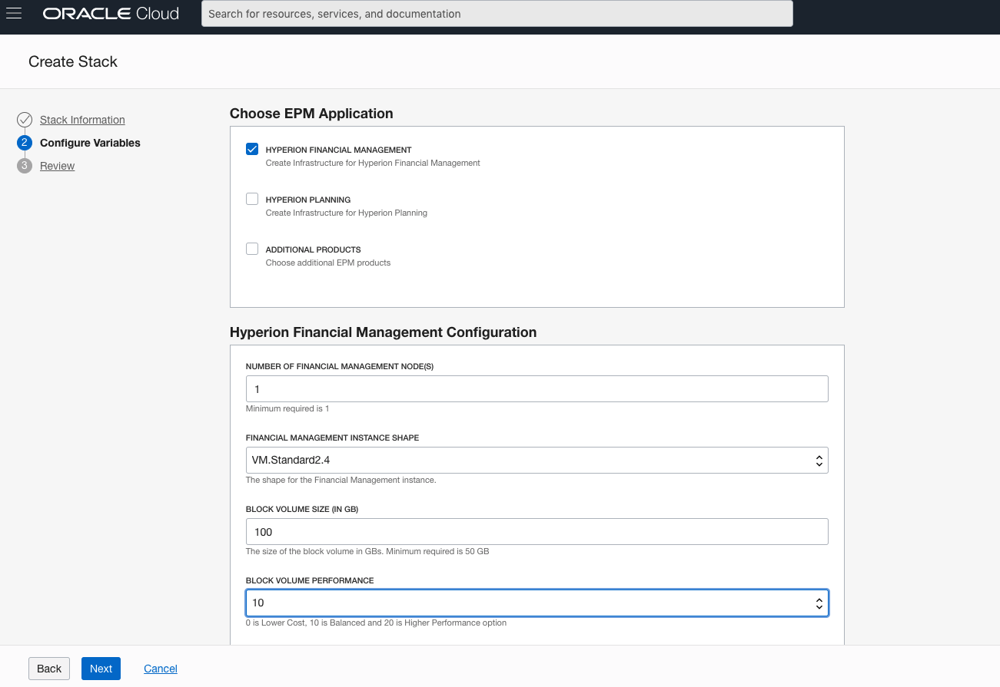

11.	Under Hyperion Financial Management Configuration, enter the following values (designed to create a low-footprint instance for a Hyperion application to rest on):

*  NUMBER OF FINANCIAL MANAGEMENT NODE(S) - 1
*  FINANCIAL MANAGEMENT INSTANCE SHAPE - VM Standard2.1
*  BLOCK VOLUME SIZE (IN GB) - 100
*  BLOCK VOLUME PERFORMANCE - 10

  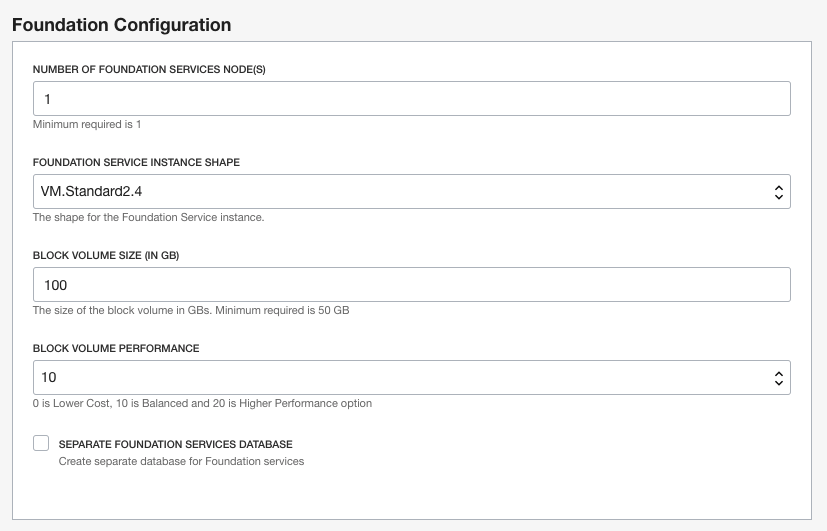

12. We'll need to create a database for our Hyperion infrastructure. Select Create EPM Database. Enter the following values that pop up in the box below:

*  DATABASE CONTAINER NAME - EPMCDB
*  DATABASE PDB NAME - EPMDB
*  DATABASE ADMIN USER PASSWORD - WElcome#1234#
*  DATABASE VERSION - 12.1.0.2
*  DATABASE EDITION -  ENTERPRISE_EDITION_EXTREME_PERFORMANCE
*  DATABASE LICENSE - LICENSE_INCLUDED
*  NUMBER OF DATABASE NODES - 1
*  DATABASE INSTANCE SHAPE - VM Standard2.2
*  DATABASE SIZE IN GB - 256
*  Leave the character set settings to default.

  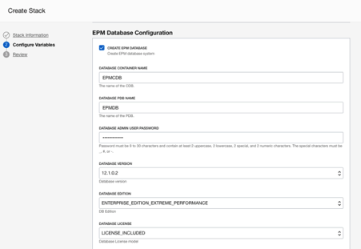

  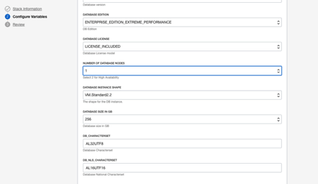

13. Time to configure the web server! In the Web Server Configuration box, enter the following values:

*  NUMBER OF WEB SERVER NODES - 1
*  SHAPE OF WEB SERVER NODE(S) - VM Standard2.1
*  BLOCK VOLUME SIZE (IN GB) - 100
*  BLOCK VOLUME PERFORMANCE - 10
*  LISTEN PORT FOR WEB SERVER - 19000

  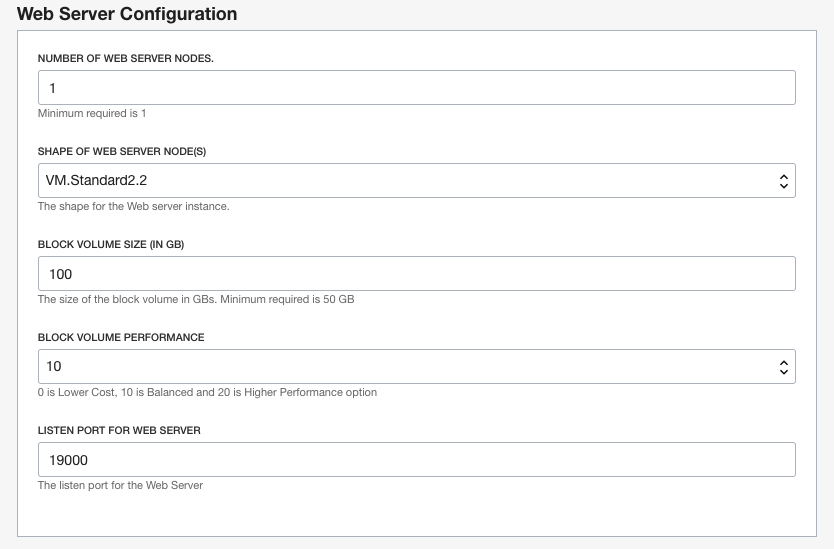

14. The default load balancer configuration will be fine for our purposes here (since we're only deploying a single instance).

  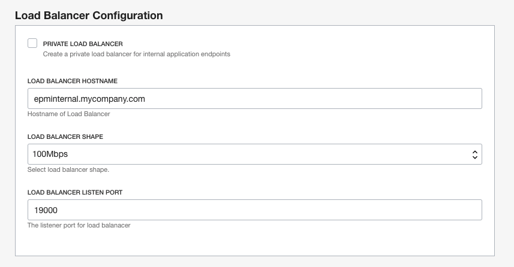

15. That finishes the configurations on this screen. Hit Next, review all the parameters we input, then hit "Create".

---

16. The console should bring us to a view of our newly created stack. Time to put it into action! Click on "Terraform Actions" --> "Plan". The console will ask for a name for the "Plan" job it's about to run; the default's fine for us here, so click "Plan" again.

  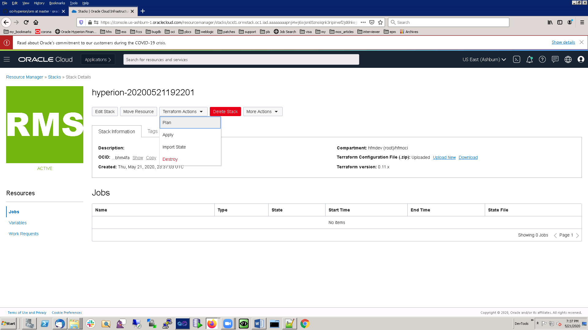

  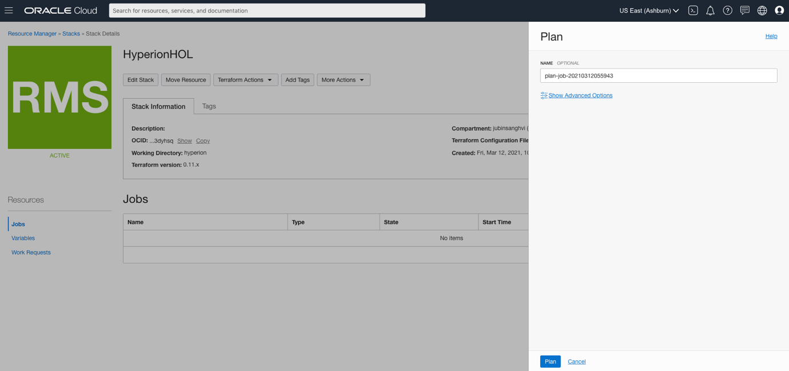

17. The console should change to show that the plan job is running.

  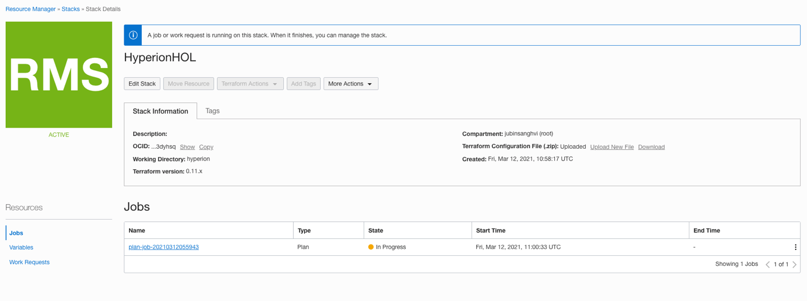

18. Plan jobs are meant to test if the infrastructure can actually be deployed; this Plan job should succeed, showing that this infrastructure is deployable. Once it has, click "Apply" to actually apply the stack. Again, the console will ask for some information; the defaults work again for us, so click "Apply" again.

  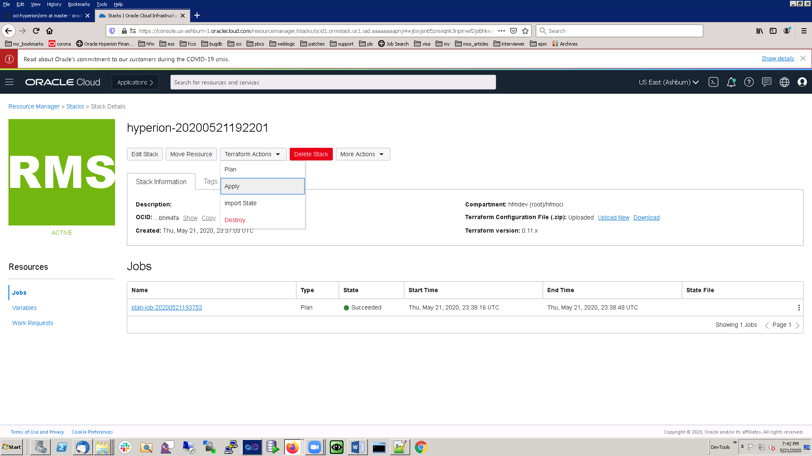

  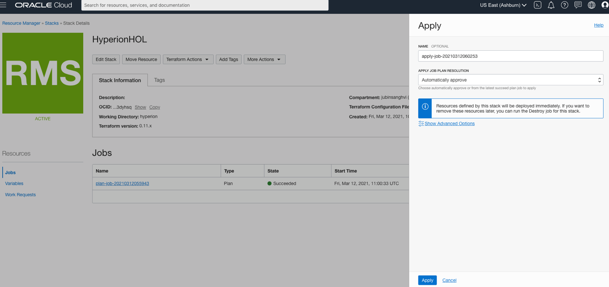

17. Just like the Plan job, the console should change to show that the apply job is running. (This portion will probably take a bit; go take a break. Make some coffee. Read an article.)

  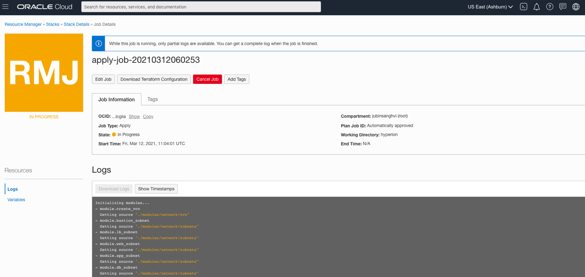

18. Once the Apply job succeeds, congratulations! All of the infrastructure we need is now provisioned on OCI, following the solution architecture in the Introduction.

  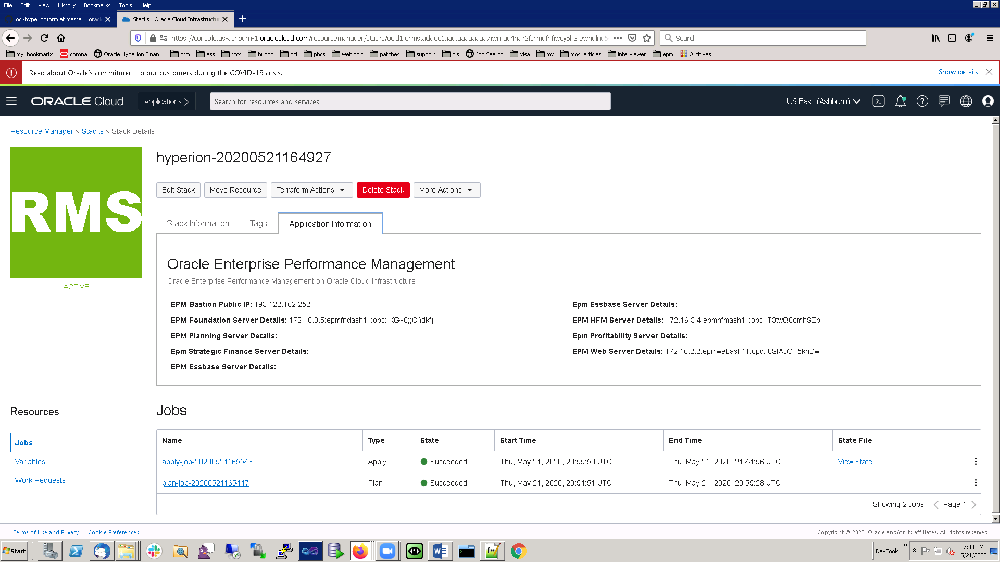

## Summary

You have now used Terraform to set up the bulk of the solution in OCI. In the next lab, we'll configure the machines that are running Hyperion.

You may now **proceed to the next lab.**

## Learn More

* [On the Terraform bundle we use in this lab](https://github.com/oracle-quickstart/oci-hyperion)
* [Terraform's main site](https://www.terraform.io/)
* [Documentation on Resource Manager](https://docs.oracle.com/en-us/iaas/Content/ResourceManager/Concepts/resourcemanager.htm)

## Acknowledgements
* **Author** - Mitsu Mehta, Cloud Engineer, Packaged Apps
* **Contributors** - The Oracle Packaged Apps Team
* **Last Updated Date** - October 1, 2021
