# Configure Instances for Hyperion in OCI

## Introduction

In this lab, we'll configure the instances that were provisioned in the previous lab. We will enable the required ports, and install the tools required to access the environments provisioned.

Estimated Time: 30-45 minutes

### About Bastion Hosts and Linux System Administration

In this infrastructure, administrators and maintainers will access the underlying infrastructure of the solution through a _bastion host_. This is a hardened machine that isn't open to the greater organization that will be able to SSH/RDP into the underlying instances. Bastion hosts can be either Linux or Windows instances; in this case, it's a Linux instance.

Most provisioned Linux instances do not provide a desktop interface for us to use right out of the box; this means that we'll need to provision a GUI through the command line. The desktop interface we'll be using is called GNOME, and is a quick standard desktop for us to spin up; the viewer will be a variant of the VNC tool called TigerVNC.

### Objectives

In this lab, you will:
*	Open the required ports on app, db, and web security lists
*	Download and install two clients onto the bastion host (VNC Viewer and Reminna) to SSH and RDP into the app servers
*	Login to reset and verify all 3 Windows compute instances that are going to be used for HFM, web, and foundation servers respectively.

### Prerequisites

You should already be logged into the Oracle console; have these things ready as we progress through the lab.

* Tenancy username (for login to the OCI console)
* Tenancy password (for login to the OCI console)
* Private-key of the SSH key bundle used in the previous lab while provisioning the instances
* Public IP address of the Linux host noted down in the previous lab
* Default passwords and IP address of the Windows hosts

To find the last two, you might have to view the instances in the OCI console. Click on the menu, then on **Compute** --> **Instances**; a few instances with `eps` should pop up. Click on each of them to get the requisite information.

## Task 1: Open Ports on the Security List

The first thing we need to do is to open up the requisite ports on the security list so that people can actually access our applications. Note that in a production scenario, we'd probably be more restrictive about who could connect to these ports by using different CIDR ranges; here, we use the non-restrictive `0.0.0.0/0`, which opens these ports to everyone.

1. If you're not already logged in, log into the console like we've done in previous labs. From there, click on the menu, then on **Networking** --> **Virtual Cloud Networks**.

2. Click on the VCN called `epmvcn`. You should see 5 distinct subnets within it.

	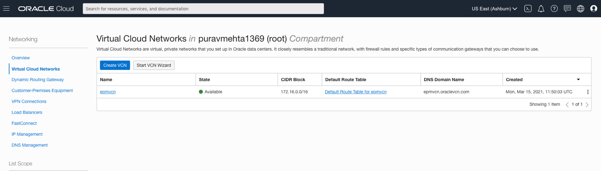

	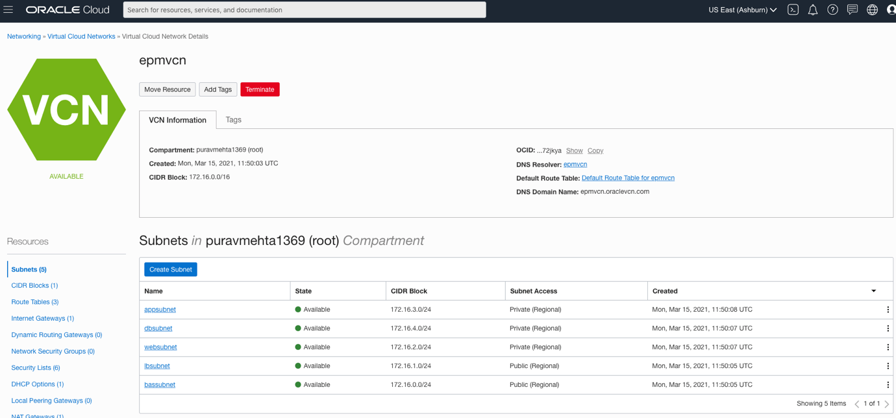

3. Select the subnet called `bassubnet`, which houses our bastion host. Then select its security list, `BastionSecList`.

	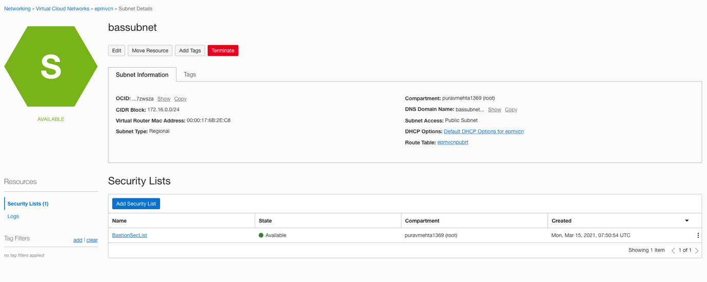

4. Click "Add Ingress Rule". Here, we'll add an ingress rule that allows all connections from all incoming connections. (In a production scenario, we would be more selective about which ports we could enter from and only provision ports for SSH/VNC connections, but to ease the lab's completion, we open all ports here.) In the Source CIDR box, type in the string `0.0.0.0/0`, then click "Add Ingress Rules" to add this ingress rule.

	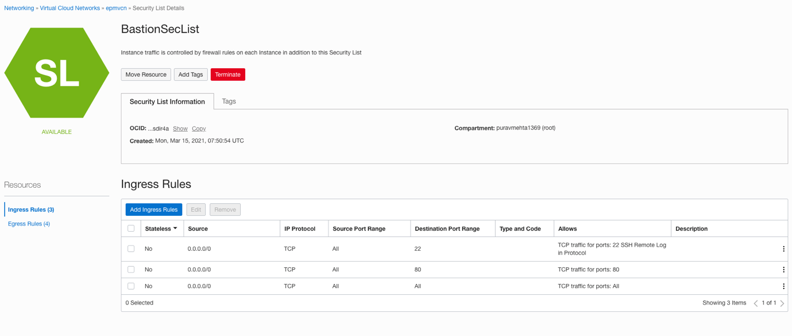

	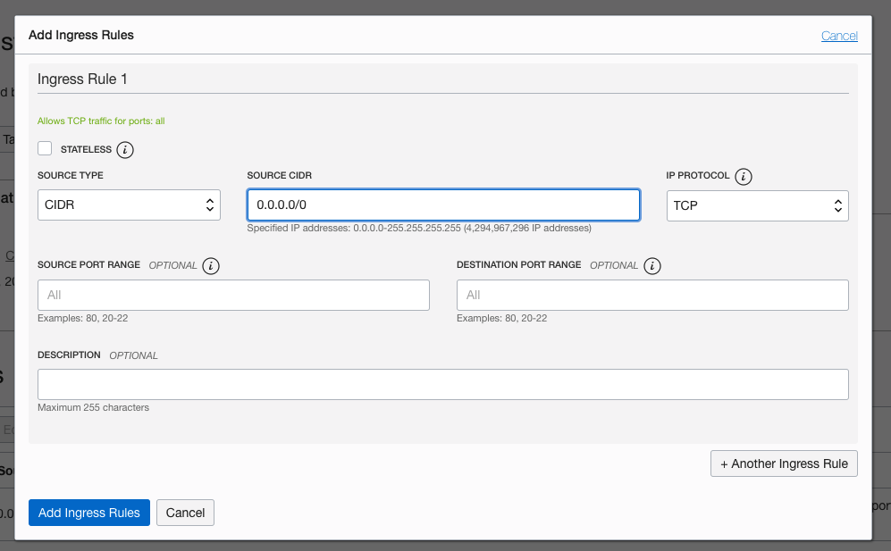

5. Now switch to "Egress Rules" by clicking on the left side, and add a similar "non-restrictive" egress rule by again filling in the string `0.0.0.0/0`, then clicking "Add Egress Rules" to add this egress rule.

	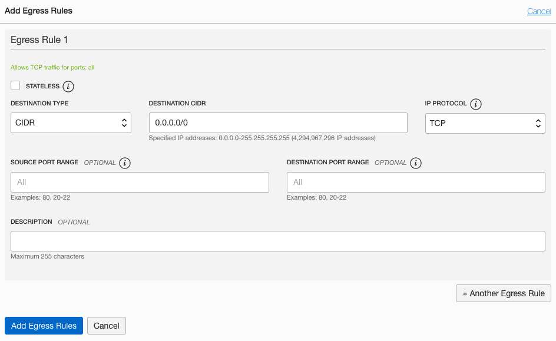

6. You're now familiar with adding security rules to subnets. Perform the same exercise with the app and web subnets (`appsubnet` and `websubnet`, respectively). Add an ingress rule for both with a destination CIDR `0.0.0.0/0` and enter the Destination port as `3389`.

## Task 2: Install a Desktop Interface on the Bastion Host

We now can access the instances we need. We'll start with configuring the bastion host.

1. From the menu, click on **Compute** --> **Instances**.

	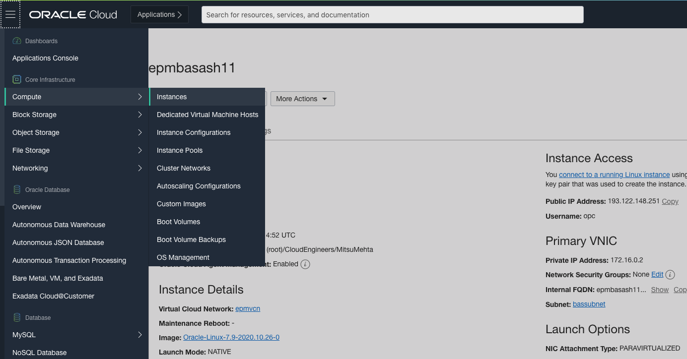

2. Click on the `epmbasash11` instance, and copy its public IP address.

	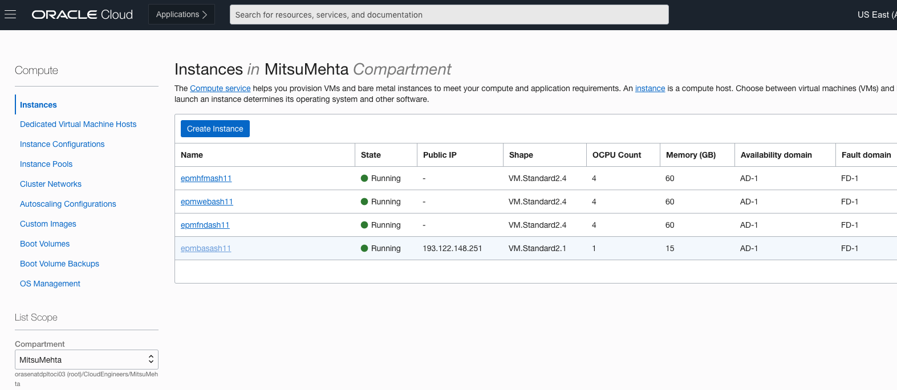

	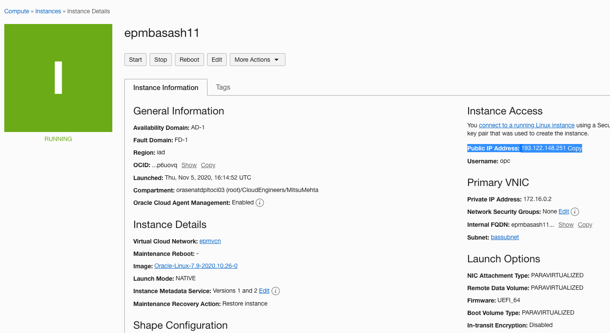

3. We'll now need to connect to the instance. Depending on what OS you're using, the method will likely be slightly different.

On Mac or Linux, you'll type the command below:
	```
	ssh -i <path_of_the_private_key> opc@<public_IP_address_of_bastion_host>
	```

The system will ask if you want to continue connecting; confirm you want to and the system will connect.

	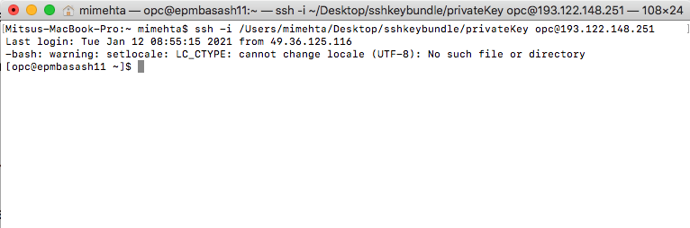

On Windows, you'll use PuTTY:

* Start PuTTY (from the Start menu, choose All Programs, PuTTY, PuTTY).
*	In the Category pane, choose Session and complete the following fields:
*	In the Host Name box, enter the public ip address of the compute instance previously copied.
*	Ensure that the Port value is 22.
*	Under Connection type, select SSH.
*	In the Category pane, expand Connection, expand SSH, and then choose Auth. Complete the following:
*	Choose Browse.
*	Select the .ppk file that you generated for your key pair and choose Open.
*	(Optional) If you plan to start this session again later, you can save the session information for future use. Under Category, choose Session, enter a name for the session in Saved Sessions, and then choose Save.
*	Choose Open.
*	If this is the first time you have connected to this instance, PuTTY displays a security alert dialog box that asks whether you trust the host to which you are connecting.
*	Choose Yes. A window opens. If prompted, enter the username as – `opc` and hit Enter.

4. Now that we're logged into the instance, we'll start configuring it.

In the terminal, execute the following command to install the GNOME desktop:
	```
	<copy>
	sudo yum groupinstall "gnome-desktop" -y
	</copy>
	```

	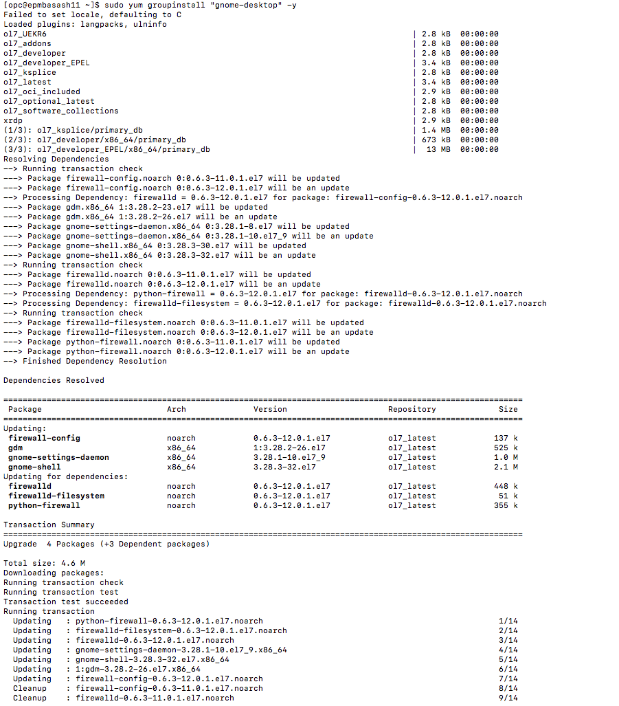

Execute the following command to install TigerVNC:
	```
	<copy>
	sudo yum install "tigervnc-server" -y
	</copy>
	```

	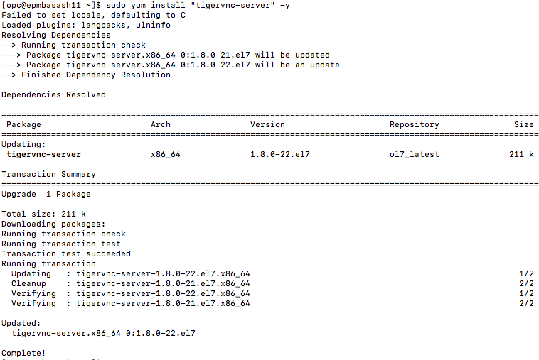

Install the Reminna client using the following set of commands:
	```
	<copy>
	wget http://dl.fedoraproject.org/pub/epel/epel-release-latest-7.noarch.rpm
	sudo rpm -ivh epel-release-latest-7.noarch.rpm
	sudo yum -y install remmina
	</copy>
	```

If you're prompted to accept a size of installation, accept.

	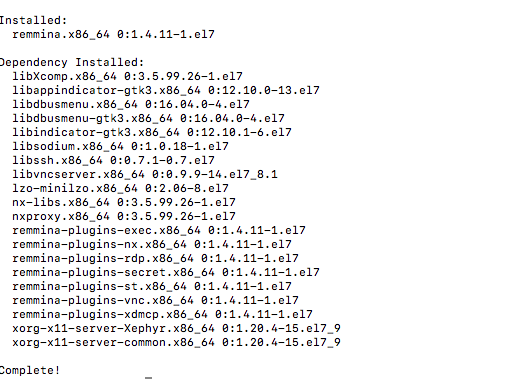

Install the Firefox browser using the following command:
	```
	<copy>
	sudo yum install firefox
	</copy>
	```

If you're prompted to accept a size of installation, accept.

	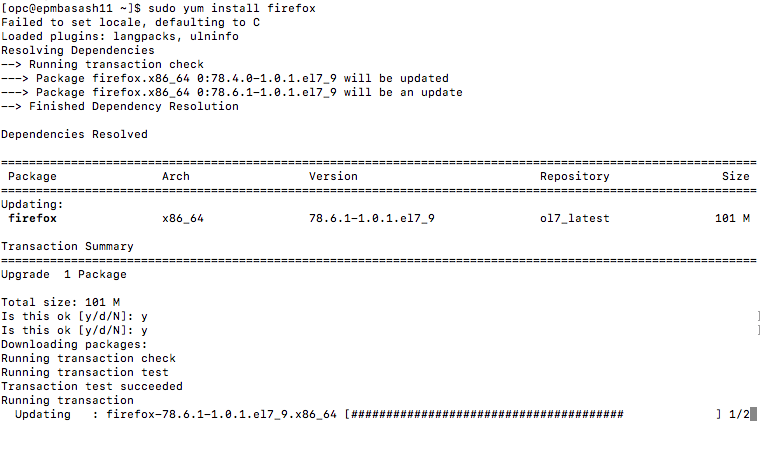

Start the VNC server using the following command:
	```
	<copy>
	- vncserver
	</copy>
	```

	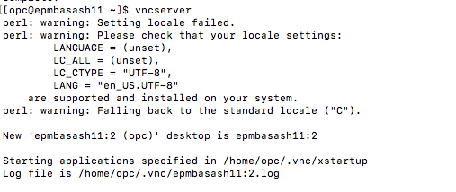

You'll be prompted to set up a password for the VNC server. You're not restricted on this, but we recommend **Welcome#1234**. Type this password in; do _not_ copy paste it. After confirming this password, the prompt will also ask for a view-only password; reject the view-only password.

5. We can now view a desktop on our bastion host. We will set up an SSH tunnel for our VNC client to connect through. Mac and Windows will again have different ways to do this.

On Mac or Linux, you'll type the command below:
	```
	<copy>
	ssh -i <path_of_the_private_key> -L 5901:127.0.0.1:5901 opc@<public_IP_address>
	</copy>
	```

The terminal will appear to freeze and not give any output; this is normal. Continue to the next step.

	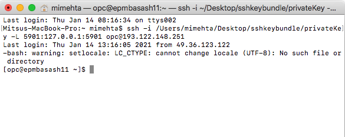

On Windows, you'll have to do the following.
		1.	Start a new window of PuTTY (from the Start menu, choose All Programs, PuTTY, PuTTY).
			* In the Category pane, choose Session and complete the following fields:
			*	In the Host Name box, enter the public ip address of the compute instance previously copied.
			* Ensure that the Port value is 22.
			* Under Connection type, select SSH.
			* In the Category pane, expand Connection, expand SSH, and then choose Auth. Complete the following:
			* Choose Browse.
			* Select the .ppk file that you generated for your key pair and choose Open.
		2.	Once you have chosen the ppk file, click on 'Tunnels' in the 'Category' tab to the left.
		3.	Add 5901 as the source port. (or the port you have opened for the vnc server to listen to. 5901 is the default port)
		4.	In 'Destination' add your instance IP address and port number in this format 'IP_ADDRESS:PORT'.
		5.	Click on 'Add'
		6.	·(Optional) If you plan to start this session again later, you can save the session information for future use. Under Category, choose Session, enter a name for the session in Saved Sessions, and then choose Save.
		7.	Choose Open. A window opens. If prompted, enter the username as – `opc` and hit Enter. You are now connected to your instance; no output will be given. This is normal. Continue to the next step.

6. We can now use our VNC Viewer on our local machine to view the instance. Open up the VNC viewer and type in the address `localhost:5901`.

	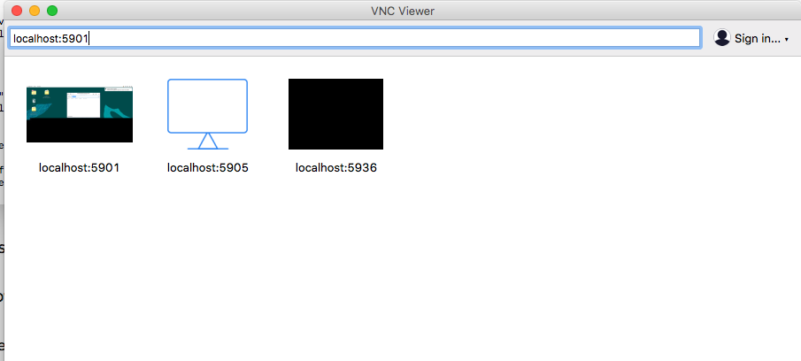

7. You will be prompted to authenticate; type the password you decided on earlier while starting the server (**Welcome#1234**), and the viewer should connect.

	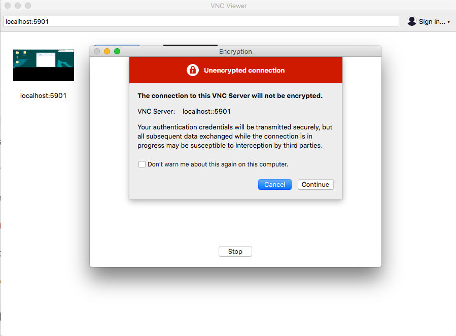

8. If all went well, you should now be seeing the desktop of our bastion host.

	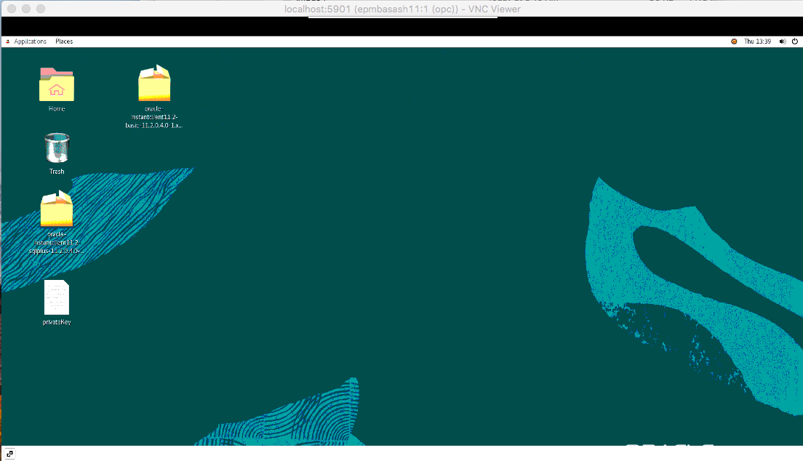

## Task 3: reset the passwords on the Windows instances

We'll now have to use our bastion host to reset the passwords of all 3 of the Windows instances that were spun up in the provisioning step.

1. From the menu, click on **Compute** --> **Instances**.

	

2. Click on the `epmfndash11, emphfmash11` and `epmwebash11` instances, and take a note of their private IP addresses and their default passwords. We'll have to use these to reset the passwords on each Windows instance.

	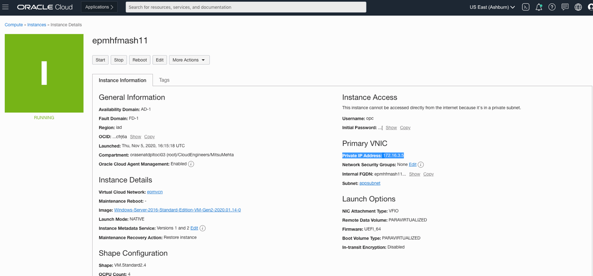

	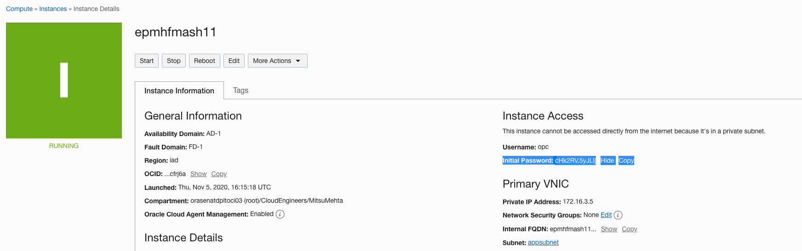

3. Back on our bastion host (and VNC Viewer), open the Reminna client by going to Application --> Internet --> Reminna.

	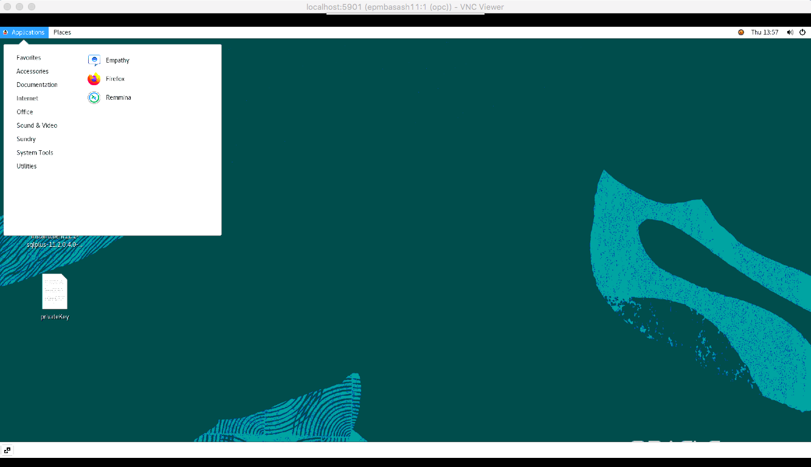

4. Select RDP from the list of protocols, Enter the private IP address of one of the three Windows instances in the text box and hit Enter. You will be prompted to enter the initial password that you took down earlier. Once that's confirmed, you can then change the password. You can either change it to something you'll remember, or simply use the default we've already been using, **Welcome#1234**.

	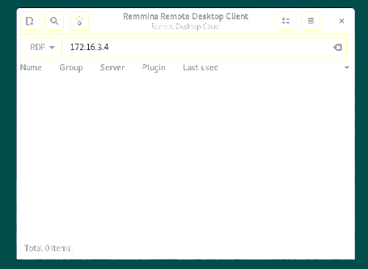

## Summary

We have now set up all of the infrastructure that we'll need to start installing the Hyperion application. The final lab is optional; it will provision a shared disk to put installer files on so that we don't have to copy them to every single machine.

You may now **proceed to the next lab.**

## Acknowledgements
* **Author** - Mitsu Mehta, Cloud Engineer, Packaged Apps
* **Contributors** - The Oracle Packaged Apps Team
* **Last Updated Date** - October 1, 2021
