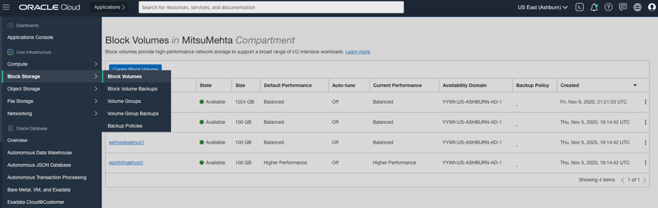
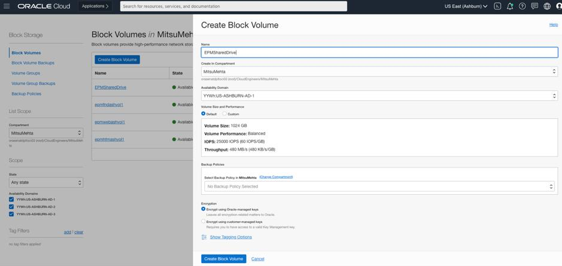
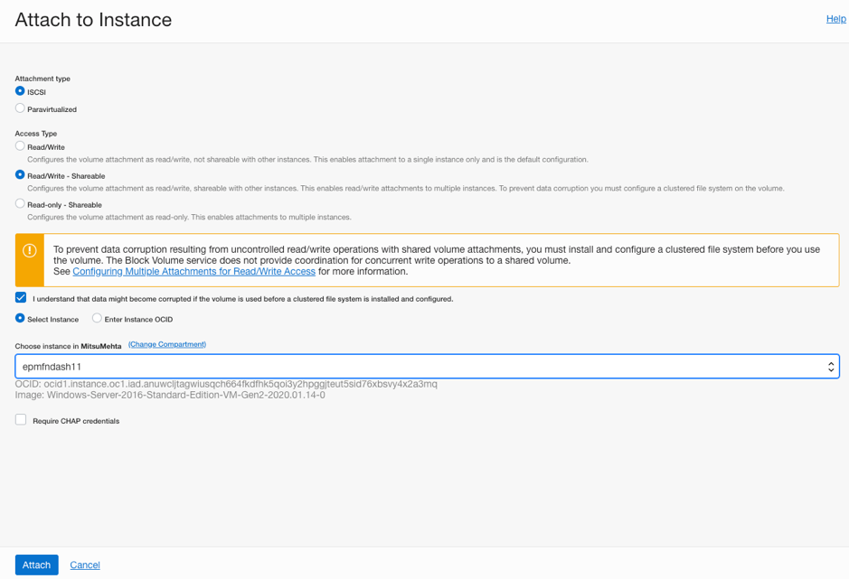
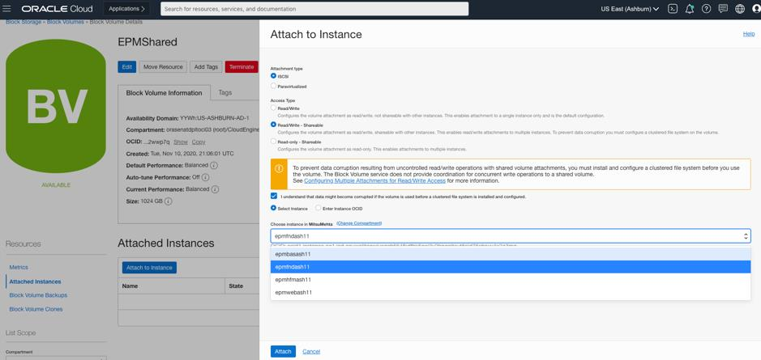

# Configure a Shared Disk to hold Installer Files

## Introduction

In this lab, we will provision and mount a shared disk to hold installer files. This will ease our job later when installing Hyperion.

Estimated Time: 40 minutes

### About Shared Block Volumes
The service we provision here is much like a hard drive in real life. However, since we're working on the cloud, we can mount this hard drive to multiple machines at once, much like a network file drive. This allows multiple machines to read and write files on the disk, which in this case will ease our installation of the various Hyperion parts we need.

### Objectives

In this lab, you will:
* Provision a block volume to serve as the storage point for Hyperion installer files
* Mount/attach the block volume to all Hyperion instances

## Task 1: Provision the Block Volume

1. From the hamburger menu in OCI, click on **Storage** -> **Block Storage** -> **Block Volume**.

2. Click on "Create Block Volume".

3. Enter the name for the block volume – `EPMSharedDrive`. Leave all the other settings as default and click on "Create Block Volume".

4. Once the volume is created, click on Attached Instances under the Resources heading, click on Attach to Instance. Select ISCSI under Attachment Type. Select Read/Write – Shareable under Access Type.

5. Select the checkbox –
I understand that data might become corrupted if the volume is used before a clustered file system is installed and configured.

6. Select any Hyperion instance (these are all the instances that start with `epm`) from the dropdown and click on Attach. Repeat this step for all 4 instances.

## Task 2: Mount the Volume to All Instances

The mounting of this block volume to all instances is covered in detail through documentation from Oracle. Use [this link](https://docs.oracle.com/en-us/iaas/Content/GSG/Tasks/addingstorageForWindows.htm) for attaching to a Windows machine, and [this link](https://docs.oracle.com/en-us/iaas/Content/GSG/Tasks/addingstorage.htm) for attaching to Linux.

## Cleaning Up

Cleaning up on the cloud is relatively simple. The Terraform stack we used in ORM is our key to cleaning up. Where we applied Terraform to create, we have a "Destroy" job that does the exact opposite. The steps are as follows:

1. Dismount the block volume from all instances.
2. Delete the block volume.
3. Go into the Resource Manager, and locate the stack we used in Part 2 to provision everything.
4. Use the "Destroy" Action to tear down all the other infrastructure.

## Summary

Congratulations! You have now learned how to set up Hyperion infrastructure on OCI.

This is the final lab in this series; however, if you need help, you may now **proceed to the next lab.**

## Acknowledgements
* **Author** - Mitsu Mehta, Cloud Engineer, Packaged Apps
* **Contributors** - The Oracle Packaged Apps Team
* **Last Updated Date** - October 1, 2021
