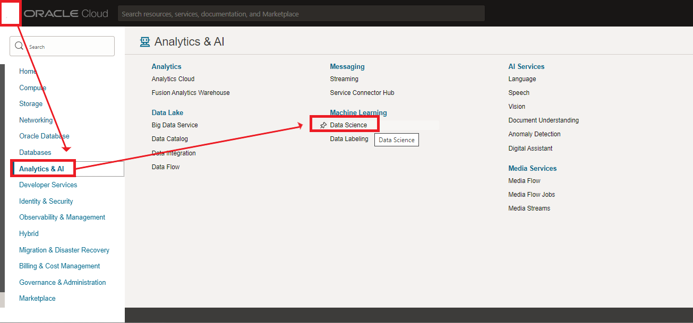
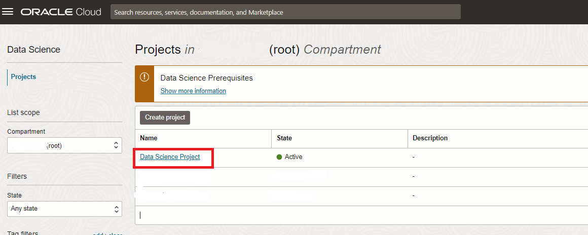
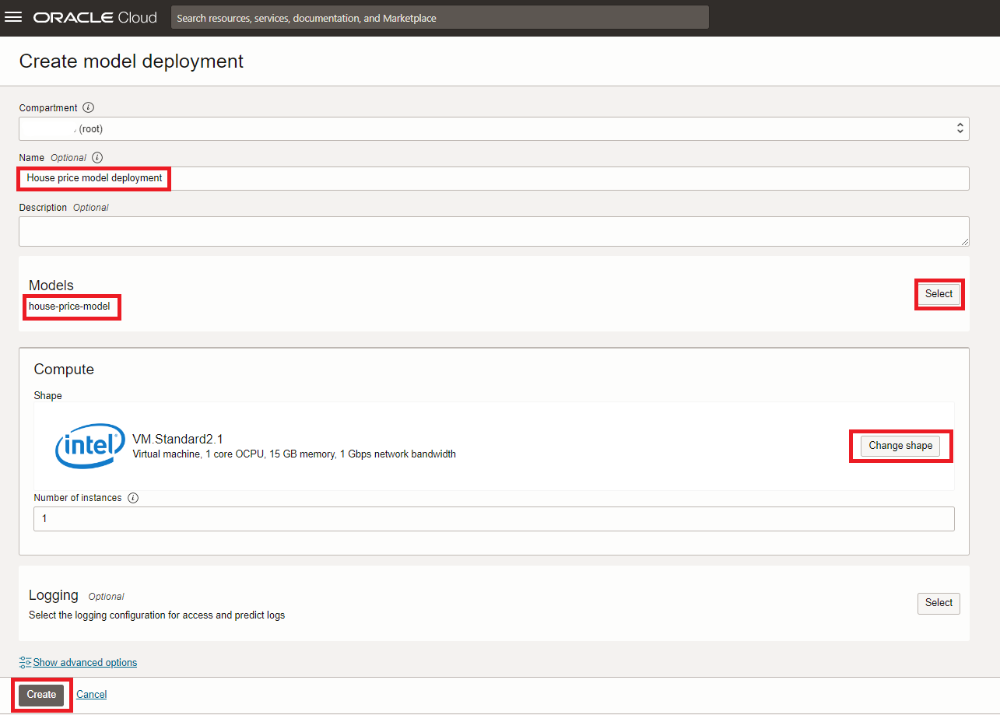

# Lab: Model Deployment

## Introduction

In the previous lab you developed a regression model to predict house prices. As any model, it only becomes useful if we deploy it, if we make it available for consumption by applications/processes. This is what we'll do in this lab.

The following requires that you built a model successfully in steps 1 to 9.

Estimated lab time: 10 minutes

### Objectives

In this lab you will:
* Learn how to publish models in the OCI Data Science model catalog.
* Learn how to deploy models on OCI.

### Prerequisites

* This lab assumes you've successfully trained the model in the previous lab. **If you had any problems during that lab**, you can download a [prebuilt notebook](https://objectstorage.eu-frankfurt-1.oraclecloud.com/p/4cZCuiGzy9-MjK5yVJWrBAXW3dG1nktPGTocs4P2G6U5MPLQ_PydthHvXNidCAOJ/n/fruktknlrefu/b/workshop-intro-to-ds/o/house-price-prediction.ipynb) with all the steps done for you. Depending on the browser you might have to use Left/Right click to save this file. Make sure the extension of the saved file is .ipynb. After that, drag the file to the files panel of the Data Science environment. When opening it, make sure you select the Conda environment "tensorflow27_p37_cpu_v1". Finally, click the icon to run the entire notebook and wait for it to complete. After this, you will be ready to start with the rest of the lab.

    

## Task 1: Store the model in the catalog and deploy it

1. Store the model in the model catalog

    At the end of your existing notebook, add the following. This will **serialize** the model and place it in the model catalog. This basically means it converts the in-memory model to a physical model on disk. This process also creates some other artifacts (files). All of these assets are stored in the model catalog under the name "house-price-model".

    ```python
    <copy>
    import ads
    from ads.common.model_artifact import ModelArtifact
    from ads.common.model_export_util import prepare_generic_model
    import os
    from os import path
    from joblib import dump
    import cloudpickle
    ads.set_auth(auth='resource_principal')
    path_to_model_artifacts = "house-price"
    generic_model_artifact = prepare_generic_model(
        path_to_model_artifacts,
        force_overwrite=True,
        function_artifacts=False,
        data_science_env=True)
    with open(path.join(path_to_model_artifacts, "model.pkl"), "wb") as outfile: cloudpickle.dump(model, outfile)
    catalog_entry = generic_model_artifact.save(display_name='house-price-model',
        description='Model to predict house prices')
    </copy>
    ```
2. Verify that the output is similar to the following:

    

## Task 2: Deploy the model

Now we're going to deploy this model to its own compute instance. This will take the model from the catalog and create a runtime version of it that's ready to receive requests. This uses normal OCI compute shapes.

1. In the OCI navigator, go back to your OCI Data Science project ("Data Science Project").

    

2. Open the OCI Data Science project.

    

3. Go to "Model deployment" and then click "Create Model Deployment".

    

    Next, choose "Create Deployment".

4. Configure the deployment

    - Select the right compartment. If you have just created your Oracle cloud account you may choose the root compartment.
    - Give the model deployment a name, e.g. "House price model deployment"
    - Choose the right model (house-price-model)
    - Choose a shape, one ("1") instance of VM.Standard2.1 is sufficient. Note that we could have chosen multiple instances, this is useful for models that are used very intensively.

    

    Finally, press "Create".

5. Deployment should take about 10 minutes. Finally, you should see that the compute instance is active.

    

[Proceed to the next section](#next).

## Acknowledgements
* **Authors** - Jeroen Kloosterman - Product Strategy Director, Lyudmil Pelov - Senior Principal Product Manager
