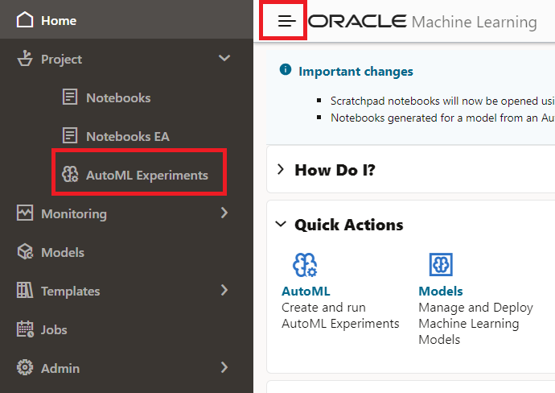

# Lab: AutoML (using Autonomous Database)

## Introduction

In the previous lab you learned how to build a model using OML4SQL.

In this lab you will see an alternative: Building the model using AutoML.

AutoML takes away a lot of the complexity behind ML. It automatically picks the best algorithm and tunes it for you, and you don't require any coding for this.

The goal of this lab is for you to experience how this can make ML easier and more productive.

### Objectives

In this lab you will become familiar with in-database AutoML.

This video covers a walkthrough of the lab.

### Prerequisites

* An Oracle Free Tier, Always Free, Paid or LiveLabs Cloud Account (see prerequisites in workshop menu)

## Task 1: Open the machine learning notebook

1. Back in the Datbase Actions home page, select Oracle Machine Learning.

   

2. Sign in

   Sign in with the new user MLUSER1 (password Oracle_12345).

   

## Task 2: Build the machine learning model with AutoML

Our goal is again to predict which customers are interested in buying Y Box Games, but this time using AutoML.

1. Open AutoML Experiments

   In the main menu, click on the upper left icon to bring back the menu. Then select "AutoML".

   

2. Create a new experiment.

    

3. Configure the experiment as follows:

   - Name: Predict Y Box Games
   - Data Source: SH (schema) SUPPLEMENTARY\_DEMOGRAPHICS (table)
   - Predict: Y\_BOX\_GAMES (this is the output variable)
   - Case ID: CUST\_ID (the column that uniquely identifies each case)

   For the input features, keep the defaults, but **_deselect_** <code>COMMENTS</code>, <code>HOME_THEATER_PACKAGE</code> and <code>YRS_RESIDENCE</code>.

    

4. Save the configuration.

    

5. Start the training of the model.

    

   You will see that the AutoML goes through different phases, from automatic algorithm selection to feature selection and tuning.

   This will typically take about 5 minutes on a trial tenancy.

6. When the AutoML process has completed, you will see the resulting accuracy of various algorithms. All of these models have been created in the database.

    

   Note how the Decision Tree model actually appears to be performing better than the Linear Regression Model.

   To keep things simple, we will continue the rest of the exercise with the original Linear Regression Model, however feel free to write some SQL to overwrite the predictions with the ones coming from the new Decision Tree model!

   Congratulations on completing this lab!

[Proceed to the next section](#next).

## Acknowledgements
* **Authors** - Jeroen Kloosterman - Product Strategy Director, Lyudmil Pelov - Senior Principal Product Manager
