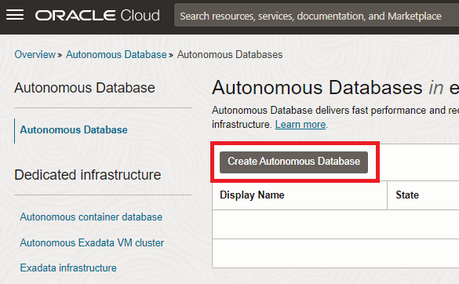

# Lab: In-database ML with OML4SQL (using Autonomous Database)

## Introduction

In this lab you create an in-database ML model and operationalize it with an APEX application. The actual machine learning logic takes place in the database and the APEX application will pick up the predictions.

As this example we will apply machine learning on a sales scenario, in this case we will predict which customers are most likely to buy a certain product.

Estimated lab time: 50 minutes

This video covers an introduction to in-database machine learning (Oracle Machine Learning).

### Objectives

In this lab you will:
* Become familiar with in-database machine learning, in particular OML4SQL.
* Understand how APEX can be used to operationalize ML models.
* Get familiar with the business value of identifying customers that are likely to buy a certain product.

### Prerequisites

* An Oracle Free Tier, Always Free, Paid or LiveLabs Cloud Account (see prerequisites in workshop menu)

## Task 1: Provision Autonomous Transaction Processing

1. From the cloud console, on the left hand menu, choose Oracle Database, then Autonomous Transaction Processing.

   

2. Start the creation wizard

   Choose to create a new instance. Choose a specific compartment first, or keep using the root compartment.

   

3. Choose any name for the database, in this case "WORKSHOP".

   

4. Choose the Transaction Processing option

   This will optimize the database for daily transactional processing.

   

5. Choose the Shared Infrastructure deployment type.

   

6. Choose other options

    In order to have an equal performance over all of the ATP instances of all the workshop participants, we recommend that:
    - Keep the Always Free option turned off
    - Keep defaults for OCPU (1) and storage (1 TB)
    - __Disable__ Auto Scaling

    

7. Set the admin password.

   Set this to "Oracle_12345".

   

8. Other settings

    Keep default for "Access Type" and set "License Type" to "License Included".

9. Create the database

    

     This process typically completes within about 5 minutes, after which you will see the status "AVAILABLE".

## Task 2: Create an Oracle Machine Learning user

We will develop the machine learning model using Zeppelin, which comes included in the autonomous database. Zeppelin is a web-based notebook environment that allows us to analyze and experiment with data. In our case we will be using it to build a machine learning model. First we will set up a user for Zeppelin.

 1. On the main page of your ATP instance, go to Tools, then "Oracle ML User Administration"

    

 2. Sign in.

    - Username: ADMIN
    - Password: Oracle_12345

    

 3. Create a new user

    

 3. Create a user called "MLUSER1".

    - Username: MLUSER1
    - First Name: Zeppelin
    - Last Name: User
    - Email address: Use any email address (it is not relevant)
    - _Deselect_ "Generate password..." and enter a password yourself: Oracle_12345

    

Congratulations on completing this lab!

[Proceed to the next section](#next).

## Acknowledgements
* **Authors** - Jeroen Kloosterman - Product Strategy Director, Lyudmil Pelov - Senior Principal Product Manager
