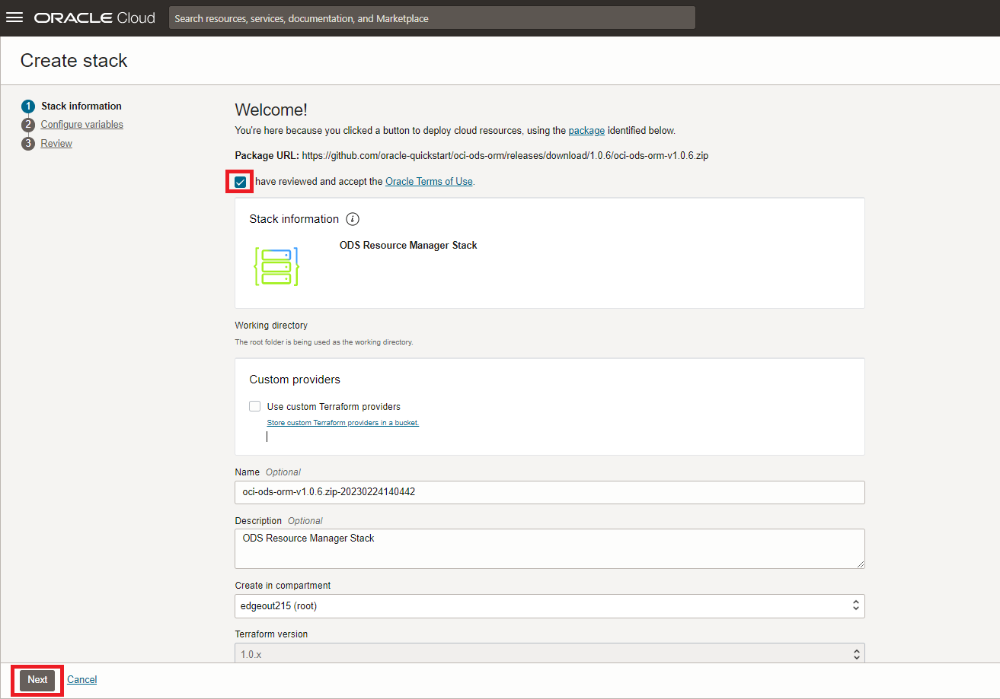

# Lab: Provision OCI Data Science

## Introduction

This lab will show you how to provision the OCI Data Science service.

Estimated lab time: 20 minutes

### Objectives

In this lab you will:
* Become familiar with the process of provisioning OCI Data Science

### Prerequisites

* An Oracle Free Tier or Paid Cloud Account (see prerequisites in workshop menu)
* You need a user with an **Administrator** privileges to execute the ORM stack or Terraform scripts. If you have just created an OCI Trial for this workshop, your main user has Administrator privileges.
* If you have just started with a new Oracle cloud account, make sure that it has completed provisioning. In particular, it's important that you don't see the message "Your account is currently being set up, and some features will be unavailable. You will receive an email after setup completes."

## Task 1: Configure prerequisites for the service

This guide shows how to use the Resource Manager to provision the prerequisites for the OCI Data Science service. This includes the configuration network (VCN) and security configuration (groups, dynamic groups and policies).

This process is automated.  However, **if you prefer a manual** approach, to control all the aspects of the provisioning, you can find those instructions here OCI Data Science: [manual provisioning steps](https://docs.cloud.oracle.com/en-us/iaas/data-science/data-science-tutorial/tutorial/get-started.htm#concept_tpd_33q_zkb). In all other cases, please continue with the steps below for automated provisioning.

1. Press this button below to open the Resource Manager.

    

    You may have to log in first in case you were not logged into to Oracle Cloud Infrastructure already.

2. Configure the Stack.

   - Check "I have reviewed and accepted the Oracle Terms of Use".
   - Select the right compartment. If you have just created your Oracle cloud account you may choose the root compartment.
   - Click Next.

    

3. **Important** In the section "ODS Configuration" *uncheck* "Create a Project and Notebook Session" (we will create them using the console later).

    

<!--4. In the section "ODS Configuration" select the shape **"VM.Standard2.2"**.

    
-->

4. In the section "Vault Configuration" uncheck "Enable Vault Support".

    

5. In the section "Functions/API Gateway Configuration", uncheck "Provision Functions and API Gateway".

    

6. Click "Next".

    

7. Make sure that that the "Run Apply" option is _checked_.

    

7. Click "Create".

    

   Provisioning should take about 5 minutes after which the status of the Job should become "Succeeded".

   

## Task 2: Create a Project and Notebook

1. Open the OCI Data Science projects and choose "Create Project".

    

    

    - Select the right compartment. If you have just created your Oracle cloud account you may choose the root compartment.
    - Choose a name, e.g. "Data Science Project" and press "Create".

    

2. The newly created project will now be opened. Within this project, provision an Oracle Data Science notebook by clicking "Create notebook session".

    

    - Select the right compartment. If you have just created your Oracle cloud account you may choose the root compartment.
    - Select a name, e.g. "Data Science Notebook"
    - We recommend you choose VM.Standard2.2 (under Intel SKYLAKE) as the shape.
    - Set blockstorage to 50 GByte.
    - Select defaults for VCN and subnet. These should point to the resources that were created earlier by the resource manager.

    

    Finally click "Create". The process should finish after about 5 minutes and the status of the notebook will change to "Active".

3. Open the notebook that was provisioned

    The name of the notebook may be different than shown here in the screenshot.

    

    

    You should now see the Jupyter environment

    

[Proceed to the next section](#next).

## Acknowledgements
* **Authors** - Jeroen Kloosterman - Product Strategy Director, Lyudmil Pelov - Senior Principal Product Manager
