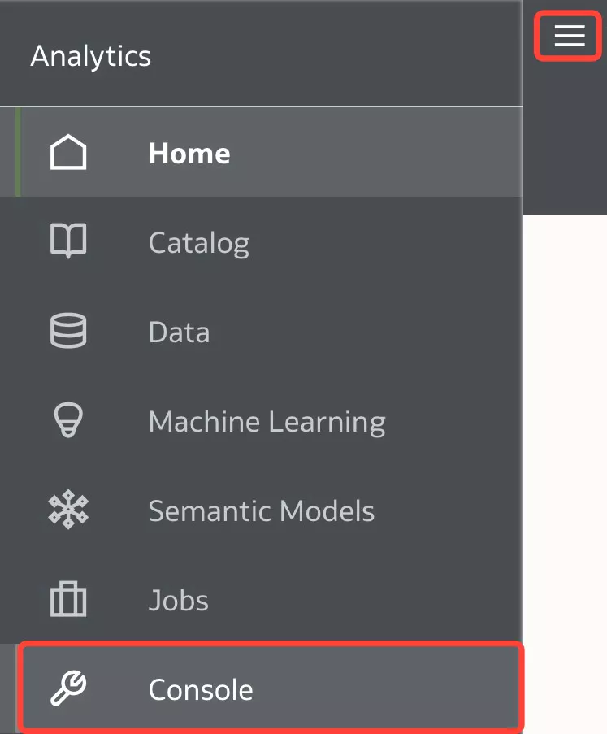

# Ask Direct Questions on Data

## Introduction

When you create a **Workbook** out of a **Data Set**, you have a blank canvas to start with.  
You can avoid _blank canvas syndrome_  using **BI Ask** to find the data and quickly visualize it.  
You can leverage the **BI ASK** feature using the _**Search Bar**_ on the _**OAC Home page**_.  
Use BI Ask to direct type your questions (using Natural Language) on data with your desktop/laptop or ask the same on your mobile, with [Day by Day](https://docs.oracle.com/en/cloud/paas/analytics-cloud/biday/index.html) mobile app.

**BI Ask** (**N**atural **L**anguage **Q**uery **P**rocessing) promotes direct interactions between the users and the BI System to explicitly understand what every user is interested in.  
It interprets semantic layer, user private data, expression library and catalog artifacts and generates on-the-fly queries – visualizations.

Alternatively, you can use the new **Auto Insights** capability, which provides automatic visualization suggestions that gives you great insights and a starting point into your key data elements within a Dataset.

_Estimated Time:_ 40 minutes

### Objectives

- Use** BI Ask** to ask (type) direct questions (Natural Language) on your data
- Use **Auto Insights** to create powerful visualization using suggestions generated by Oracle Analytics

### Prerequisites

* An [_Oracle Cloud Free Tier Account_](https://www.oracle.com/cloud/free/) or a Paid account
* All previous labs successfully completed

## Task 1: Certify and Index your Data Set

1. **Search** for your Data Set.  
In order to ask questions using the Data Set, you need to **index** the Data Set to **enable the searching**, to choose a **Language** and  **Indexing Schedule**.  
In the **Oracle Analytics Home** page, click the **Navigator** on top left, and then click **Data**.  
Note: if you are still on the previous lab, you can quickly Go Back  to the **Home** page without saving the project  

   

2. Click **Navigator** and select **Data**.  

   

3. **Select** your Data Set.  
   From **Data** page, select **Data Sets** section and identify or search for **DCA\_SALES\_DATA** Data Set.  
   Click the **Actions menu** of the data set or right-click the Data Set, and click **Inspect**

   

3. **Certify** the Data Set  
   From **General** tab click **Certify** button  
   
   

4. **Index** the Data Set  
   From **Search** tab click **Index Data Set for Searching**  
  
   

5. **Control access** (optional)  
   Access to the Data Sets can be controlled from **Access** tab  
  
     
   Note: best practice is to enforce control using **Roles** rather than individual **Users**

   Click **Save** and then **Close** button.

6. Go to **Home** Page
   Click **Navigator** and then select **Home**  
  
   

## Task 2: Ask Questions about your data

1. **BI Ask**.  
In the **Home** Page of OAC, a dialog bar appearing at the top can be leveraged to **ask** plain English language questions on the data.

2. Click the **Search** bar and **Type** in the bar area "**show me value by sales week**".  
   As you enter the information, the application returns search results in a drop-down list. The system can be searched by column names or data elements or both. Best fit results are returned immediately

3. Press **SHIFT + ENTER** to visualize data  
  
   

4. Check the results. Insights are rendered immediately from the best matching Data Set  
  
   

5. Continue to type in the bar area "**for customers**" and press **SHIFT + ENTER**  
   
   
   We observe that we are losing customers over time

6. Continue to type in the bar area "**for direct channel**" and press **SHIFT + ENTER**  
    
    

7. Remove the last query.  
    Select  "**for direct channel**" and press the x (remove) sign 
    
    

8. Continue to type in the bar area "**by channel**" and press **SHIFT + ENTER**  
   
   

9. You have 9 visuals to start with. You can always choose one (or more) and explore it.  
    Note: optional you can select the first visual, hover over the top left of the visual and choose **Explore as Workbook** 

   

## Task 3: Auto Insights

**Auto Insights** are a great way to create powerful visualization using suggestions generated by Oracle Analytics..  

1. Turn **Auto Insights On** for all Datasets.  
Go to Home Page > Navigator > Console

   

2. Go to **System Settings** > **Performance and Compatibility** > **Enable Auto Insights on Datasets**

   
   

3. Enable Insights for **DCA\_SALES\_DATA** Dataset. 
Go to Home page, click **Navigator**, then **Data**. 

   

4. Select **Datasets** tab, locate **DCA\_SALES\_DATA** Dataset > Click the **Actions Menu**  and select **Inspect**

   

5. On the **General** table, select **Enable Insights**, Click **Save** and **Close**.

   

6. Select **Datasets** tab, locate **DCA\_SALES\_DATA** Dataset > Click the **Actions Menu**  and select **Open**

   

7. Click **Create Workbook** button.

   

8. On the toolbar the Auto Insights icon is white when Oracle Analytics is calculating the best insights for the dataset. When the insights are ready, the Auto Insights icon turns yellow  and Oracle Analytics displays suggested visualizations with a textual description of the insight that you can gain.

   

9. In the **Auto Insights** panel, hover over the visualizations that you want to include in your workbook and click + to add them to your workbook canvas. Close  **Auto Insights** panel.

   

You have just finished to learn how to ask direct questions to your data using **BI Ask** and **Auto Insights** new feature.  
* Optional: you can check in the next [video](https://youtu.be/uEESc7yo6kA) how BI Ask engine works with OAC DV and Day by Day in a side by side comparison 

You may now [proceed to the next lab](#next)

## Want to Learn More?

* [Using Search and BI Ask](https://docs.oracle.com/en/cloud/paas/bi-cloud/bilug/using-search-and-bi-ask.html#GUID-97F546AE-6277-45AB-B5A7-C55E2328AC0E)
* [Advanced Search Commands for Finding Content](https://docs.oracle.com/en/cloud/paas/analytics-cloud/acubi/find-and-explore-your-content.html#GUID-8B85899F-8A6D-42BE-AAA0-B27D8086DBFF)
* [Natural Language Interview with Jacques Vigeant](https://www.youtube.com/watch?v=piE1ah51DnE&feature=youtu.be)  
* [Begin every data journey with Auto Insights](https://blogs.oracle.com/analytics/post/begin-every-data-journey-with-auto-insights)

You may now **proceed to the next lab**.
## **Acknowledgements**

- **Author** - Lucian Dinescu, Product Strategy, Analytics
- **Contributors** -
- **Reviewed by** - Shiva Oleti, Product Strategy, Analytics, Sebastien Demanche, Andor Imre (Oracle Cloud Center of Excellence) 
- **Last Updated By/Date** - Lucian Dinescu, March 2022
