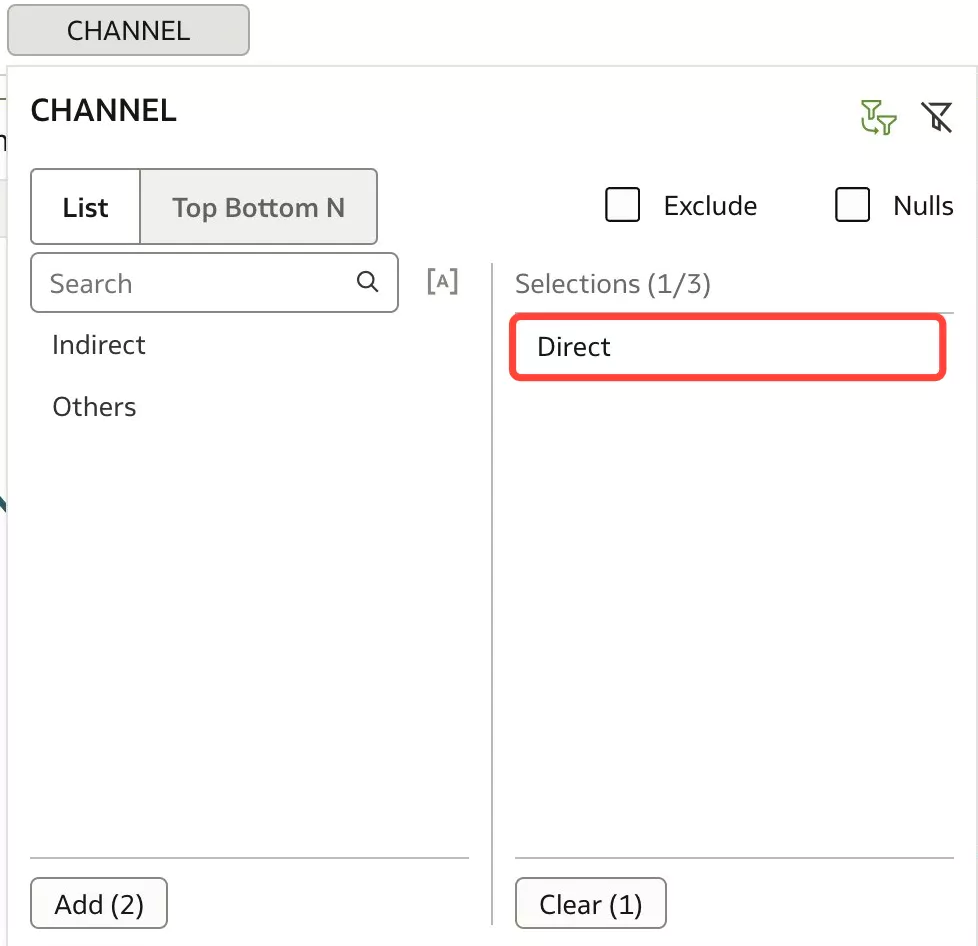
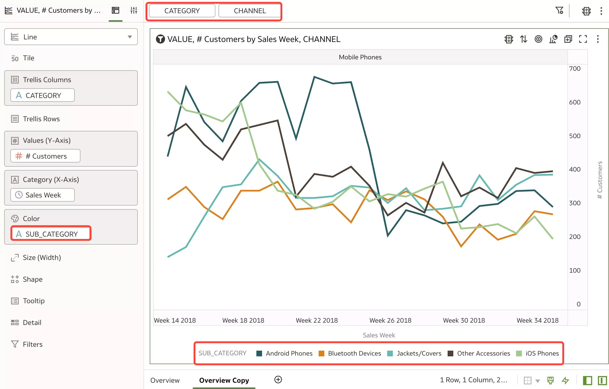

# Build a simple Interactive Workbook

## Introduction

In this lab, you will start creating your first simple interactive workbook, use filters, canvases and basically further investigate why we are losing customers from mobile phones.

_Estimated Time_: 20 minutes

### Objectives

- Start your first simple interactive analysis

### Prerequisites

* An [_Oracle Cloud Free Tier Account_](https://www.oracle.com/cloud/free/) or a Paid account
* All previous labs successfully completed

## Task 1: Start your first analysis

Lets Start from the previous workbook and clean up the report a bit.

1.  Close **Performance Tools** pane and Remove **VALUE** from Grammar Pane Value (Y-Axis).  
Hover the mouse over the **VALUE** and click the 'x' sign.
    

    

2.  **Add Trend Line**.  
In the Properties Pane select the **Analytics** **icon** and double-click **Add Trend Line**.

    

3.  Rename the canvas as **Overview**.  
Double-click on **Canvas 1**, type in **Overview** and hit Enter.

    

4.  **Duplicate** Canvas.  
Right-click the canvas tab and select  **Duplicate**.  
This adds a copy of the selected canvas to the project’s row of canvas tabs.

    

5.  Lets filter on Mobile Phones.   
Right Click **Mobile Phones** Category and select **Keep Selected**.  
That keeps only the selected members and remove all others from the visualization and its linked visualizations.

    

6.  Move **Channel** to Color.  
Drag **CHANNEL** from Trellis Rows section and Drop it to **Color** section.

    

7.  Lets **Remove** the trend line for the sake of simplicity.  
Go Analytics Property Pane > Trend and click x.

    
    

8.  Filter **CHANNEL** to **Direct Channel** .  
Right Click on **Channel** > **Create Filter** and Select **Direct**.

      
     

9.  Lets **Drill** on **Direct Channel** to SUB\_CATEGORY.  
Right Click > **Drill to Attribute/Hierarchy** and select Data Elements > **SUB\_CATEGORY**.  
This Drill to [Attribute Name] to directly drill to a specific attribute within a visualization.

      
    

10.  Lets look at the results for 'Customers by Sales Week and Subcategory'.

     

11.  Lets analyze customers across various sub categories and choose the **Create Best Visualization** option.  
Go to **Data Panel**,  Select **# Customers**, press CTRL key and Select  **SUB\_CATEGORY**; Right Click and select **Create Best Visualization**  
A visualization is automatically created on the canvas, and the best visualization type is selected based on the preconfigured logic. The selected data element is also positioned on a specific area of the Grammar Panel.

     

12.  The system decided that Bar Chart was the best viz type to visualize this information.

     

13.  Changing the chart type is very easy.  
Click on Grammar Pane Visualization type  and select **Donut** chart.

     

14.  Move **SUB_CATEGORY** from **Category** section to **Color** section.

     

15. Chart properties can be modified here.  
Go to **Property Pane**, **Values** tab and change **Data Labels** from Percent to **Percent**, **Value** and **Label**.

     

16.  **Change** Visualization from Donut to **Treemap**.  
Click on Grammar Pane Visualization type  and select **Treemap** chart.

     

17.  Remove legend from the Treemap Visualization.  
Go **Property Pane**, click **General** tab, **Legend** element and select **None**.

     

18.  Change back to **Donut**.
Click on Grammar Pane Visualization type  and select **Donut** chart again.
       
     > notice there is no legend displayed this time

19. Use a **Visualization** **as a Filter**.  
You can configure a visualization to filter other visualizations on the canvas.  
Select Donut visualization, Right Click and select **Use as Filter**.
     

20. Experiment with Visualization as a Filter.  
Click on a different slice of the Donut visualization and notice the change in the first visualization.
     

21. Remove Use as Filter.  
Select the Donut Visualization, Right Click and deselect **Use as Filter**.
     

22. Delete **CHANNEL** Filter.  
Go to the **Filter Menu**, hover over CHANNEL, Click on the small down arrow and Select **Delete**.
     

23.  Rename the canvas as **Phones**.  
Double Click on Canvas > type in **Phones** and hit Enter.

     

24.  **Duplicate** Canvas.  
Right-click the canvas tab and select  **Duplicate**.  
This adds a copy of the selected canvas to the project’s row of canvas tabs.

     

25. Lets filter out the data to those sub categories where we are losing maximum customers - iPhones and Android phones.  
Select **SUB_CATEGORY** from Data Pane and Drag and Drop it to **Filter area** .
     

26. Select Android Phone and iOS Phones.  
Click **Android Phone** and **iOS Phones** (they will be moved to **Selections** tab). Click anywhere in Filter area.

     

27. Filter **CHANNEL**.  
Go to Data Pane, select **CHANNEL** and drop it to Filter area.
     

28. Select **Direct** Channel.  
Click **Direct** (there will be moved to **Selections** tab). Click anywhere in Filter area..
     
     

29. Delete **CHANNEL** Filter.  
Go to the **Filter Menu**, hover over CHANNEL, Click on the small down arrow and Select **Delete**.
     

You have just finished learning how to create your first analysis, use filters and building new canvases by reusing the previous content.

You may now **proceed to the next lab**.

## Want to Learn More?

* Free [Udemy: Modern Data Visualization with Oracle Analytics Cloud](https://www.udemy.com/augmented-analytics/), Section 2: Build Your First Data Visualization Project with Oracle Analytics

## **Acknowledgements**

- **Author** - Lucian Dinescu, Product Strategy, Analytics
- **Contributors** -
- **Reviewed by** - Shiva Oleti, Product Strategy, Analytics, Sebastien Demanche, Andor Imre (Oracle Cloud Center of Excellence)
- **Last Updated By/Date** - Lucian Dinescu, March 2022