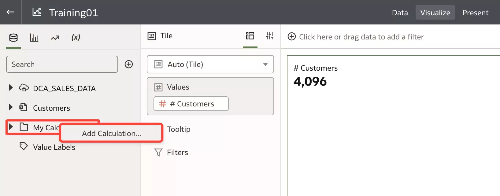

# Leverage Database functions with OAC

## Introduction

In this lab, you will learn about OAC integration with the underline database, especially with ADW.  
Oracle Analytics Cloud (OAC) exposes the power of Oracle Autonomous Database (ADW/ADB) through a simplified UI.  
Each OAC release brings more integration.  
An non exhaustive list is:

1. **EVALUATE**, **EVALUATE\_AGGR** database functions (create custom calculations)
2. **Registering OML** exposes existing OML models from ADW to the enterprise models
3. **Database analytics nodes**, easily execute complex functions on your data (Data Flow)

For this lab we are going to cover **EVALUATE** and **EVALUATE\_AGGR** database functions.

_Estimated Time_: 30 minutes

### Objectives

* Use **EVALUATE** and **EVALUATE\_AGGR** functions to ship heavy-lift work down to the underlying ADW database.

### Prerequisites

* An [_Oracle Cloud Free Tier Account_](https://www.oracle.com/cloud/free/) or a Paid account
* All previous labs successfully completed

## Task 1: Enable Evaluate Support Level

First step is to check **Evaluate Support Level** for your OAC instance.  
That specifies who can issue database functions: \_EVALUATE, EVALUATE_ANALYTIC, EVALUATE\_AGGR, and EVALUATE\_PREDICATE.\_

By default is (**0**) that means the **EVALUATE** database functions are **disabled**.

1.  Open System Settings.  
On the **Home** page, click **Navigator** , select **Console** and click on **System Settings**

    

2.  Change the default value (0) to 1.  
Value 1 is for Service administrators only. Users with the BI Service Administrator application role can invoke EVALUATE database functions.  
Value 2 is for Anyone. Any user who signs in to Oracle Analytics can invoke EVALUATE database functions.   
Go to **Performance and Compatibility** section, select **Evaluate Support Level**, click on the arrow and choose 1.

    

3.  You have to restart the instance.  
Scroll up, Click **Restart** button and then Click **OK**.

    

4.  Wait till OBI Server finish restarting.

    

5.  Close the page and return to the **Home** page.  
Click **Navigator** and select **Home**

    

6.  You make sure that **Data Access** is set to **Live** for the Datasets that will be referenced by the Evaluate function.  
By setting it to Live, you are ensuring that OAC Server always sends the query to the underlying database and does not retrieve results from cache.  
You have already configured **DCA\_SALES\_DATA** to **Live**.
## Task 2: Leverage EVALUATE function

OAC transparently ships heavy-lift work down to the underlying database engines and makes the most of each specific capabilities of each database system, by automatically shipping proper syntaxes.  
OAC Evaluate function enables users to create powerful analyses by directly invoking database functions. Evaluate provides a syntax to pass the specified database function with optional OA referenced columns as parameters. It is particularly useful when users wants to call a specialized database function to process a heavy calculation directly in the underlying database.

1.  Open your **Training01** Project.

     

2.  Click **Add Canvas** icon  

    

3.  Create Best `Visualization` for **#Customers**  
Select **#Customers** from Data Panel, Right-Click and Select **Create Best Visualization**

    

4.  Check the results

    

5.  Lets see the Query Log from **Performance Tools**.
    

    Go to **Console**, click on **Session and Query Cache**  
    The query log shows that **Count Distinct** is being used against the column in the query

    

6.  Lets open SQL Developer Web and run **APPROX\_COUNT\_DISTINCT** function with **DCA\_SALES\_DATA** 
Select Overview > Autonomous Database > Autonomous Database Details > Tools > SQL DEveloper Web > Open SQL Developer Web

    

7.  Enter your **Username** and **Password** and click **Login In**

    

8.  Run the following select statement in the Worksheet.  
SELECT
    APPROX\_COUNT\_DISTINCT(CUST\_ID)
FROM
    DCA\_SALES\_DATA;

    

9.  Go back to your project.  
**EVALUATE** and **EVALUATE\_AGGR** are functions in OAC that allows to invoke functions from the underlying database. We can invoke the APPROX\_COUNT_DISTINCT function of the database using EVALUATE\_AGGR from OAC

10.  Create a **new calculation**.  
You can create a new data element (typically a measure) to add to your visualization.  
The calculated data elements are stored in the data set’s **My Calculations** folder and not in the project. In a project with a single data set only one My Calculations folder is available and the new calculated data elements are added to it

     In the **Visualize** canvas navigate to the bottom of the Data Panel, right-click **My Calculations**, and click **Add Calculation** to open the New Calculation dialog

     

11.  Enter a name and add the following expression.  
The exact function name should be used within EVALUATE\_AGGR. Parameters needed to the function are passed as %1 and they are substituted with actual column values.  
Enter the Name 'Approx Count' and in the expression builder pane, compose and edit 'EVALUATE\_AGGR('APPROX\_COUNT\_DISTINCT(%1)',CUST\_ID)'.  
Click **Validate** and click **Save**.

     

12.  Lets switch to **SQL Developer Web** and run **APPROX\_COUNT\_DISTINCT** function in the ADW database. 

     **APPROX\_COUNT\_DISTINCT** returns the approximate number of rows that contain a distinct value for expr.  
     This function provides an alternative to the **COUNT (DISTINCT** expr) function, which returns the exact number of rows that contain distinct values of expr. APPROX\_COUNT\_DISTINCT processes large amounts of data significantly faster than COUNT, with negligible deviation from the exact result.

     Connect to the _SQL Developer Web page URL_, enter your **Username** and **Password** > Select **SQL** from **Development** tab > **Worksheet** pane > **Run** (SELECT APPROX\_COUNT\_DISTINCT(CUST\_ID) FROM ADMIN.DCA\_CUST\_DATA);

       
     Note: COUNT\_DISTINCT shows 4,096 and  APPROX\_COUNT\_DISTINCT shows 4,087

13.  Lets switch back to your OAC project and check **EVALUATE\_AGGR** function.  
EVALUATE and EVALUATE\_AGGR are functions in OAC that allow you to invoke functions from the underlying database. You can invoke the APPROX\_COUNT\_DISTINCT function of the database using EVALUATE\_AGGR

14.  Create **Approx Count** new calculation.  
In the Visualize canvas navigate to the bottom of the Data Panel, right-click **My Calculations**, and click **Add Calculation** to open the New Calculation dialog.  
Enter Name **Approx Count**; In the expression builder pane, compose and edit an expression 'EVALUATE\_AGGR('APPROX\_COUNT\_DISTINCT(%1)',CUST\_ID)', Click **Validate**, Click **Save**.

     

15.  Create Best Visualization for **Approx Count**. 
Expand My Calculations, Select **Approx Count**, Right-Click and Select **Create Best Visualization** 

     

16.  Check the visualization.  
The calculation returns an approximate distinct count of Customer ID 

     

17.  Go to the Query Log.  
Open a new **Home** page > Click **Navigator** > Select **Console** > Click **Sessions and Query Cache** under _Configuration and Administration_ section, Pick-up the most recent entry and Click **View Log**.  
The query logs shows that the function approx\_count\_distinct is function shipped to database query 

     

18.  Calculations performed using EVALUATE\_AGGR can be sliced and diced with attributes, but calculations with EVALUATE cannot be broken down by dimensions/attributes in the Data Set.

19.  Switch back to your OAC project and lets add **CATEGORY** attribute.  
Double-Click on **CATEGORY** attribute from the Data Pane. 

     

20.  **Save** and **Close** the Project.  
Click the **Save** icon from top right.  

     

     Click **Go Back** left arrow 
## Task 3: Performance impact of function shipping database functions

To demonstrate the performance impact of function shipping database functions, lets open the **SSB schema** on ADW and run a Count Distinct on Supplier Key.  
The [SSB schema](https://docs.oracle.com/en/cloud/paas/autonomous-database/adbsa/sample-queries.html#GUID-431A16E8-4C4D-4786-BE5C-30029AC1EFD8) provides a well-known large sample data set. The SSB schema in the Autonomous Database contains 1 TB of data. You can use this schema to test the performance of your service. The SSB schema contains the tables: lineorder, customer, supplier, part, and dwdate.

You have 2 main options:  
* OAC: create a new live Data Set (**SSB**), run  **Count Distinct** for **LO\_SUPPKEY**, create a new calculation **Approx Count** '(EVALUATE\_AGGR('APPROX\_COUNT\_DISTINCT(%1)',LO\_SUPPKEY)', run both and note the time.  
* ADW: run the 2 statements directly in the database using SQL Developer Web

For simplicity, you go with the second one.

1.  Connect to SQL Developer Web.  
SQL Developer Web page URL should be similar to
https://dbname.adb.us-ashburn-1.example.com/ords/schema-alias/_sdw/?nav=worksheet  
In the SQL Developer Web Sign in page, enter your **Username** and **Password…**.

2.  Run first Select Statement.  
Go to the **Worksheet** pane and Run (SELECT Count(Distinct(LO\_SUPPKEY)) FROM SSB.LINEORDER;).

     

3.  Run the second Select Statement.  
(SELECT APPROX\_COUNT\_DISTINCT(LO\_SUPPKEY) FROM SSB.LINEORDER;).

     

4.  Compare the Running Time.  
**Count Distinct** ran for around **573 seconds** while **APPROX\_COUNT\_DISTINCT** has been completed in **76.3 seconds**.

You have just finished learning about how to leverage your database functions with OAC.  
Approximate query processing is an interesting feature that can be used when there are performance issues with aggregated data.  
The performance of approximate queries can be significant faster than the standard query.

Congrats, you have just finished this workshop.

## Want to Learn More?

* [Unleash your Database power within OAC using Evaluate function](http://oracledataviz.blogspot.com/2019/07/unleash-your-database-power-within-oac.html)  
* Free [Udemy: Modern Data Visualization with Oracle Analytics Cloud](https://www.udemy.com/augmented-analytics/), Section 4: Story Telling and Collaborating your Discovery Project / Section 30. Build Calculated Metrics
* [Evaluate Functions](https://docs.oracle.com/en/cloud/paas/bi-cloud/bilug/functions.html#GUID-7035040C-BB40-4392-920A-9A435593F659)
* [Aggregate Functions](https://docs.oracle.com/en/cloud/paas/analytics-cloud/acubi/functions.html#GUID-8A4462E9-68C8-4064-8A98-D7390207F92A)
* [Making the Most of OAC and Oracle Machine Learning Native Integration](https://analyticsanddatasummit.org/techcasts/)

## **Acknowledgements**

- **Author** - Lucian Dinescu (Oracle Analytics Product Strategy)
- **Contributors** - 
- **Reviewed by** - Shiva Oleti (Oracle Analytics Product Strategy), Sebastien Demanche, Andor Imre (Oracle Cloud Center of Excellence)
- **Last Updated By/Date** - Lucian Dinescu (Oracle Analytics Product Strategy), February 2022