# Immediate Basic Insights on Data

## Introduction

When creating a Workbook out of a Dataset, you'll see a blank canvas.  
You avoid the _blank canvas syndrome_  using **Explain**. Explain uses machine learning (**ML**) to find useful insights about your data. 

_Estimated Time:_ 25 minutes

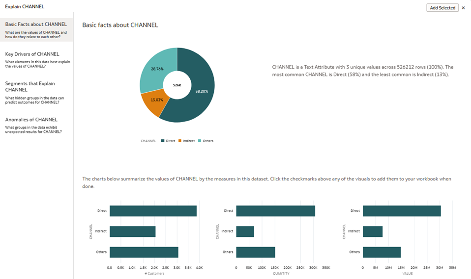

### Objectives

- Use **Explain** to get immediate basic insights on data

### Prerequisites  

* An [_Oracle Cloud Free Tier Account_](https://www.oracle.com/cloud/free/) or a Paid account
* All previous labs successfully completed
## Task 1: Create a Workbook  
Creating visualizations and workbooks is easy, and your data analysis work is flexible and exploratory.  
Oracle Analytics helps you to understand your data from different perspectives and fully explore your data to find correlations, discover patterns, and see trends.

1.  Prerequisites  
After you have applied the [starter file script](https://objectstorage.us-ashburn-1.oraclecloud.com/p/c_PgI7AIzbn3bkEkqbZAhAUuNjMVw2KE6dvITNOtj9AVRJ_sNiCub6nRaR2kJApp/n/idbwmyplhk4t/b/LiveLabs/o/starter-file.sql) and run the SQL code with "**_Lab 3: Connecting OAC to ADW and adjusting Data Set properties_**", you can quickly **create** your **Workbook**.  

2.  Go to top right and click **Create Workbook** button.

    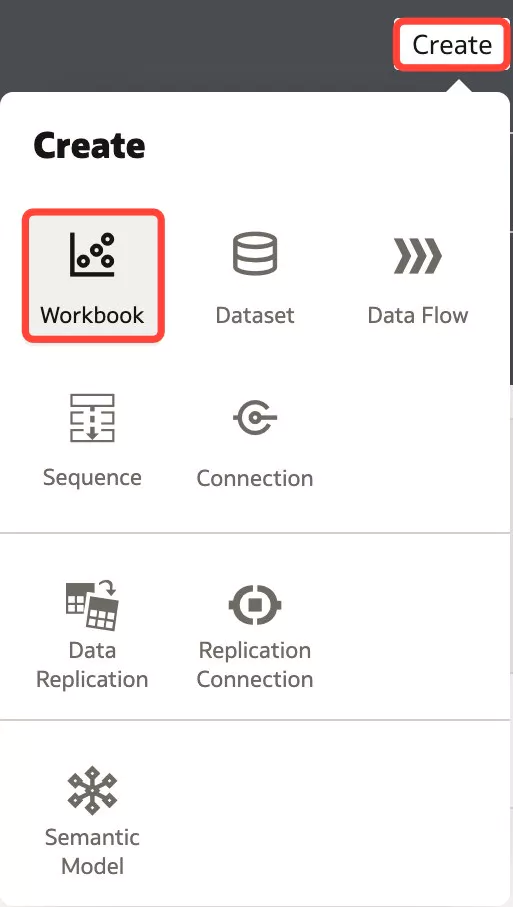
    

3.  Select DCA\_SALES\_DATA and click **Add to Workbook** button.

    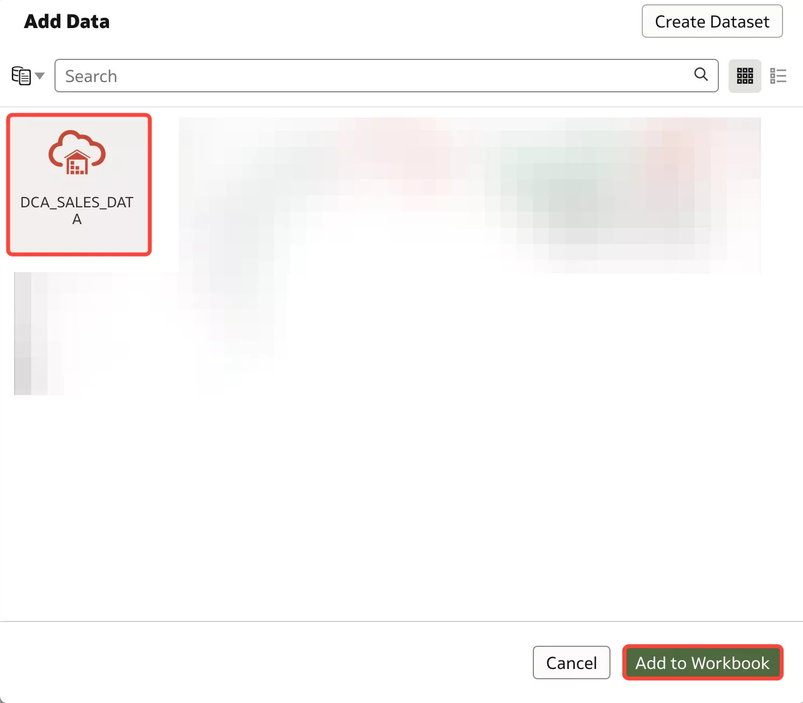

4.  An empty **Canvas** is presented in **Visualize** tab  

    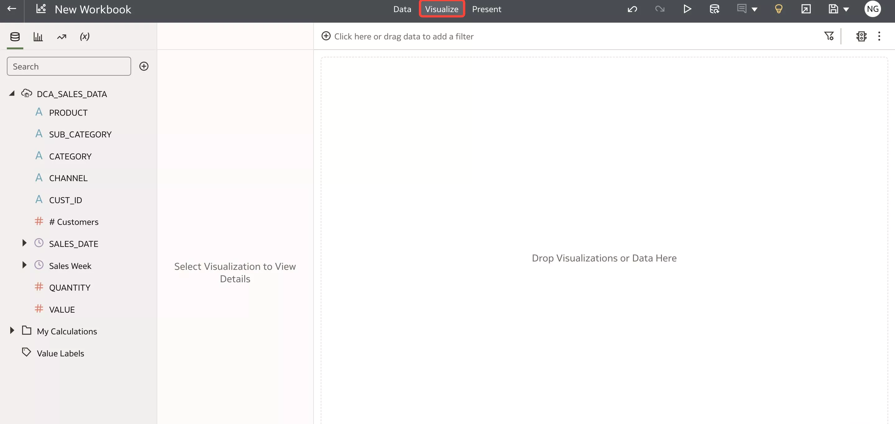    

## Task 2: Get Started with Visualizing Data  
Before drowning into details, let us introduce you to the different sections of the screen. This will help you to easily follow the next steps.

1. An **Oracle Analytics Workbook** consist of **three main parts** (you can see them at the top center part of the screen):

     
     - **Data**: Here is where you prepare your data. You get a preview of each dataset on the Workbook. You enrich it by adding columns, hiding or renaming the available ones. You can also define joins between datasets here  
     - **Visualize**: Here is where you explore and Analyze the data. You can create several canvases to hold the different visualizations you define  
     - **Present**: Here is where you create a more presentation-oriented view of the analysis you created. This tab allows you to choose which insights to show and add comments and descriptions. It helps to understand your analysis journey and focus on showing the results

    During this workshop, you will use the **Data** and **Visualize** tabs mainly.

2. You have already seen the **Data** screen on previous steps.  
The **Visualize** screen is this one:

   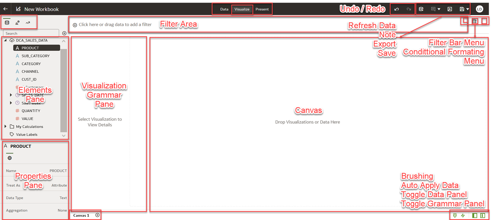

    Main areas to note here are:  
    - **Elements Pane**: Contains all fields from your datasets to be used in the Workbook  
    - **Properties Pane**: Allows you to define the properties and parameters of the selected object. If it is a column it will be highlighted in blue (in the screen PRODUCT in the Explorer menu is selected), if it is a graphic from the canvas it will have a thin blue borderline around it  
    - **Visualization Grammar Pane**: Contains definition of the selected Visualization, which fields to use and where (Axis, Filters, Trellis Groups...)
      > After you’ve selected the Data Sets for your Workbook, you can begin to add data elements such as _measures_ and _attributes_ to visualizations
    - **Canvas**: Your play area. You can place your visuals here. You can also create more Canvases and copy/move visuals around

    Some of the **options** are **context based**, so we’ll get a better idea once we start working on it

## Task 3: Basic Insights

Now that you know a bit your way around in the **Workbook**, you can continue with the lab.  
**Remember** that you have just added the new dataset from the **DCA\_SALES\_DATA** table.  

1. Let’s start by allowing the system to generate insights.  
This is the **Explain** feature.  
    It works on both **Attributes** and **Measures** columns, and helps to analyze important and non-obvious patterns in data.  
    The insights that Explain delivers are based on the column type or aggregation that you chose and will vary according to the aggregation rule set for the chosen metric. Explain generates only the insights that makes sense for the column type that you chose.

2. Explain for **Attributes**  
    **_Basic Facts_** insights (distribution across categories)  
    **_Key Drivers_** list columns that influence attribute values and their distribution  
    **_Segment_** tab visualizes segments where value for the attribute can be identified with certain confidence based on other columns in the dataset  
    **_Anomalies_** tab performs combinatorial analysis between selected attribute and other attribute columns and shows groups that exhibit unexpected behavior

3. Explain for **Measures**  
    **_Basic Facts_**  
    **_Anomalies_** insights based on the aggregation rule

4. Lets start to explain **# VALUE**  
In Data Pane Select **# VALUE**, Right-Click and select **Explain VALUE**

    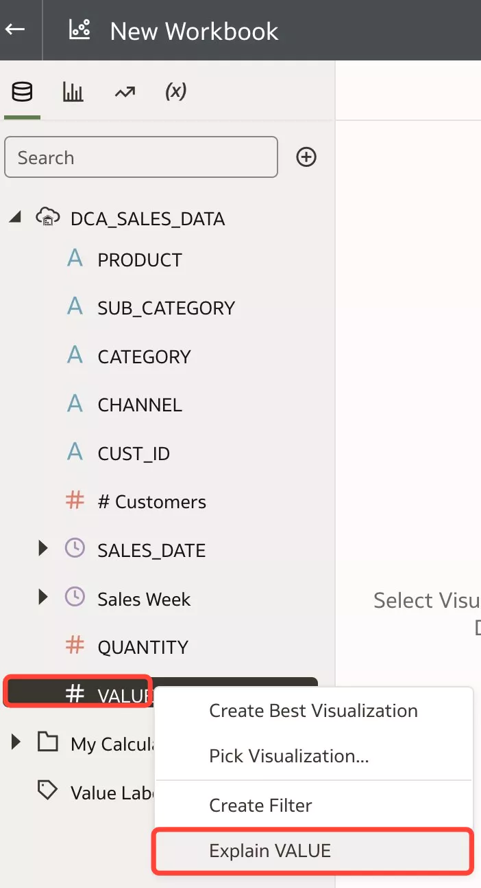  
    Explain displays its findings to you as text descriptions and visualizations. You can select key visualizations and add them to your Workbook's canvas.

5. A new page is opened. Explain on metric provides basic facts and anomalies based on aggregation rule.

   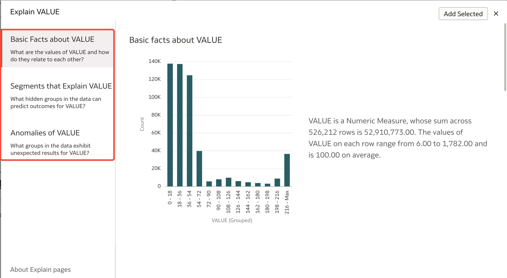  

6. Interesting visuals can be selected to be added to the canvas.  
Scroll down, hover the mouse over **SALES\_DATE**; **Category** and click on top right of the insight its checkmark (_Select for Canvas_) 

   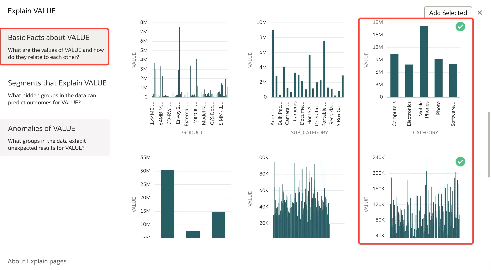 

7. Anomalies tab exhibits groups in the data that show unexpected results.  
Select first two visualizations and click on top right of the insight (_Select for Canvas_) 

    

8. Go to top right corner of the page and click **Add Selected**   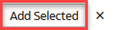 

9. Returning to the canvas you notice the 4 selected insights as visualizations.  
Note that the canvas name has changed to **Explain VALUE** and under _My Calculations_ you get 2 new measures and 2 new attributes.  

   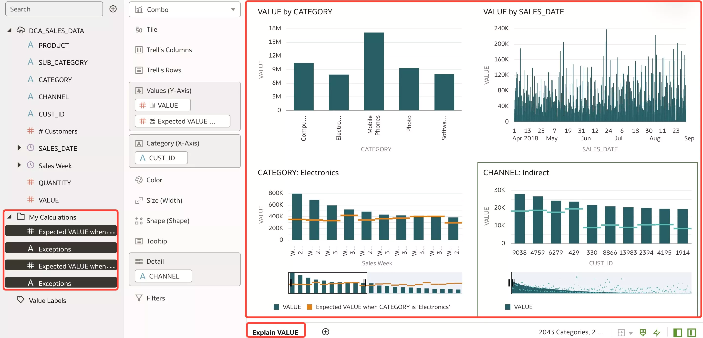 

10. Let's now **select** an **attribute** column which generates basic factual insights, key drivers, segments and anomalies.  
In Data Pane Select **SUB\_CATEGORY**, Right-Click and select **Explain SUB\_CATEGORY**

11. Check visuals and then close the page (Click **Close** ) 

    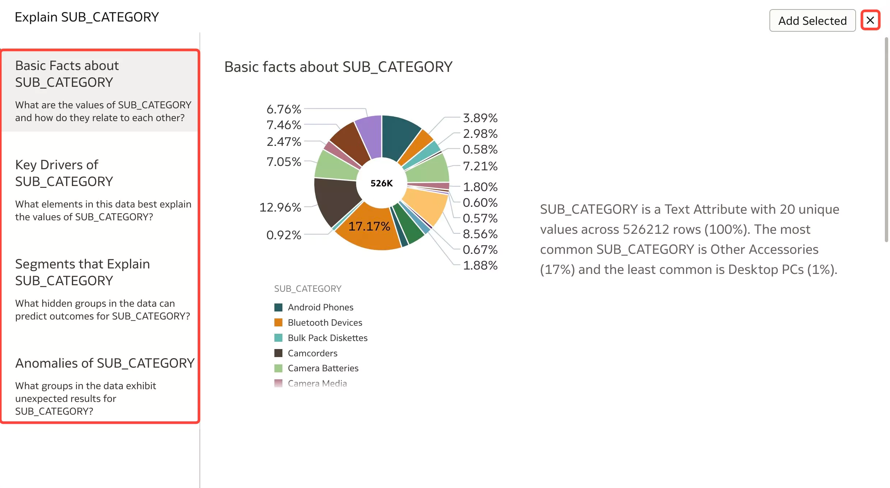

You have just finished to explore **Explain** **ML** feature, which enable insights that you can immediately start with, instead of a blank canvas.

You may now **proceed to the next lab**.

## Want to Learn More?

- Free [Udemy: Modern Data Visualization with Oracle Analytics Cloud](https://www.udemy.com/augmented-analytics/), Section 4, Topic 28. Augumented Analysis using Explain Feature
- [Analyze Data with Explain](https://docs.oracle.com/en/middleware/bi/analytics-desktop/bidvd/analyze-data-explain.html#GUID-D1C86E85-5380-4566-B1CB-DC14E0D3919E)

## **Acknowledgements**

- **Author** - Lucian Dinescu, Product Strategy, Analytics
- **Contributors** - Priscila Iruela, Database Business Development | Juan Antonio Martin Pedro, Analytics Business Development Victor Martin, Melanie Ashworth-March, Andrea Zengin
- **Reviewed by** - Shiva Oleti, Product Strategy, Analytics, Sebastien Demanche, Andor Imre (Oracle Cloud Center of Excellence)
- **Last Updated By/Date** - Lucian Dinescu, February 2022