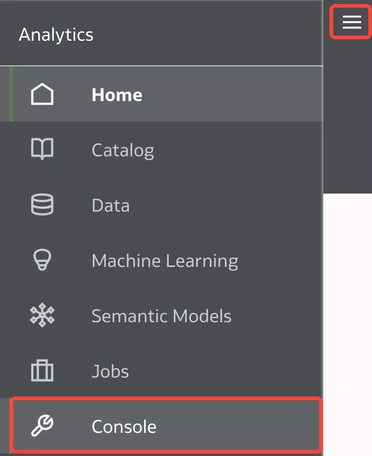

# Monitor ADW activity and OAC Query Logs

## Introduction

In this lab, you will explore capabilities available for your Autonomous Data Warehouse (**ADW**) using **Database Service Console** and check **OAC query logs** looking for the Logical and Physical SQL.

_Estimated Time_: 40 minutes

### Objectives

* Monitor ADW activity generated by OAC
* Check OAC query logs

### Prerequisites

* An [_Oracle Cloud Free Tier Account_](https://www.oracle.com/cloud/free/) or a Paid account
* All previous labs successfully completed
## Task 1: Monitor ADW activity generated by OAC
The **ADW Service Console** provides dashboards to monitor the real-time and historical CPU and storage utilization, as well as database activity, like the number of running or queued statements.

1.  Launch **Database Service Console**.  
Log in to **Oracle Cloud Infrastructure Console**, select **Autonomous Data Warehouse** from the Hamburger Menu and navigate to your ADW instance.  

    Enter your **User Name**, **Password** and Click **Sign In.**

    

2.  Click on the hamburger **MENU** link at the upper left corner of the page.  
This will produce a drop-down menu, where you select **Autonomous Data Warehouse.** 

    

3.  Select your Compartment and Click on your ADW instance

    

4.  In your ADW **Database Details** page, click the **Service Console** button.

    

5.  Examine the **Console Overview** and **Activity** Page.  
A new Canvas Page is opening.  
Examine the components of the Overview page:  
    * Storage used  
    * CPU utilization  
    * Running SQL statements  
    * Number of OCPUs allocated  
    * SQL statement response times

    

6.  To access detailed information about the service's performance, click the **Activity** tab in the Service Console.

    

7.  Click the **Monitored SQL** tab to see information about current and past monitored SQL statements.

    

8.  Navigate to OAC canvas, lets **refresh** the data and see if new queries gets generated in ADW.  
Open the browser page with your OAC canvas (previous lab) and click **Refresh Data** button from top right.

    

9. Go Back to ADW **Activity** > **Monitored SQL** and notice a new query has just been generated.
    
      

## Task 2: Check OAC Query Logs  

Administrators can examine the **underlying SQL query** requests that are executed.

1.  Going back to our visualization, lets Remove Analytics.  
Click on your visualization and you activate the Visualization Properties Pane on the lower left of the screen.  
Click on **Analytics** Properties and mouse hover on the **Trend** till you get an red x, Click on it and do the same with **Forecast**.  
   
    

2.  Lets save our workbook for further analysis.  
   Click on **Save** icon from upper top right of the screen. 

    

3.  Save Project as Training01 (or any name we choose). Type **Name**: **Training01** an Click **Save** button. 

    

4.  OAC **Query Log**  
Lets now check the query logs generated inside of OAC.  
Click **Go Back** left arrow from upper left of the screen to go to the Analytics Home Page. 

5.  Click **Navigator** and then Select **Console**.

    

6.  Click **Sessions and Query Cache** under _Configuration and Administration_ section.

    

7.  The logs screen shows all the query logs and it can be sorted in ascending/descending order.  
Locate the **Cursor Cache** section, and review the query information recorded there. 

    

8.  Sort the query log in a descending order.  
   **Sort By**> Select **Order Time Descending**.

    

9.  Pick-up the most recent one and Click **View Log**.

    

10. **Logs** contain **logical SQL** generated by the BI Server and the **physical SQL** fired against the database.  
Scroll down the log file and you'll first find the **Logical SQL** and further down the **Physical SQL** as well. 

      
     > Note: for the physical SQL search the log for "_Sending query to database named_"
    
    

11. Bonus  
Lets test the _**Logical SQL**_ with _**OAC**_ and see the _**Physical SQL**_ in the _**ADW Console**_.

12. **Copy** the **Logical SQL** from the log file. 

     

13. Go back to **Console**  and Click **Issue SQL** under _Configuration and Administration_ section.  
    
     

14. Paste the _Logical SQL_ and Click **Issue SQL** button.  

     

15. You can quickly see the results (unformatted table below the SQL query). 

     

16. Go to the ADW **Service Console > Activity > Monitored SQL**, select your query, right-click and select **Show Details**.

     

17. Check the **Overview** tab, you'll find the Physical **SQL Text** which is identical with the one from OAC query log. 

     

18. You can also browse through the other tabs as **Plan Statistics** to see other relevant query information.

     

## Task 3: Performance Tools
You can review performance statistics for visualization components including **Logical SQL**, **Query Generation** and **Execution Log** with **Performance Tools**.

1. Enable **Developer Options**
In the **Home** page, click the user icon, then click **Profile**.

     

2. On the **Admin** page, click **Advanced**, and click **Enable Developer Options**.
Click **Save**, then **Close**.

     

    If you have **BI Service Administrator** or **BI Content Author** Application Roles, you can now display **Developer Options** below the Visualize pane in Workbook designer (Click **Menu**, then **Developer**).  
    **Developer Options** aren't available if you log into Oracle Analytics with consumer privileges only. However, you can analyze the performance of a visualization canvas by appending a workbook URL in your browser with '&devtools=true'

3. Open Workbook
On the **Home** page, click **Training 01** workbook.

     

4. Open Developer options.  
Click **Menu**, and click **Developer**.  

     

5. We are going to focus on **Performance Tools** tab from lower left, to review performance statistics in the current workbook. You may want to Click **Refresh Data**  to get the latest statistics.  
Select **Performance Tools** tab from lower left, and then go to **Logical SQL** tab.  

      

6. Select **Summary**.  

      

7. Select **Execution Logs**.  

      

You have just finished learning how to **monitor ADW activity generated by OAC**.  
You have also learnt how to check **OAC query logs** and find the **Logical and Physical generated SQL** with **Performance Tools**.

You may now **proceed to the next lab**.

## Want to Learn More?

* [Where is the Log for My Data-Flow In Oracle Analytics?](https://blogs.oracle.com/analytics/where-is-the-log-for-my-data-flow-in-oracle-analytics)
* [Analyze SQL Queries and Logs](https://docs.oracle.com/en/cloud/paas/analytics-cloud/acabi/monitor-users-and-activity-logs.html#GUID-24782185-AED4-4F6B-BBF6-51AE9C0C7962)
* [Oracle Analytics Best Practices - Gathering and Analyzing Query Logs](https://blogs.oracle.com/analytics/post/oracle-analytics-best-practices---gathering-and-analyzing-query-logs)  
* [Developer Reference](https://docs.oracle.com/en/cloud/paas/analytics-cloud/acubi/developer-reference.html#GUID-5A0BD6CE-EEB3-4028-B64C-BE3178B69C21)

## **Acknowledgements**

- **Author** - Lucian Dinescu (Oracle Analytics Product Strategy)
- **Contributors** - 
- **Reviewed by** - Shiva Oleti (Oracle Analytics Product Strategy), Sebastien Demanche, Andor Imre (Oracle Cloud Center of Excellence)
- **Last Updated By/Date** - Lucian Dinescu (Oracle Analytics Product Strategy), March 2022
