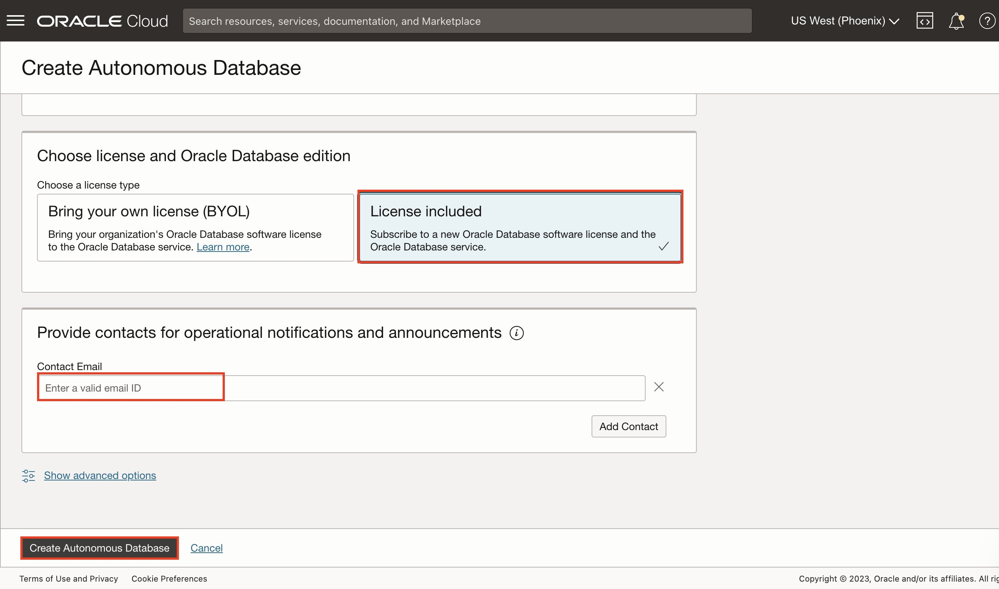

# Provision your Oracle Autonomous Data Warehouse Database (ADW) instance

## Introduction

This workshop walks you through the steps to get started using the **Oracle Autonomous Data Warehouse Database (ADW)**. You will provision a new database in just a few minutes.

Oracle Autonomous Databases have the following characteristics:

**Self-driving**
Automates database provisioning, tuning, and scaling.

- Provisions highly available databases, configures and tunes for specific workloads, and scales compute resources when needed, all done automatically.

**Self-securing**
Automates data protection and security.

- Protect sensitive and regulated data automatically, patch your database for security vulnerabilities, and prevent unauthorized access—all with Oracle Autonomous Database.

**Self-repairing**
Automates failure detection, failover, and repair.

- Detect and protect from system failures and user errors automatically and provide failover to standby databases with zero data loss.

Watch our short video that explains Lab 1 - Provision your Autonomous Database instance & Lab 2 - Provision your Oracle Analytics Cloud instance in detail:

_Estimated Time:_ 15 minutes

### Objectives
- Create an Autonomous Database with the latest features of Oracle Databases

### Prerequisites

* An [_Oracle Cloud Free Tier Account_](https://www.oracle.com/cloud/free/) or a Paid account.  

  > **Note:** If you have a **Free Trial** account, when your Free Trial expires your account will be converted to an **Always Free** account. You will not be able to conduct Free Tier workshops unless the Always Free environment is available. **[Click here for the Free Tier FAQ page.](https://www.oracle.com/cloud/free/faq.html)**

## Task 1: Create a new Autonomous Data Warehouse Database

1. Click on the hamburger **MENU (Navigator)** link at the upper left corner of the page.

    This will produce a drop-down menu, where you should select **Autonomous Data Warehouse.**  
    

    This will take you to the management console page.

    [You can learn more about compartments in this link](https://docs.cloud.oracle.com/en-us/iaas/Content/Identity/Tasks/managingcompartments.htm).

2. To create a new instance, click the blue **Create Autonomous Database** button.

    

    Enter the required information and click the **Create Autonomous Database** button at the bottom of the form. For the purposes of this workshop, use the information below:

    >**Compartment:** Verify that a compartment ( <tenancy_name> ) is selected.

    By default, any OCI tenancy has a default ***root*** compartment, named after the tenancy itself. The tenancy administrator (default root compartment administrator) is any user who is a member of the default Administrators group. For the workshop purpose, you can use ***root*** or create your own _Compartment_ under the **root** folder.

     > **Display Name:** Enter the display name for your ADW Instance. Use a user-friendly name to help you easily identify the resource. You can leave the name provided. That field is not a mandatory one.

    > **Database Name:** Enter any database name you choose that fits the requirements for ADW. The database name must consist of letters and numbers only, starting with a letter. The maximum length is 14 characters. For this demo purpose, I have called my database **ADWH**.
  
    > **Workload Type:** Autonomous Data Warehouse  
    >
    > **Deployment Type:** Shared Infrastructure
    >
    > **Always Free:** Off
    
      - **Not recommended for this lab**, but you can select Always Free configuration to start enjoying your Free Autonomous Database.  With Free option you will not be able to scale the database when need it.
      
        [If you select 'Always Free Tier On', please check the following link](https://www.oracle.com/uk/cloud/free/#always-free).

      

   > **Choose Database version:** you can leave the default displayed version
   >
   > **CPU Count:** 2
   >
   > **Storage Capacity (TB):** 1
   >
   > **Auto scaling:** On
   

3. Under **Create administration credentials** section:

    > **Administrator Password:** Enter any password you wish to use noting the specific requirements imposed by ADW. A suggested password is ADWwelcome-1234.
    >
    > **Reminder:** Note your password in a safe location as this cannot be easily reset.

    Under **Choose network access** section:

    > Select **'Allow secure access from everywhere'** 
    

4. Under **Choose a license type** section, choose **License Type: Licence Included**.

    When you have completed the required fields, scroll down and click on the blue **Create Autonomous Database** button at the bottom of the form:  
    

5. The Autonomous Database **Details** page will show information about your new instance. You should notice the various menu buttons that help you manage your new instance -- because the instance is currently being provisioned all the management buttons are greyed out.

6. A summary of your instance status is shown in the large box on the left. In this example, the color is amber and the status is **Provisioning.**  

7. After a short while, the status turns to **Available State** and the "ADW" box will change color to green:  

8. Once the Instance Status is **Available**, additional summary information about your instance is populated, including workload type and other details.

    The provisioning process should take **under 5 minutes**.

9. After having the Autonomous Database instance **created** and **available**, you you may be prompted with a Pop Up window asking you to upgrade. You may choose to upgrade the database version after the hands-on session, otherwise the upgrade process can take a few minutes, and you may miss a few exercises during the session.

    This page is known as the **Autonomous Database Details Page**. It provides you with status information about your database, and its configuration. Get **familiar** with the buttons and tabs on this page.  
    

You have just created an Autonomous Database with the latest features of Oracle Databases.

You may now **proceed to the next lab**.

## **Acknowledgements**

- **Author** - Lucian Dinescu, Product Strategy, Analytics
- **Contributors** - Priscila Iruela, Database Business Development | Juan Antonio Martin Pedro, Analytics Business Development Victor Martin, Melanie Ashworth-March, Andrea Zengin
- **Reviewed by** - Shiva Oleti, Product Strategy, Analytics, Sebastien Demanche, Andor Imre (Oracle Cloud Center of Excellence)
- **Last Updated By/Date** - Lucian Dinescu, March 2022