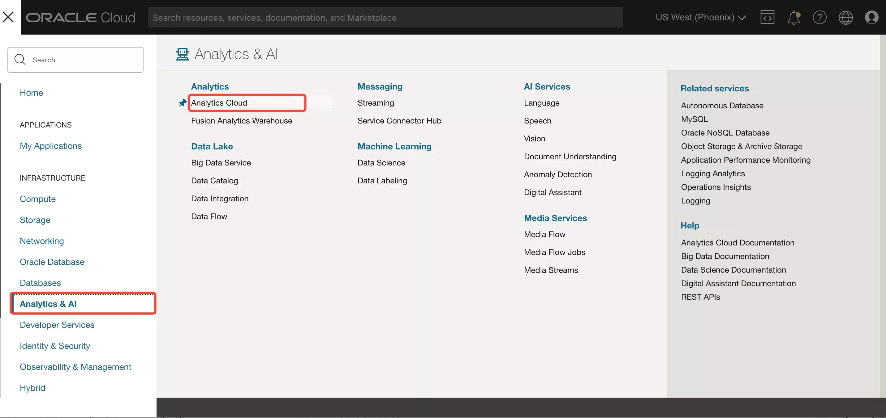
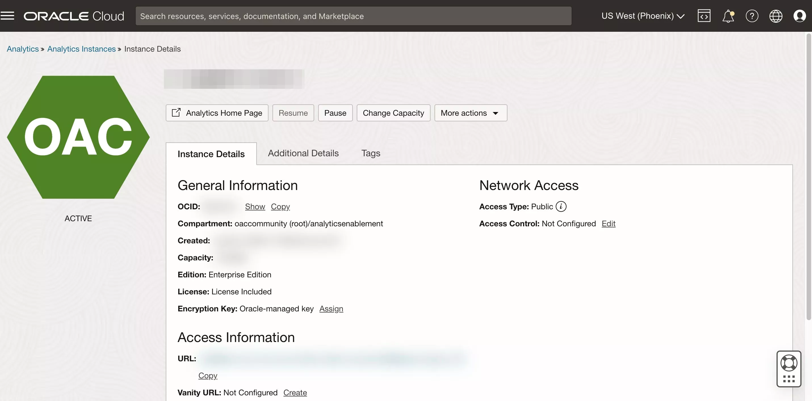

# Provision your Oracle Analytics Cloud (OAC) instance

## Introduction

This section describes the process of deploying **Oracle Analytics Cloud** instances on Oracle Cloud Infrastructure Gen 2, which is the default for newly provisioned accounts in **EMEA** and **US**.

Your Oracle Cloud Free Tier account will use the Oracle Cloud Free Trial **credits** while this instance is provisioned, as Oracle Analytics Cloud is not part of the **Always Free** cloud services.

Provisioning an Oracle Analytics Cloud instance can take up to **40 minutes**.

_Estimated Time:_ 15 minutes.

### Objectives

- Create an Oracle Analytics Cloud Instance
### Prerequisites

* An [_Oracle Cloud Free Tier Account_](https://www.oracle.com/cloud/free/) or a Paid account.  

  > **Note:** If you have a **Free Trial** account, when your Free Trial expires your account will be converted to an **Always Free** account. You will not be able to conduct Free Tier workshops unless the Always Free environment is available. **[Click here for the Free Tier FAQ page.](https://www.oracle.com/cloud/free/faq.html)**

## Task 1: Create an Oracle Analytics Cloud (OAC) Instance

Return to the Oracle Cloud Infrastructure Console accessing from **Oracle Home Page** (oracle.com) and sign in into your cloud account.
Click in **View Account** and **Sign in to Cloud**.  

1. Go to **Home Console Page** and navigate to **Analytics & AI** section and then select **Analytics Cloud**.

    

2. Select **Create Instance**.

    Complete the form using the following information:

    >**Compartment**: Select a valid compartment in your tenancy
    >
    >**Instance Name**: Choose a Name
    >
    >**Description**: &lt;optional&gt;
    >
    >**Feature Set**: Enterprise Analytics (important)
    >
    >**Capacity**: 2  
       > **Important**: **1 OCPU OAC instance is for Trials Only**; you cannot scale up an 1 OCPU instance once need it, and also the shape you chose comes with [Limits for Querying, Displaying, Exporting Data](https://docs.oracle.com/en/cloud/paas/analytics-cloud/acsom/create-services-oracle-analytics-cloud.html#GUID-164D8568-9AE3-4A74-9F1A-0D87B78713C9) => **DO NOT create an 1 OCPU instance for OAC Production environment**
    >
    >**License Type**: "Subscribe to a new Analytics Cloud software > license and the Analytics Cloud." (You will use this service as part of the free Oracle Cloud trial that you requested for this workshop).

3. Click **Create**.

    

4. The Analytics instance page will be displayed with a status of ***CREATING***.

    ***Reminder***: Provisioning an Oracle Analytics Cloud instance can take over **40 minutes**.

6. The Analytics instance page will be displayed with a status of ***ACTIVE***.  

    

You may now **proceed to the next lab**.

## **Acknowledgements**

- **Author** - Lucian Dinescu, Product Strategy, Analytics
- **Contributors** - Priscila Iruela, Database Business Development | Juan Antonio Martin Pedro, Analytics Business Development Victor Martin, Melanie Ashworth-March, Andrea Zengin
- **Reviewed by** - Shiva Oleti, Product Strategy, Analytics
- **Last Updated By/Date** - Lucian Dinescu, February 2022