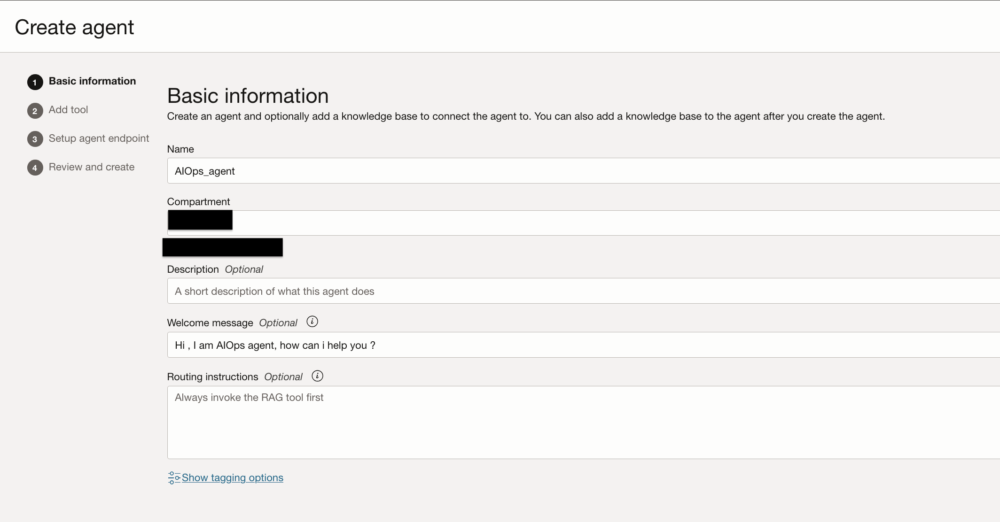

# Install and Configure OCI Generative AI Agents

## Introduction

Once you have Email Delivery configured, you can use it with a wide variety of OCI services. For this lab, we will going to generate SMTP credentials as we are going to use in Email tool. We will also provision Generative AI agent endpoint and Agent client Function tools.

Estimated Lab Time: 45 minutes

### About <Product/Technology>

OCI Generative AI Agents is a fully managed service that combines the power of large language models (LLMsLLM (Generative AI, Generative AI Agents) ) with AI technologies to create intelligent virtual agents that can provide personalized, context-aware, and highly engaging customer experiences.

### Objectives

In this lab, you will:

* Generate SMTP Credentials
* Provisioning an Generative AI agent endpoint using the OCI Console
* Prepare Python Virtual Environment
* Configure Environment variable file
* Deploy OCI Generative AI Agents using python Agent Development Kit(ADK)

### Prerequisites

This lab assumes you have:

* Oracle Cloud account
* All previous labs successfully completed

## Task 1: Generate SMTP Credentials

1. While in the OCI Console, Click on your **Profile** which can be found in the upper-right corner of any screen in the OCI console. Select **My Profile**.


2. Click on **SMTP credentials** on the left-hand side of your profile under Resources.

3. Click on the **Generate SMTP Credentials** button.


4. Enter a description for the credentials and then click on the **Generate credentials** button.

5. Copy the Username and Password. Save them to a secure location for use in the next task. **Close** the Generate credentials window when complete.


6. There is one more piece of information you need for your Postfix configuration. Before you leave the console, click the **Navigation menu** in the upper left, navigate to **Developer Services** then select **Application Integration - Email Delivery**. Once at the Email Delivery screen, click **Configuration** in the left-hand side.


7. Copy the Relay Host Public Endpoint and SMTP Ports for use in the next task. Save for use later.


## Task 2: Provisioning an Generative AI agent endpoint using the OCI Console

We will going to provision Generative AI Agent using OCI Console. Through endpoint our Generative AI Agent receives and responds to chat or function‑calling requests.This step is about infrastructure setup and we will use OCI Console to do it.

1. Log in to the OCI Console, go to **Analytics & AI**, click **AI Services** and choose **Generative AI Agents**


2. Click on **Overview** and select **Create agent**


3. Enter **Name** and **Welcome message**


4. Since we are going to create Tools using OCI ADK so click on **Next**


5. In **Setup agent endpoint** select **Automatically create an endpoint for this agent** and rest with default options


6. Go to **Review and Create** and click **Create agent**


7. Once the agent creation completed and go to **Endpoints** and click on **endpoint** and copy **OCID**


## Task 3: Prepare Python Virtual Environment

Here we are preparing virtual environment with all libraries which are required to provison OCI Generative AI Agents. I am assuming you have compute instance where Visual Studio code and Python 3.12 already installed.

1. Create a **project** with a virtual environment


2. Install the latest version **Agent Development Kit(ADK)**


3. Install all required libraries using **requirement.txt**. Please download this file and run below command:
[requirements.txt](https://c4u04.objectstorage.us-ashburn-1.oci.customer-oci.com/p/EcTjWk2IuZPZeNnD_fYMcgUhdNDIDA6rt9gaFj_WZMiL7VvxPBNMY60837hu5hga/n/c4u04/b/livelabsfiles/o/labfiles%2Frequirements.txt)

    ``` bash
    <copy>
    pip install -r requirements.txt
    </copy>
    ```

## Task 4: Configure Environment variable file

Environment variables are key-value pairs used to configure applications without hardcoding sensitive or environment-specific information.
Here you have fill variables as per your environment except **"SLACK_BOT_TOKEN"** and **"SLACK_APP_TOKEN"**. This we will fill after slack configration.


**Download .env file**
[.env](https://c4u04.objectstorage.us-ashburn-1.oci.customer-oci.com/p/EcTjWk2IuZPZeNnD_fYMcgUhdNDIDA6rt9gaFj_WZMiL7VvxPBNMY60837hu5hga/n/c4u04/b/livelabsfiles/o/labfiles%2Fenv)

## Task 5: Deploy OCI Generative AI Agents using python Agent Development Kit(ADK)

ADK (Agent Development Kit) is a client-side library that simplifies building agentic applications on top of OCI Generative AI Agents Service.

When pairing ADK with OCI Generative AI Agents Service, you can use simple but powerful primitives to build complex, production-grade agentic applications.
The ADK provides an AgentClient class to simplify handling authentication and management of agent resources. Four authentication types are supported like
**API Key Authentication (Default)**: In this lab we have used this. Request you to setup your API configuration and set profile name as **CHICAGO**. To set up API key authentication, follow the [OCI API key setup guide](https://docs.oracle.com/en-us/iaas/Content/API/Concepts/apisigningkey.htm)

1. Download the **agent-tool-creation.py**. This contains all steps to configure agent:
[agent_tool_creation.py](https://c4u04.objectstorage.us-ashburn-1.oci.customer-oci.com/p/EcTjWk2IuZPZeNnD_fYMcgUhdNDIDA6rt9gaFj_WZMiL7VvxPBNMY60837hu5hga/n/c4u04/b/livelabsfiles/o/labfiles%2Fagent_tool_creation.py)

2. Let's execute this python code. It will start deploying agent tools one by one.


3. Validate all tools deployed successfully in OCI Console.


## Acknowledgements

* **Author**
    **Nikhil Verma**, Principal Cloud Architect, NACIE
