# Deploy OCI Test Compute Instance and Configure Alarms

## Introduction

In this lab, we will learn how to deploy test compute instance, Install Stress test and enable CPU and Memory Alarms in OCI Console.

Estimated Time: 20 minutes

### Objectives

In this lab, you will:

- Deploy Test Compute Instance
- Setting up the compute instance
- Install and configure Stress-ng
- Enable CPU and Memory Alarms in OCI Console

### Prerequisites

This lab assumes you have:

- All previous labs successfully completed

- You already have Deployed VCN

- You have access to deploy compute instances

## Task 1: Deploy Test Compute Instance

1. Go to the OCI console. From the OCI services menu, click Compute > Instances.
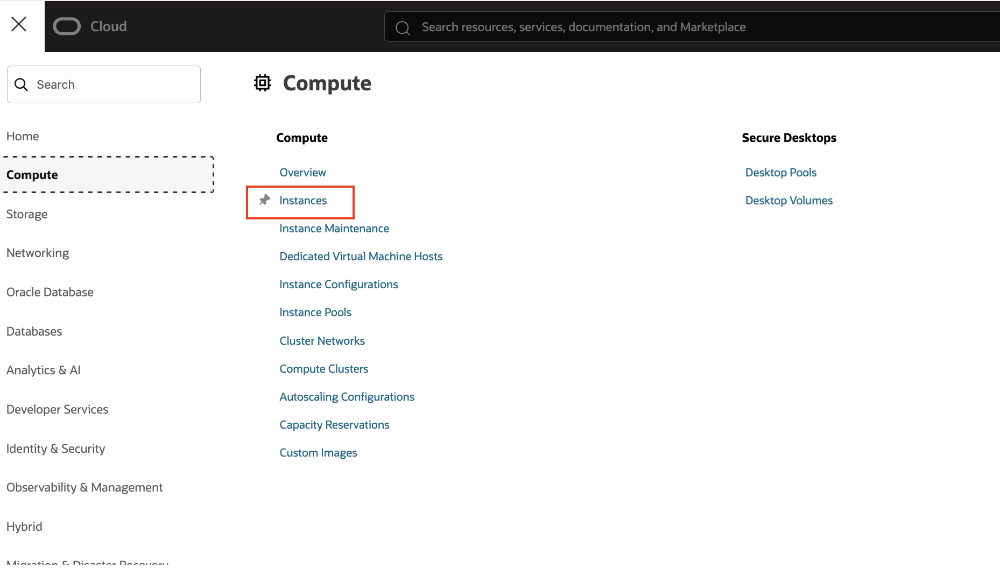

2. Click Create Instance.
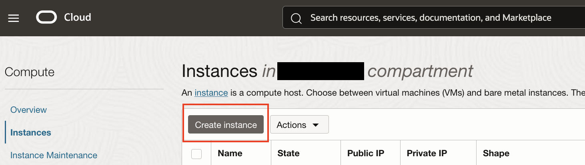

3. Enter a name for your instance and select the compartment you used earlier to create your VCN.
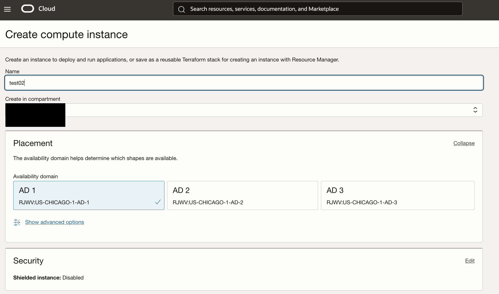

4. Scroll down on the page. Click Change Image and choose Oracle linux 8 then click on Change Shape and choose VM.Standard.A1.Flex.
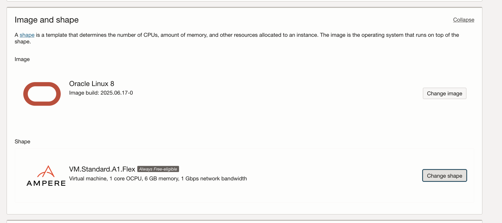

5. Scroll down to Primary VNIC Information section and edit the following:

    Virtual cloud network: Choose the VCN you created in Task 1

    Subnet: Choose the Public Subnet under Public Subnets (it should be named Public Subnet-NameOfVCN)

    Assign a Public IPv4 address: Automatically assign public IPv4 address
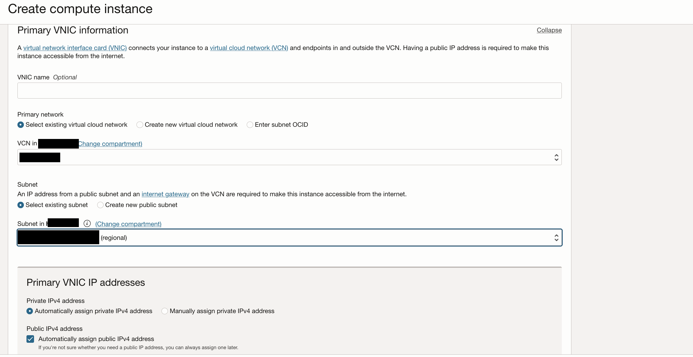

6. Add SSH Keys: Choose Generate a key pair for me and save private and public keys. If you already have ssh keys, choose Paste public keys or upload public key saved.
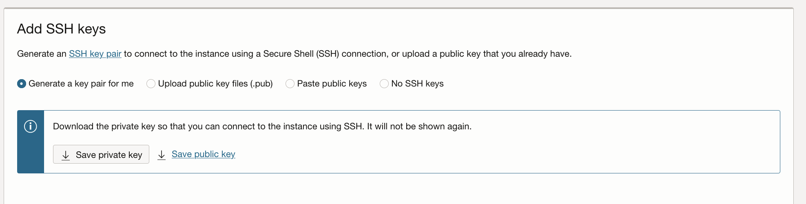


7. Click Create.

## Task 2: Setting up the compute instance

1. SSH into the compute instance
In cloud shell terminal or your machine's terminal, navigate to the directory where your SSH keys are stored. To get there, enter the command:

    ``` bash
    <copy>cd ~/path_to_ssh_directory</copy>
    ```

2. Enter **ls** to view the files in this directroy and verify your SSH key file exists.

3. Change the permissions of private key file, enter the command:

    ``` bash
    <copy>
    chmod 400 <private_sshkeyname>
    </copy>
    ```

    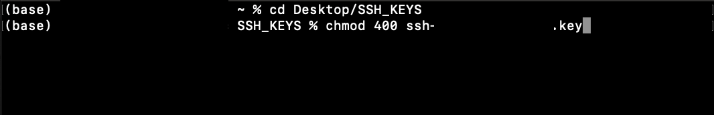

4. Now we will SSH into your compute instance, enter the command:

    ``` bash
    <copy>ssh -i <private_sshkeyname> opc@<PUBLIC_IP_OF_COMPUTE></copy>
    ```

    Check the details of your compute instance in the OCI web console to the **```PUBLIC_IP_ADDRESS```**

    **HINT:** If 'Permission denied error' is seen, ensure you are using '-i' in the ssh command. You MUST type the command, do NOT copy and paste ssh command.

5. Enter 'yes' when prompted for the security message.

6. Verify opc@`<COMPUTE_INSTANCE_NAME>` appears on the prompt.
        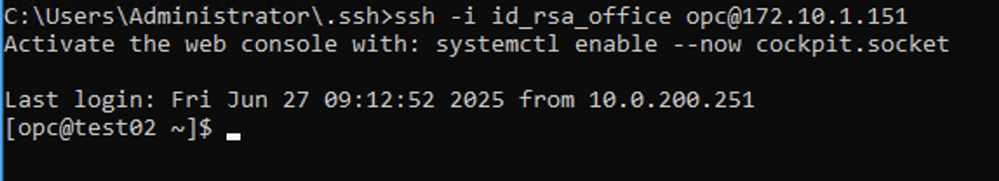

## Task 3: Install and configure Stress-ng

1. Now we will navigate to the home directory of the terminal. To do so, enter:

    ``` bash
    <copy>
    cd ~
    </copy>
    ```

2. Let's install the required dependencies:

    ``` bash
    <copy>
    sudo dnf install stress-ng -y
    </copy>
    ```

## Task 4: Configure Alarms

1. Go to **Observality & Management** and Choose **Alarm Definitions**
   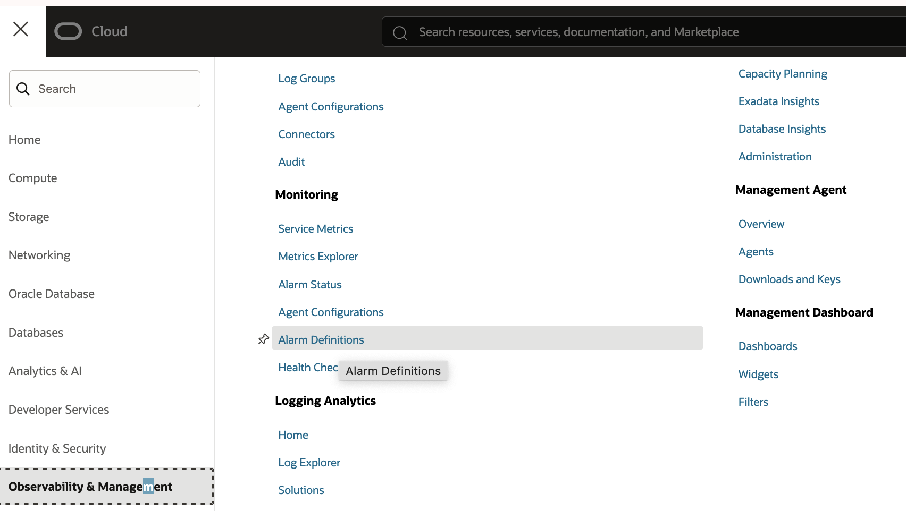

2. Create Alarm definition for CPU and Memory Alarms.
   Let's create CPU_ALARM first, Name of alarm matters as our Generative AI Agent look for this name in Alarm status Dashboard
   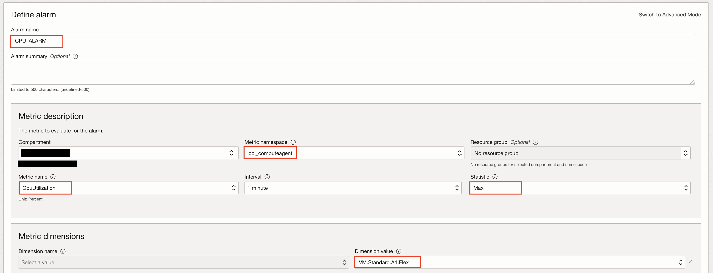
   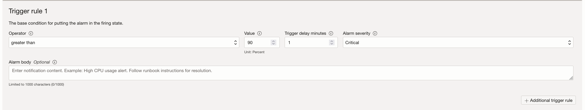

   Let's create MEMORY_ALARM first, Name of alarm matters as our Generative AI Agent look for this name in Alarm status Dashboard
   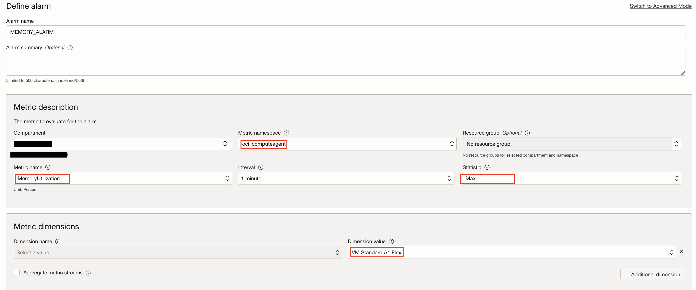
   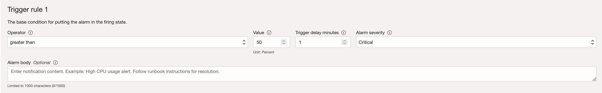

3. Let's trigger alarms from OCI Instance
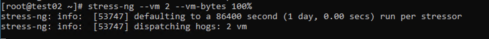

4. Go to **Observality & Management** and Choose **Alarm Status**. You will find alarms here.
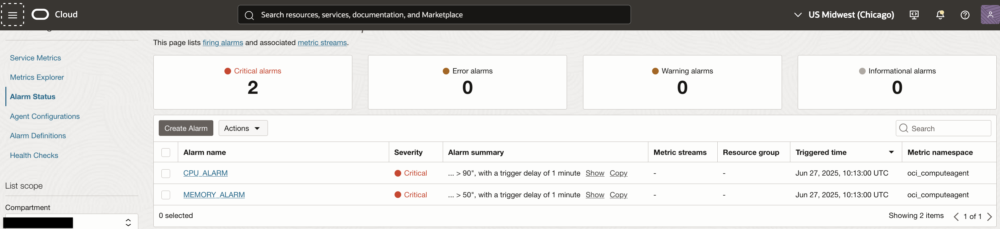

## Acknowledgements

- **Author**
    **Nikhil Verma**, Principal Cloud Architect, NACIE
