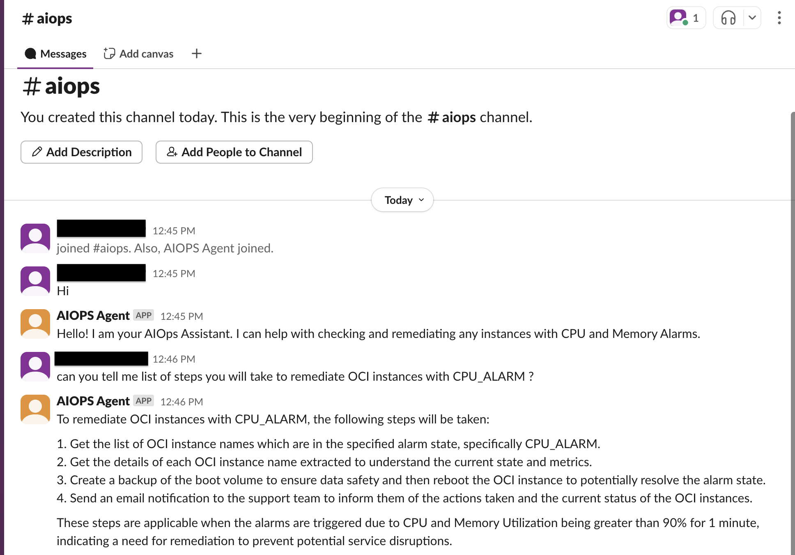
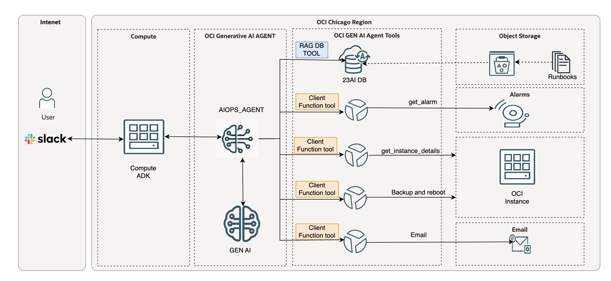

# Introduction

## About this Workshop

This workshop will help you configure OCI Generative AI Agents in your own OCI tenancy.
It enables Support Engineers, SREs, and developers to perform IT operations using the OCI Generative AI Agent Service with runbook-based guidance.
The users can then

- Connect to OCI Generative AI Agent Service from Slack.
- Get responses of their question (in natural language) from OCI Generative AI Agent client function tools.
By following the workshop users can perform IT Operations OCI Generative AI Agent in their own tenancy

Estimated Workshop Time: 3 hours

### Objectives

Objective of this workshop is to set-up the required OCI services to create a full Generative AI Agent solution with RAG and client function tool capabilities:

- OCI Generative AI Agent Service – Users can configure OCI Generative AI Agent Service (create and configure Knowledge Bases and Agents).
Users can then ingest and perform RAG on the user’s documents in 23ai database, using OCI Generative AI Agent Service.
- Local Client Machine – Users will use Local client machine which will orchestrate all OCI Generative AI agent tools. We will use OCI Agent Development Kit(ADK) a client-side library that simplifies building aganetic application on top of OCI Genrative AI Agent service.
- Slack Application – Users can create slack app in their workspace which will be used to connect from Slack to OCI Generative AI Agent Service.

In this workshop, you will learn how to:

- Create autonomous database and upload documents in the database.
- Setup & configure Generative AI Agent Service (Knowledge Bases and Agents)
- Setup & configure Slack App integration with OCI ADK

### Prerequisites

This lab assumes you have:

- An Oracle Cloud Account
- Access to OCI Generative AI Agents
- Access to a Region where the Agent service is available: Chicago, Frankfurt
- Must have an Administrator Account or Permissions to manage several OCI Services: Generative AI Agents, 23ai database, OCI Instances, Network, Dynamic Groups, Policies, IDCS/Identity Domain Confidential Applications
- Familiarity with Oracle Cloud Infrastructure (OCI) is helpful

## Learn More

- [What Is Generative AI? How Does It Work?](https://www.oracle.com/artificial-intelligence/generative-ai/what-is-generative-ai/)
- [What Is Retrieval-Augmented Generation (RAG)?](https://www.oracle.com/artificial-intelligence/generative-ai/retrieval-augmented-generation-rag/)
- [Overview of Generative AI Service](https://docs.oracle.com/en-us/iaas/Content/generative-ai/overview.htm)

## Acknowledgements

- **Author**
  - **Nikhil Verma**, Principal Cloud Architect, NACIE
