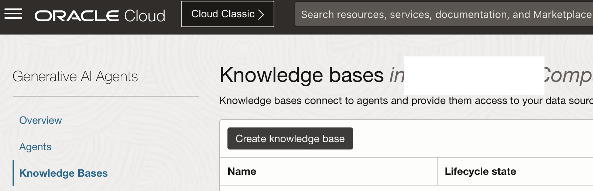
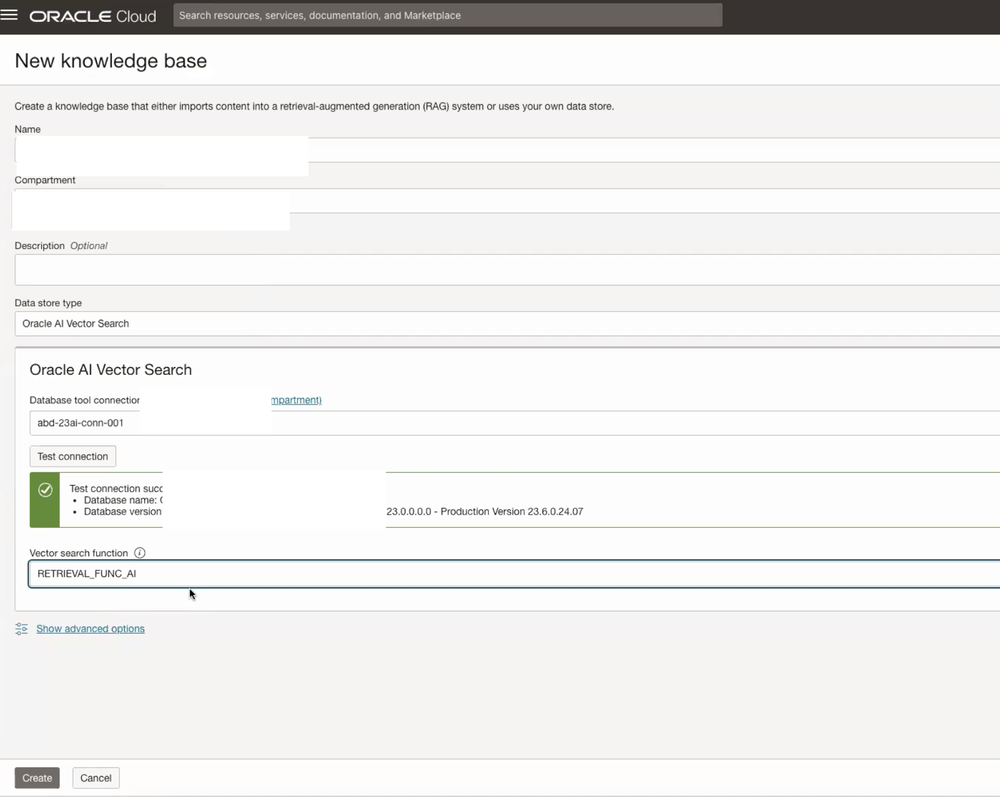

# Create Knowledge base

## Introduction

This lab walks you through the steps to setup an OCI Generative AI Agent including ingesting a knowledge base from 23ai adb.

Estimated Time: 10 minutes

### About Generative AI Agents

OCI Generative AI Agents is a fully managed service that combines the power of large language models (LLMs) with an intelligent retrieval system to create contextually relevant answers by searching your knowledge base, making your AI applications smart and efficient.

OCI Generative AI Agents supports several ways to onboard your data and then allows you and your customers to interact with your data using a chat interface or API.

### Objectives

In this lab, you will:

* Create Knowledge base

### Prerequisites

This lab assumes you have:

* All previous labs successfully completed
* Permissions to manage OCI Services: Generative AI Agents
* Access to a Region where the Agent service is available: Chicago, Frankfurt

## Task: Create Knowledge Base

This task will help you create a knowledge base using 23ai database as source.

1. Locate Knowledge Bases under Analytics & AI -> Generative AI Agents.

    

2. Click on your Create knowledge base. Provide Name, Data store type as Oracle AI Vector Search, Provide Database tool connection and click on Test connection. Once successful provide the vector search function created in the optional lab or your own vector search function. Lastly, click on create to create the Knowledge base.

    

## Acknowledgements

* **Author**
    **Nikhil Verma**, Principal Cloud Architect, NACIE
