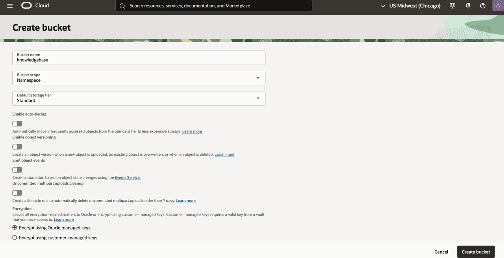
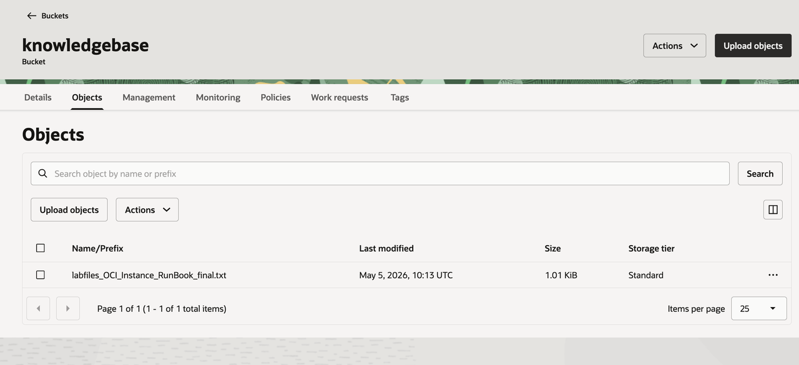
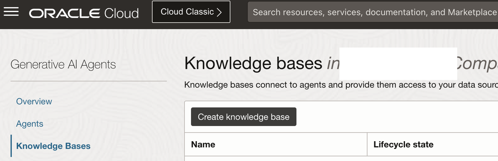
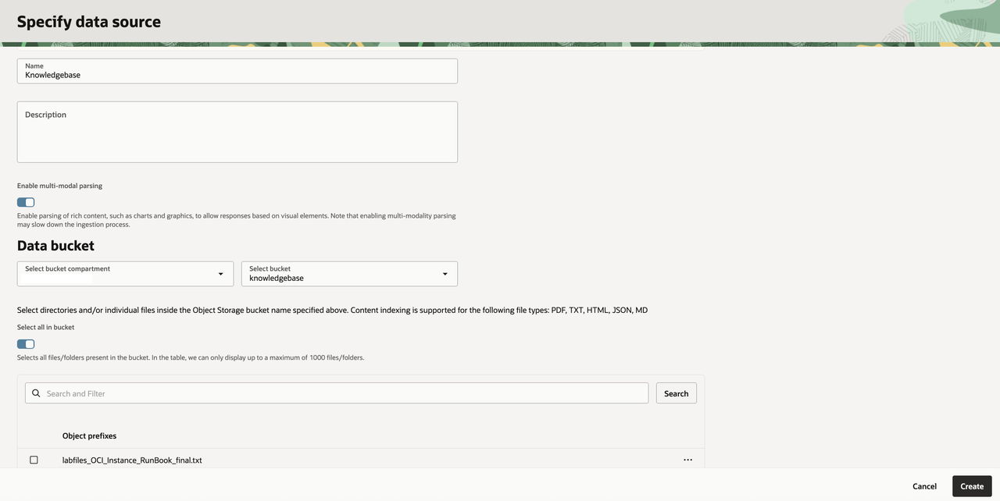

# Create Knowledge base

## Introduction

This lab walks you through the steps to setup an OCI Generative AI Agent including ingesting a knowledge base from OCI Bucket.

Estimated Time: 10 minutes

### About Generative AI Agents

OCI Generative AI Agents is a fully managed service that combines the power of large language models (LLMs) with an intelligent retrieval system to create contextually relevant answers by searching your knowledge base, making your AI applications smart and efficient.

OCI Generative AI Agents supports several ways to onboard your data and then allows you and your customers to interact with your data using a chat interface or API.

### Objectives

In this lab, you will:

* Create Knowledge base

### Prerequisites

This lab assumes you have:

* All previous labs successfully completed
* Permissions to manage OCI Services: Generative AI Agents
* Access to a Region where the Agent service is available: Chicago, Frankfurt

## Task: Create Knowledge Base

This task will help you create a knowledge base using OCI Bucket as source.

1. Create bucket in your compartment

    

2. Download Sample Runbook and upload this in bucket.
    [OCI_Instance_RunBook_final.txt](https://c4u04.objectstorage.us-ashburn-1.oci.customer-oci.com/p/EcTjWk2IuZPZeNnD_fYMcgUhdNDIDA6rt9gaFj_WZMiL7VvxPBNMY60837hu5hga/n/c4u04/b/livelabsfiles/o/labfiles%2FOCI_Instance_RunBook_final.txt)
    

3. Locate Knowledge Bases under Analytics & AI -> Generative AI Agents.

    

4. Click on your Create knowledge base. Provide Name, specify the data source as bucket and select all files and click on Create.

    

## Acknowledgements

* **Author**
    **Nikhil Verma**, Principal Cloud Architect, NACIE
* **Last Updated By/Date**
    **Nikhil Verma**, Principal Cloud Architect, NACIE, May 2026
